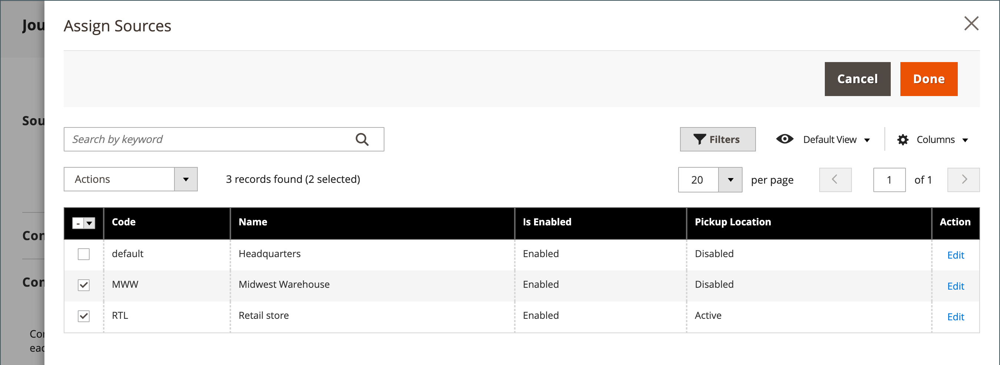
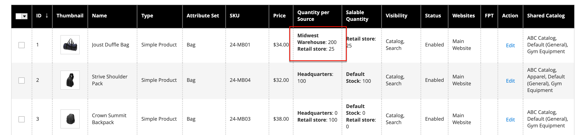

# Inventory assign sources and quantities

For multisource merchants using [Inventory Management](../inventory-management/introduction.md), scroll down to the **Sources** section and assign sources and quantities:

1. To add a source, click **Assign Sources**.

1. Browse or search sources and select the checkbox next to the sources you want to add for the product.

   {: .zoom}

1. Click **Done** to add the sources.

1. To manage the quantity and status of the source, click **Advanced Inventory** and set **Manage Stock** to `Yes`.

1. Set **Source Item Status** to `In Stock`.

1. Enter an amount update the **Qty** for on-hand stock.

1. To set a notification for inventory quantities, do one of the following:

   - _Custom Notify Quantity_ - Clear the **Notify Quantity Use Default** checkbox and enter an amount in **Notify Quantity**.

   - _Default Notify Quantity_ - Select the **Notify Quantity Use Default** checkbox. Commerce checks and uses the setting in Advanced Inventory or global Store configuration. 

   {: .zoom}
