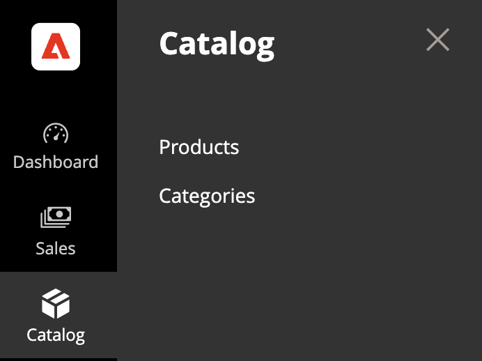
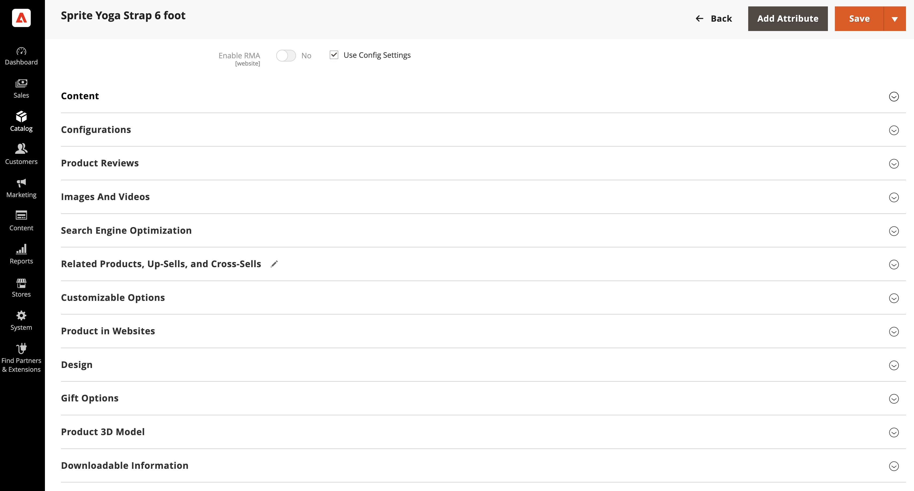
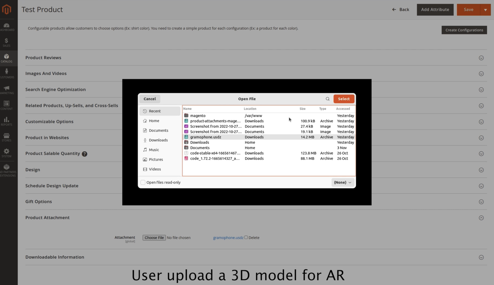
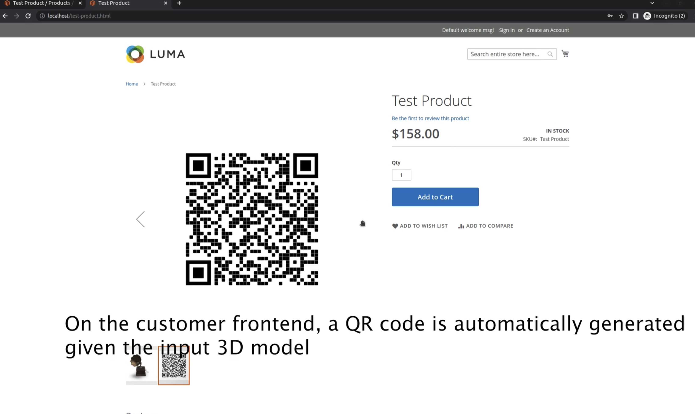
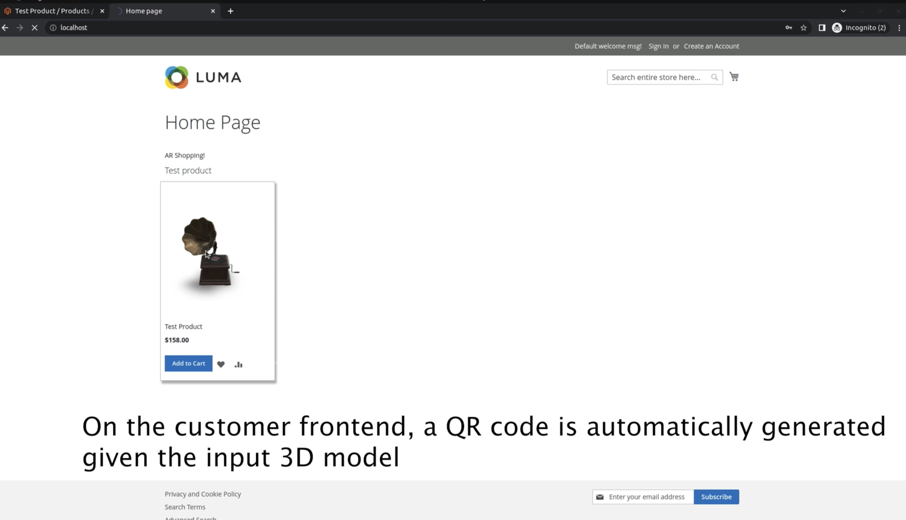

# Install

Normal composer procedure installation https://experienceleague.adobe.com/docs/commerce-operations/installation-guide/tutorials/extensions.html

## Add a USDZ schema

Step 1: Create a product in the Admin menu.
Step 1: Edit a product in the Admin menu.

  

  

Step 2: In **Product 3D Model** attribute, upload a 3d model of the product. (Current supported file format: .usdz)

  

Step 3: After click save button, the extension will generate the AR file at the backend, and insert an QR code to the product description which encodes the AR file.

Step 4: At customer's frontend, customer can see the QR code in product page.

  

Step 5: Customers use their mobile device to scan this QR code, AR experience will rendered on the device.

  
