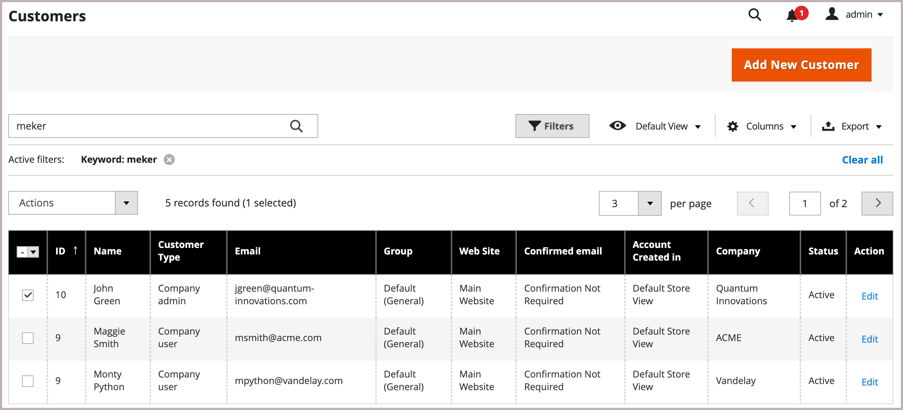
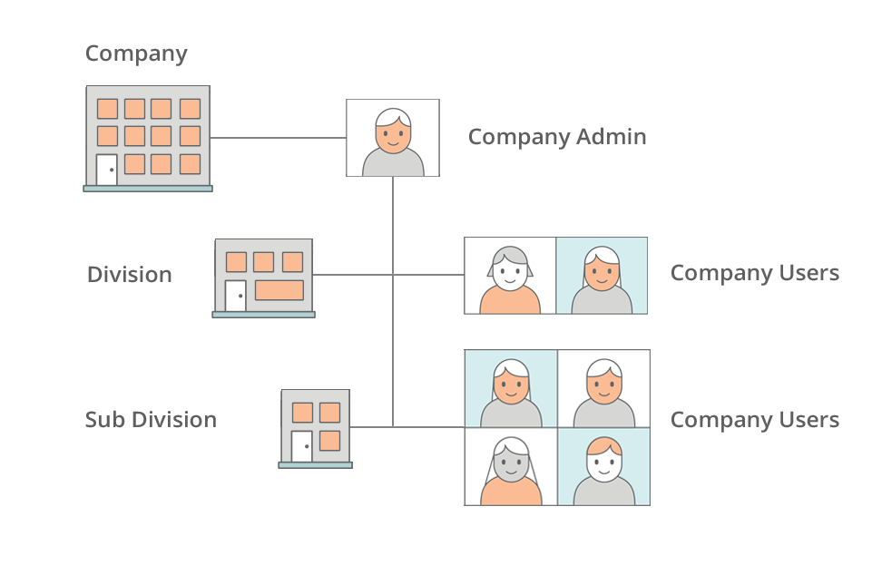
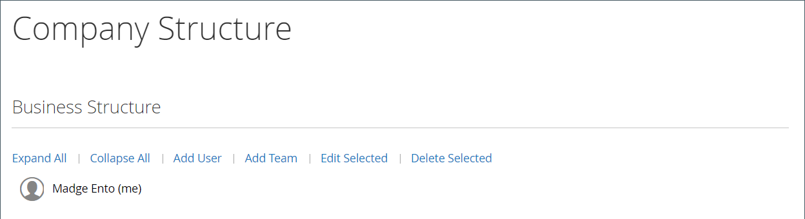
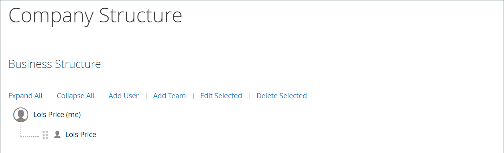

# Company Accounts

When you incorporate B2B company accounts in your store, you can simplify the corporate shopping experience by enabling companies to create multiple subaccounts with flexible permissions based on user roles in their organization. Depending on the customer groups of the company, a store administrator can adjust promotions and prices to suit their needs, and create highly customized offers that cater to the shoppers’ demands and increase orders. Adding a company account association to a standard [individual](https://docs.magento.com/user-guide/customers/account-create.html) allows the customer to use the specific purchasing workflows defined for the company.

Advantages of a company account:

- Offers unlimited [company users](account-company-users.md) and the creation of additional accounts, which simplifies corporate purchases.

- Includes support for a _smart_ company account hierarchy with different [roles and permissions](account-company-roles-permissions.md) for placing orders.

- Provides a mechanism for merchants to increase income by offering [company store credit](credit-company.md) as a payment method.

- Supports the [management](account-company-manage.md) of all company accounts in the Admin.

## View company accounts

The _Companies_ grid lists all active company accounts and pending requests, regardless of status setting. It also provides the tools for [creating](account-company-create.md) and [managing](account-company-manage.md) company accounts. Use the standard grid controls to filter the list, and adjust the column layout. For a list of column descriptions, see the _Column Descriptions_ section in [Managing Company Accounts](account-company-manage.md).

Customers can create a company account from the storefront, or a merchant can create one from the Admin. By default, the ability to create company accounts from the storefront is enabled. If allowed by the configuration, a visitor to the store can request to open a company account. After the company account is approved, the company administrator can set up the company structure and users with various levels of permission.

In the _Admin_ sidebar, go to **Customers** > **Companies**.

<!-- zoom -->

The Companies grid lists all companies regardless of status. The displayed example shows accounts for two companies: the “ABC Company” and the “XYZ Company”.

## Company administrator

The following example shows the _Customers_ grid with the initial company administrator account for the “XYZ Company”.

<!-- zoom -->

It is possible that the person who serves as company administrator has multiple roles within the company. If a separate email address is entered for the company administrator, the initial company structure includes the company administrator plus an individual user account in the name of the company administrator. In such a case, the company administrator can sign in to the account as the company or as an individual user.

After creating the account, the company administrator defines the company structure of [teams](account-company-structure.md), sets up the [company users](account-company-users.md), and establishes [roles and permissions](account-company-roles-permissions.md) for each.

## Company structure

A company account can be set up to reflect the structure of the business. Initially, the company structure includes only the company administrator, but can be expanded to include teams of users. The users can be associated with teams or organized within a hierarchy of divisions and subdivisions within the company. This is designed to support the use of [approval rules](account-dashboard-approval-rules.md) for [purchase orders](purchase-order-flow.md) (POs) associated with the company account.

<!-- zoom -->

In the company administrator's account dashboard, the company structure is represented as a tree and initially consists of only the company administrator.

<!-- zoom -->

When the account is created, the company administrator can use the company email address or be assigned a different email address.

In the following example, the initial company structure includes the company administrator plus an individual user account in the name of the company administrator. But company administrator functions (such as company structure and approval rules) are available only when they are logged in to the user account that is designated as the company administrator.

<!-- zoom -->
