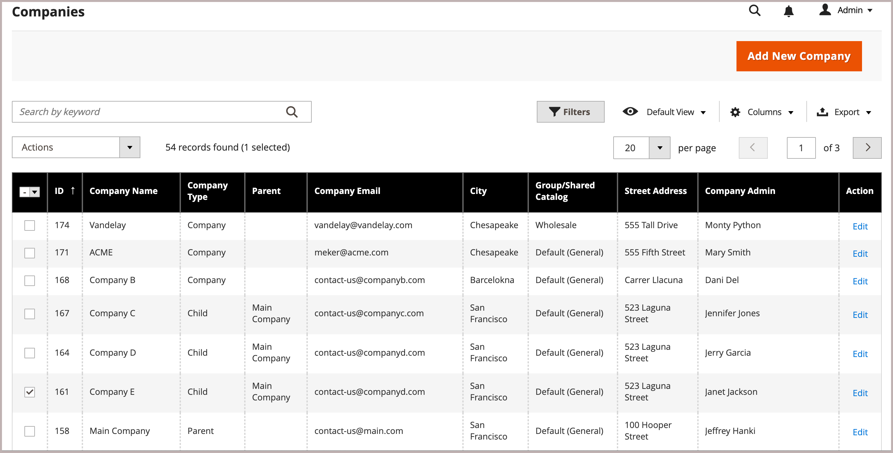
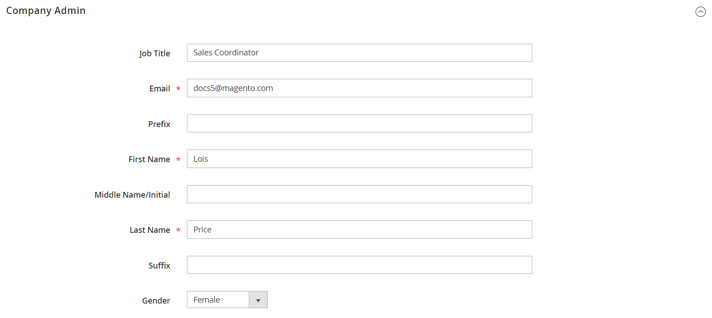

# Assign a Company Administrator

The company administrator is initially assigned when the company account is first created, and can be modified only by a store administrator from the Admin.

1. On the _Admin_ sidebar, go to **Customers** > **Companies**.

1. Find the company in the list and click **Edit**.

   <!-- zoom -->

1. Expand  the **Company Admin** section.

   <!-- zoom -->

1. Enter the **Job Title** of the new company administrator and click **Proceed** to continue.

   This action clears the form and the required _First Name_ and _Last Name_ fields are highlighted.

1. Enter the **Email** address of the new company administrator.

   If the system doesn’t find the email address in the database, you are prompted to confirm that you want to replace the company administrator.

   - If a user account doesn’t exist for the new company administrator, the system creates an account of the `Company Admin` type.

   - If the user account exists in the system, it is moved to the company administrator position in the company hierarchy.

1. Enter the **First Name** and **Last Name**, and any other information as applicable for the new company administrator.

1. When complete, click **Save**.

   The individual account of the former company administrator remains in the system as an active individual user account in the company hierarchy, assigned to the default user role.

   The system sends email notification of the change to the new and former company administrators.
