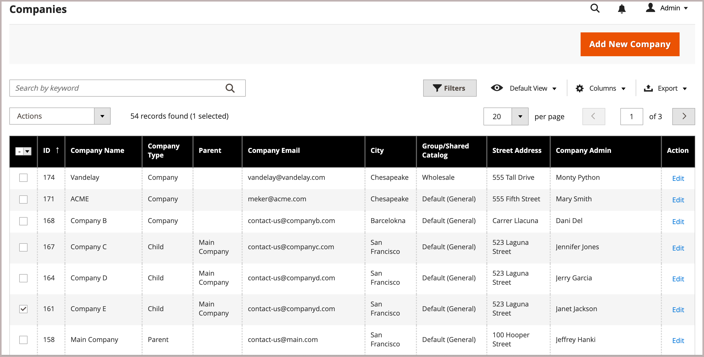
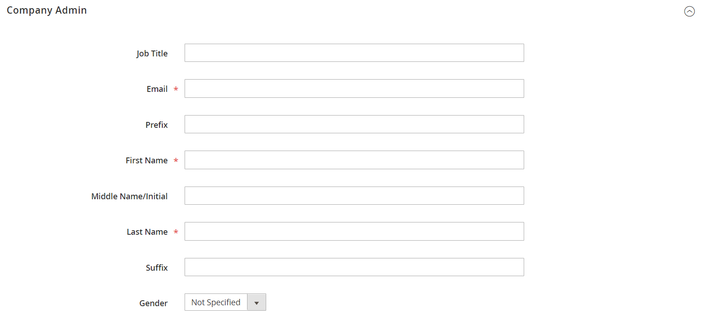

# Assign a company administrator

The company administrator is initially assigned when the company account is first created, and can be modified only by a store administrator from the Admin.

- Each company can have only one assigned administrator.
- A company user can be the administrator for only one company.
- Changes to the assigned company administrator must be completed by a store administrator from the Admin.

## Change assigned company administrator

1. On the _Admin_ sidebar, go to **[!UICONTROL Customers]** > **[!UICONTROL Companies]**.

   {width="700" zoomable="yes"}

1. Find the company in the list, and then click **[!UICONTROL Edit]**.

1. Expand  the **[!UICONTROL Company Admin]** section.

   {width="700" zoomable="yes"}

1. Enter the **[!UICONTROL Job Title]** of the new company administrator.

   This action clears the form and the required _[!UICONTROL First Name]_ and _[!UICONTROL Last Name]_ fields are highlighted.

1. Enter the **[!UICONTROL Email]** address of the new company administrator.

   If the system doesn't find the email address in the database, you are prompted to confirm that you want to replace the company administrator.

   - If a user account doesn't exist for the new company administrator, the system creates an account of the `Company Admin` type.

   - If the user account exists in the system, it is moved to the company administrator position in the company structure.

1. Enter the **[!UICONTROL First Name]** and **[!UICONTROL Last Name]**, and any other information as applicable for the new company administrator.

1. When complete, click **[!UICONTROL Save]**.

   The individual account of the former company administrator remains in the system as an active user account, assigned to the default user role. If this is the only company associated with the user account, the account type changes from *[!UICONTROL Company user]* to *[!UICONTROL Individual user]*.

   The system sends email notification of the change to the new and former company administrators.

