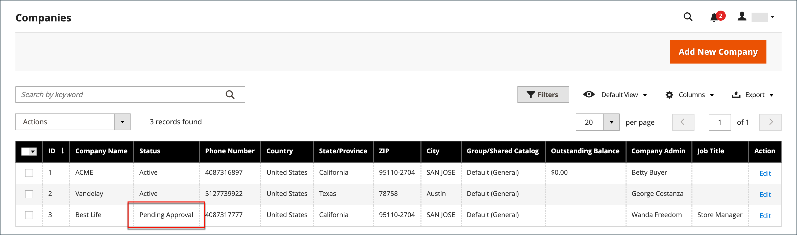
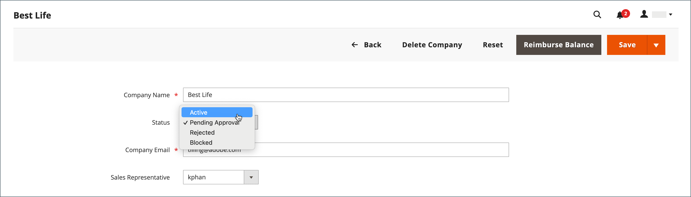

# Approve a Company Account

The status of requests received from the storefront to create a company are “Pending Approval” until the request is reviewed by the store administrator, and either approved or rejected. The status of a company account might be set to any of the following:

- Active
- Pending Approval
- Rejected
- Blocked

You can also use the [Actions control](account-company-manage.md) to approve multiple company requests. New company requests are easy to find, because they appear at the top of the list in the _Companies_ grid.

<!--- zoom --->

## Approve a pending company account

1. On the _Admin_ sidebar, go to **Customers** > **Companies**.

   All pending requests appear at the top of the list. To make them more noticeable, you can adjust the grid layout to include the _Status_ column.

1. In the _Action_ column, click **Edit**.

1. Set **Company Status** to `Active`.

   <!--- zoom --->

1. When prompted to confirm, click **Change status**.

   The company administrator receives notification that the company is now active.

1. If applicable, set **Sales Representative** to a specific Admin user account.

1. Expand   the **Account Information** section and use the **Comment** field to enter notes about the account.

   The comments are not visible from the storefront.

1. When complete, click **Save**.

   A confirmation email is sent to the company and company administrator with instructions to set the account password.

## Company status

| Status           | Description |
|------------------| ----------- |
| Active           | The company is approved and can be managed from the storefront by the company administrator. |
| Pending Approval | A request to create a company account was submitted from the storefront, but is not yet reviewed. |
| Rejected         | The request to create a company account was rejected by the store administrator. |
| Blocked          | The company account is no longer in good standing, and the customer cannot access the account from the storefront. |

{style="table-layout:auto"}
