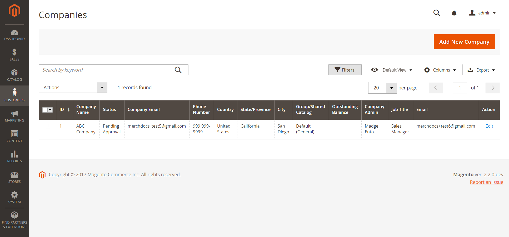
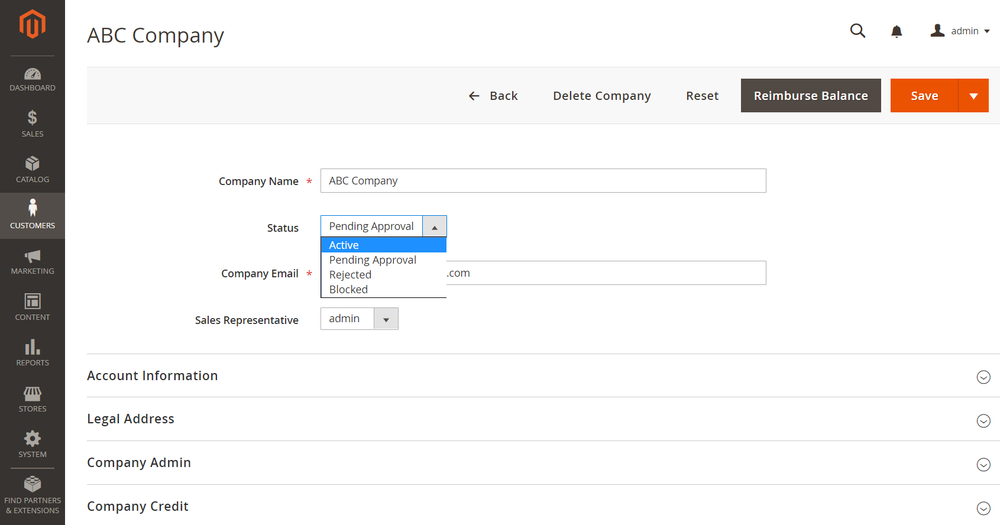

# Approve a company account

The status of requests received from the storefront to create a company are `Pending Approval` until the request is reviewed by the store administrator, and either approved or rejected. The status of a company account might be set to any of the following:

- [!UICONTROL Active]
- [!UICONTROL Pending Approval]
- [!UICONTROL Rejected]
- [!UICONTROL Blocked]

You can also use the [Actions control](account-company-manage.md) to approve multiple company requests.

{width="700" zoomable="yes"}

## Approve a pending company account

1. On the _Admin_ sidebar, go to **[!UICONTROL Customers]** > **[!UICONTROL Companies]**.

   You can use the _[!UICONTROL Columns]_ selector above the grid to display the **[!UICONTROL Status]** column.

1. In the _[!UICONTROL Action]_ column, click **[!UICONTROL Edit]**.

1. Set **[!UICONTROL Company Status]** to `Active`.

   {width="700" zoomable="yes"}

1. When prompted to confirm, click **[!UICONTROL Change status]**.

   The company administrator receives email notification that the company is now active.

1. If applicable, set **[!UICONTROL Sales Representative]** to a specific Admin user account.

1. Expand   the **[!UICONTROL Account Information]** section and use the **[!UICONTROL Comment]** field to enter notes about the account.

   The comments are not visible from the storefront.

1. When complete, click **[!UICONTROL Save]**.

   A confirmation email is sent to the company and company administrator that the company account is approved.

## Company status

| Status           | Description                                                                                                                                |
|------------------|--------------------------------------------------------------------------------------------------------------------------------------------|
| [!UICONTROL Active] | The company is approved and can be managed from the storefront by the company administrator.                                               |
| [!UICONTROL Pending Approval] | A request to create a company account was submitted from the storefront, but is not yet reviewed.                                          |
| [!UICONTROL Rejected] | The request to create a company account was rejected by the store administrator.                                                           |
| [!UICONTROL Blocked]| The company account is no longer in good standing. The customer can access the account from the storefront, but cannot make purchases. |

{style="table-layout:auto"}
