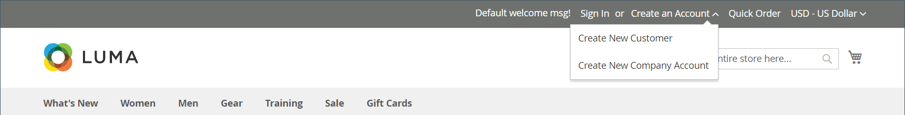
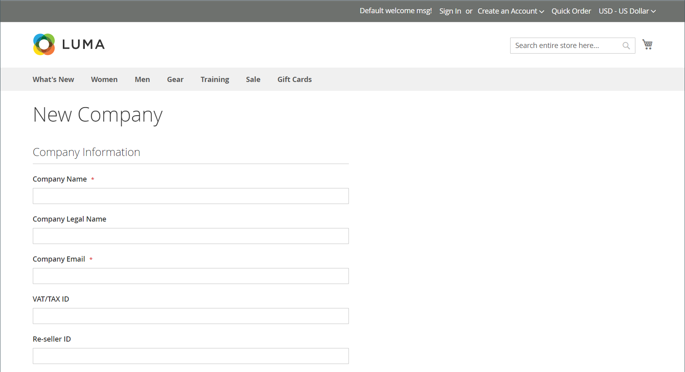
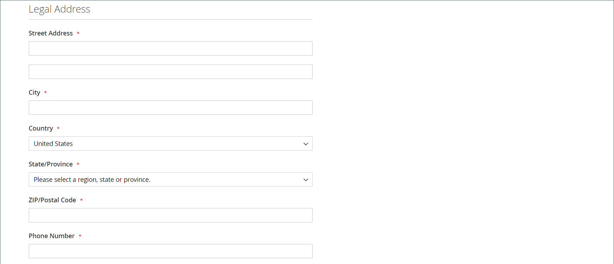
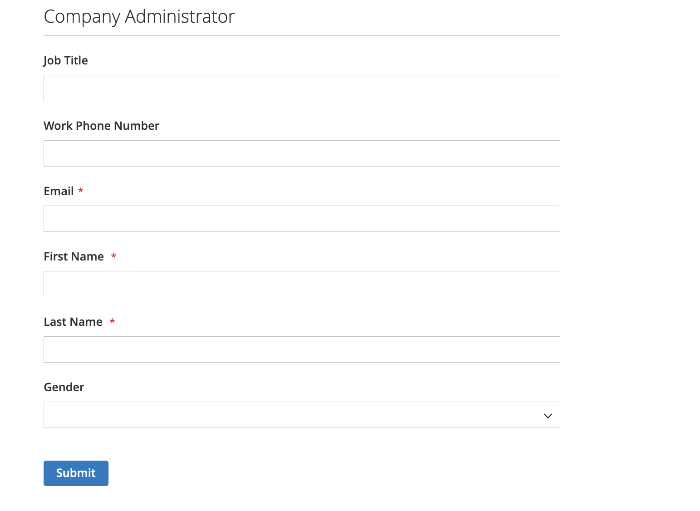
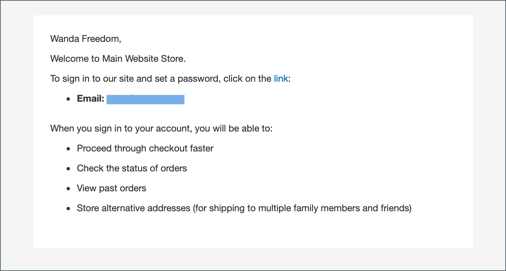
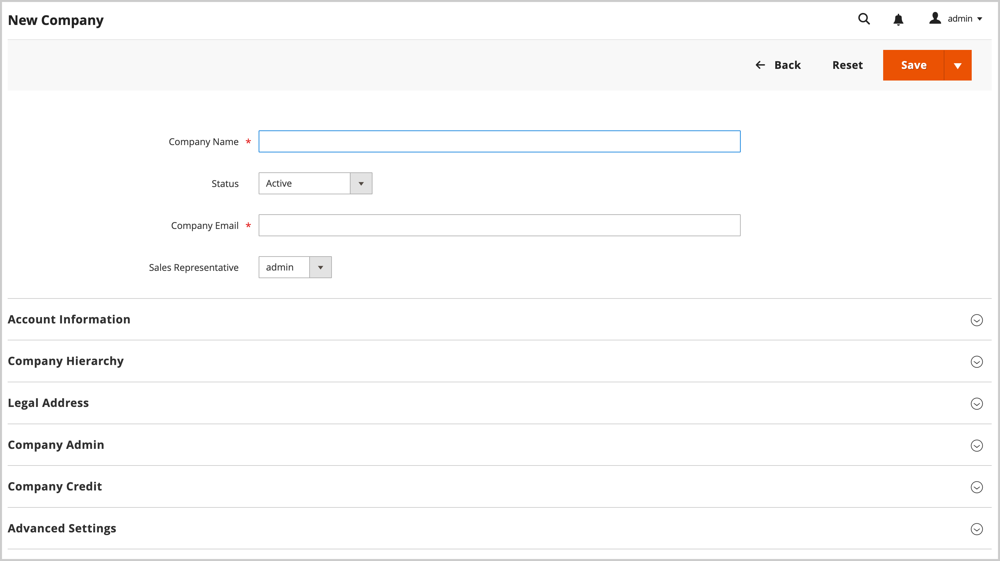
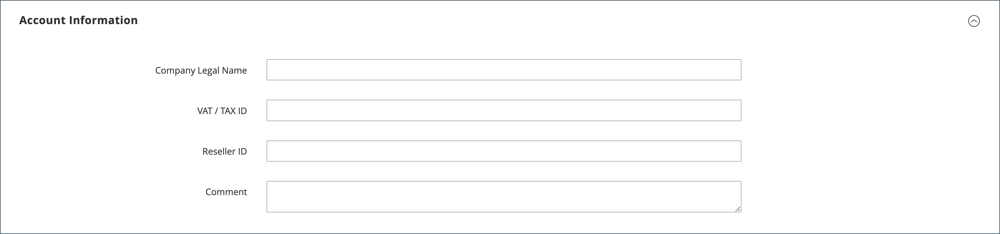

# Create a company account

Company accounts enable B2B businesses to manage their purchasing, users, and credit within Adobe Commerce. This topic covers the complete process of creating, configuring, and activating company accounts.

## Company Account Creation Overview

Company accounts can be created through two methods, each suited for different business scenarios:

* **Storefront Registration**—Self-service account requests by businesses
* **Admin Creation**—Sales-assisted account setup with pre-configured details

All company accounts require administrator approval before becoming active, ensuring proper vetting and configuration.

## Prerequisites

Before creating company accounts, ensure the following requirements are met:

* **System Requirements:**
  * [B2B features are enabled](enable-basic-features.md) in your Adobe Commerce installation
  * Company registration is enabled for storefront creation
  * Email notifications are configured for approval workflows

* **Business Requirements:**
  * Approval processes and policies are established
  * Sales representatives are assigned (for Admin-created accounts)
  * Credit policies are defined (if using company credit)
  * Customer groups and shared catalogs are configured

* **Administrative Access:**
  * Appropriate permissions for company management
  * Access to customer and company administration sections

The system assigns the [company administrator](account-company-admin.md) role to the person who sets up a company account from the storefront. After the store administrator approves the company account creation request in the Admin, the company administrator can set an account password and log in to the account.

## Method 1: Customer creates the account from the storefront

**When to Use This Method:**

* Self-service business registration is preferred
* Customers have all necessary business information readily available
* Standard approval workflow is sufficient
* No special configuration or pre-population is required

>[!IMPORTANT]
>
>To support this method (allowing customers to register their company from the storefront), make sure that the [B2B Features](enable-basic-features.md) are enabled.

1. In the upper-right corner of the storefront header, the customer clicks **[!UICONTROL Create an Account]** and chooses **[!UICONTROL Create New Company Account]**.

   {width="700" zoomable="yes"}

   >[!NOTE]
   >
   >If a visitor is logged in to a registered user account, they can create a company account by navigating to _[!UICONTROL Customer Profile]_ > **[!UICONTROL Company Structure]** > **[!UICONTROL Create a Company Account]**.

1. In the _[!UICONTROL Company Information]_ section, the customer does the following:

   - Completes the required fields:

      - **[!UICONTROL Company Name]**
      - **[!UICONTROL Company Email]**

   - Completes the remaining fields, as applicable:

      - **[!UICONTROL Company Legal Name]**
      - **[!UICONTROL VAT/TAX ID]**
      - **[!UICONTROL Reseller ID]**

   {width="700" zoomable="yes"}

1. Completes the required fields in the _[!UICONTROL Legal Address]_ section.

   - **[!UICONTROL Street Address]**
   - **[!UICONTROL City]**
   - **[!UICONTROL Country]**
   - **[!UICONTROL State/Province]**
   - **[!UICONTROL ZIP/Postal Code]**
   - **[!UICONTROL Phone Number]**

   {width="700" zoomable="yes"}

1. In the _[!UICONTROL Company Administrator]_ section, does the following:

   - Enters the **[!UICONTROL Email address]** for the company administrator.

      The email address for the company administrator can be the same as the company email address or a different email address. If you enter a different email address, the system creates a company user account, in addition to the company administrator account.

   - Enters the **[!UICONTROL First Name]** and **[!UICONTROL Last Name]** of the company administrator.

   - Optionally completes the following fields:

      - **[!UICONTROL Job Title]**
      - **[!UICONTROL Work Phone Number]**
      - **[!UICONTROL Gender]**

   

1. Completes the validation if reCAPTCHA is enabled for this storefront function.

1. When the information is complete, select **[!UICONTROL Submit]**.

   When the merchant approves the request to create a company account, the system sends an email notification to the company administrator.

   {width="500"}

   When the password is set, the company administrator can [sign in](../customers/customer-sign-in.md) to the account.

## Method 2: Merchant creates the account from the Admin

**When to Use This Method:**

* Sales-assisted account creation is preferred
* Pre-populating account details from existing business relationships
* Custom configuration is required (credit limits, special pricing)
* Immediate activation without approval workflow is needed

The process of creating a company from the Admin is essentially the same as from the storefront, but with additional fields.

{width="700" zoomable="yes"}

1. On the _Admin_ sidebar, go to **[!UICONTROL Customers]** > **[!UICONTROL Companies]**.

1. Click **[!UICONTROL Add New Company]** and do the following:

   - Complete these required fields:

      - **[!UICONTROL Company Name]**
      - **[!UICONTROL Company Email]**

   - If you are not ready for the account to go live, set **[!UICONTROL Status]** to `Pending Approval`. (Set to `Active` by default.)

   - If applicable, choose the Admin account of the **[!UICONTROL Sales Representative]** who is to manage the account.

1. In the _[!UICONTROL Account Information]_ section, do the following:

   - Complete the following fields as applicable:

      - **[!UICONTROL Company Legal Name]**
      - **[!UICONTROL VAT/TAX ID]**
      - **[!UICONTROL Reseller ID]**

   - For **[!UICONTROL Comment]**, enter any additional information about the customer that might be needed.

      The comments are visible only from the Admin.

   {width="700" zoomable="yes"}

1. When you initially create a company, the _[!UICONTROL Company Hierarchy]_ grid appears empty when you expand it. After you save the company, you can include it in a company hierarchy. See [Company Management](manage-companies.md).

1. In the _[!UICONTROL Legal Address]_ section, complete these required fields:

   - **[!UICONTROL Street Address]**
   - **[!UICONTROL City]**
   - **[!UICONTROL Country]**
   - **[!UICONTROL ZIP/Postal Code]**
   - **[!UICONTROL Phone Number]**

1. In the _[!UICONTROL Company Admin]_ section, do the following:

   - Complete these required fields:

      - **[!UICONTROL Email]**
      - **[!UICONTROL First Name]**
      - **[!UICONTROL Last Name]**

   - Complete the following optional parts of the name, which might be applicable to some customer names more than others and can be used at your discretion:

      - **[!UICONTROL Prefix]**
      - **[!UICONTROL Middle Name/Initial]**
      - **[!UICONTROL Suffix]**

   - If the information is available, complete the remaining fields to describe the company administrator:

      - **[!UICONTROL Website]**
      - **[!UICONTROL Job Title]**
      - **[!UICONTROL Work Phone Number]**
      - **[!UICONTROL Gender]**
      - **[!UICONTROL Send Welcome Email From]**

    {width="700" zoomable="yes"}

1. In the _[!UICONTROL Company Credit]_ section, which displays a summary of the customer's credit activity, complete as many of the fields in the lower part of the section as applicable:

   - **[!UICONTROL Credit Currency]**
   - **[!UICONTROL Credit Limit]**
   - **[!UICONTROL Allow to Exceed Credit Limit]**
   - **[!UICONTROL Reason for Change]**

   {width="700" zoomable="yes"}

1. In the _[!UICONTROL Advanced Settings]_ section, do the following:

   >[!NOTE]
   >
   >The customer group assignment determines which shared catalog is available to the company and its employees. By default, the system assigns the company to the customer group configured as the default.

   - You can change the **[!UICONTROL Customer Group]** assignment for the company and its employees to a group that has access to a different shared catalog or to a standard customer group. The system prompts you to confirm before changing the group.

      {width="600"}

   - If you want to allow company employees to generate quotes from their account, set **[!UICONTROL Allow Quotes]** to `Yes`.

   - If you want to allow company employees to create and use purchase orders from their account, set **[!UICONTROL Enable Purchase Orders]** to `Yes`.

   - To change the **[!UICONTROL Applicable Payment Methods]** that are available to the company, clear the **[!UICONTROL Use config settings]** checkbox and choose one of the following:

      | Option                        | Description                                                                                                                                                                                                                             |
      |-------------------------------|-----------------------------------------------------------------------------------------------------------------------------------------------------------------------------------------------------------------------------------------|
      | `B2B Payment Methods`         | (Default) Enables all [payment methods set as default](../configuration-reference/general/b2b-features.md#default-b2b-payment-methods) for B2B orders.                                                                                  |
      | `All Enabled Payment Methods` | Makes all [enabled payment methods](../configuration-reference/sales/payment-methods.md) available for customer accounts associated with the company account.                                                                           |
      | `Selected Payment Methods`    | Allows you to select the payment methods that are available for customer accounts associated with the company account. To select multiple payment methods, hold down the Ctrl key (PC) or the Command key (Mac) and select each option. |

      {style="table-layout:auto"}

   - To change the **[!UICONTROL Applicable Shipping Methods]** that are available to the company, clear the **[!UICONTROL Use config settings]** checkbox and choose one of the following:

      | Option                         | Description                                                                                                                                                                                                                                        |
      |--------------------------------|----------------------------------------------------------------------------------------------------------------------------------------------------------------------------------------------------------------------------------------------------|
      | `B2B Shipping Methods`         | (Default) Enables all [shipping methods set as default](../configuration-reference/general/b2b-features.md#default-b2b-shipping-methods) for B2B orders.                                                                                           |
      | `All Enabled Shipping Methods` | Makes all [enabled shipping methods](../configuration-reference/sales/delivery-methods.md) available for customer accounts associated with the company account.                                                                                    |
      | `Selected Shipping Methods`    | Allows you to select the shipping methods that are available for customer accounts that are associated with the company account. To select multiple shipping methods, hold down the Ctrl key (PC) or the Command key (Mac) and select each option. |

      {style="table-layout:auto"}

1. When complete, select **[!UICONTROL Save]**.

   When the request to create a company account is approved by the merchant, an email notification is sent to the email address of the company administrator.

   When the password is set, the company administrator can [sign in](../customers/customer-sign-in.md) to the account.

## After Account Creation

Once a company account is created, the following process occurs:

### 1. Approval Workflow

* **Pending Status**—New accounts await administrator review
* **Review Process**—Store administrators verify business information and approve/reject requests
* **Status Updates**—Companies receive email notifications about approval status changes

### 2. Account Activation

* **Welcome Email**—Approved company administrators receive setup instructions
* **Password Setup**—Administrators create secure passwords for account access
* **Initial Login**—First-time access to the company dashboard and features

### 3. Next Steps for Company Administrators

After activation, company administrators should:

* **[Configure Company Structure](account-company-structure.md)**—Set up departments and user hierarchy
* **[Manage Company Users](account-company-users.md)**—Add employees and assign roles
* **[Set Up Purchase Orders](purchase-order-flow.md)**—Configure approval workflows if needed
* **[Review Credit Settings](credit-company.md)**—Understand and manage company credit (if enabled)

## Common issues and troubleshooting

### Account creation problems

**Registration form fails to submit**

* Verify all required fields are completed correctly
* Check that email addresses are valid and unique
* Ensure B2B features are enabled and company registration is allowed
* Clear browser cache and try again

**Company Name Already Exists**

* Choose a unique company name
* Contact administrator if you believe this is an error
* Consider adding location or business unit identifier

**Email Address Issues**

* Use business email addresses rather than personal ones
* Ensure the company administrator email is accessible
* Check that the domain isn't blocked by email filters

### Approval and activation issues

**Approval Email Not Received**

* Check spam/junk email folders
* Verify the email address was entered correctly during registration
* Contact the store administrator for manual approval status check
* Allow 24-48 hours for processing during business days

**Cannot Set Password After Approval**

* Use the exact link provided in the approval email
* Check if the activation link has expired
* Request a new activation email from the administrator

**Access Issues After Activation**

* Verify that you're logging in through the correct company account portal
* Check that your account status is "Active"
* Ensure you're using the company administrator credentials
* Contact support if permissions seem incorrect

## Security best practices

When creating and managing company accounts:

* **Use Strong Passwords**—Require complex passwords for company administrators
* **Verify Business Information**—Validate company details during the approval process
* **Monitor Account Activity**—Regularly review company user access and permissions
* **Protect Sensitive Data**—Ensure credit and financial information is properly secured

## Company account user interface reference

### Button bar

| Button                    | Description                                                      |
|---------------------------|------------------------------------------------------------------|
| [!UICONTROL Back ]        | Returns to the Companies page without saving changes.            |
| [!UICONTROL Reset]        | Restores the original values to any fields with unsaved changes. |
| [!UICONTROL Save]         | Saves changes to the company, and keeps the profile open.        |
| [!UICONTROL Save & Close] | Saves changes to the company and closes the profile.             |

{style="table-layout:auto"}

### Field descriptions

| Field                             | Description                                                                                                                                                                                                                                                                                                                                                                                                                                                                                                                                                                                                                                                                                                                                                                                                                                                                                                                     |
|-----------------------------------|---------------------------------------------------------------------------------------------------------------------------------------------------------------------------------------------------------------------------------------------------------------------------------------------------------------------------------------------------------------------------------------------------------------------------------------------------------------------------------------------------------------------------------------------------------------------------------------------------------------------------------------------------------------------------------------------------------------------------------------------------------------------------------------------------------------------------------------------------------------------------------------------------------------------------------|
| [!UICONTROL Company Name]         | The company name is entered when the company account is first created, and can be a shortened version of the full legal name.                                                                                                                                                                                                                                                                                                                                                                                                                                                                                                                                                                                                                                                                                                                                                                                                   |
| [!UICONTROL Status]               | (Admin Only) Indicates the current state of the company account. Options:  **[!UICONTROL Active]** - The company account is approved by the store administrator. The company administrator and associated members can log in the account from the storefront and make purchases.  **[!UICONTROL Pending Approval]** - A request to open a company account has been submitted, but is not yet approved by the store administrator.  **[!UICONTROL Rejected]** - A request to open a company account was submitted, but not approved by the store administrator. The initial login credentials that were used to submit the request are blocked.  **Blocked** - Company members can log in and access the catalog, but cannot make purchases. The store administrator might block a company account that is not in good standing. The block on the account can be removed by the store administrator at any time. |
| [!UICONTROL Company Email]        | The email address that is associated with the company account.                                                                                                                                                                                                                                                                                                                                                                                                                                                                                                                                                                                                                                                                                                                                                                                                                                                                  |
| [!UICONTROL Sales Representative] | (Admin Only) The Admin user who is the primary contact for the company account.                                                                                                                                                                                                                                                                                                                                                                                                                                                                                                                                                                                                                                                                                                                                                                                                                                                 |

{style="table-layout:auto"}

#### [!UICONTROL Account Information]

| Field                           | Description                                                                                                                                                                                                                                                                                                                                                                                                                                                     |
|---------------------------------|-----------------------------------------------------------------------------------------------------------------------------------------------------------------------------------------------------------------------------------------------------------------------------------------------------------------------------------------------------------------------------------------------------------------------------------------------------------------|
| [!UICONTROL Company Legal Name] | The full legal name of the company.                                                                                                                                                                                                                                                                                                                                                                                                                             |
| [!UICONTROL VAT / TAX ID]       | The [value-added tax](../stores-purchase/vat.md) number that is assigned to the company by some jurisdictions for tax reporting purposes. To configure the customer VAT/TAX ID to appear in the storefront, see [Create New Account Options](../configuration-reference/customers/customer-configuration.md).   **_Note:_** The company administrator and other company users do not have their own separate VAT/TAX ID numbers in their customer accounts. |
| [!UICONTROL Reseller ID]        | The resale number that is assigned to the company for tax reporting purposes.                                                                                                                                                                                                                                                                                                                                                                                   |
| [!UICONTROL Comment]            | (Admin Only) These notes about the company account are for reference and visible only from the Admin.                                                                                                                                                                                                                                                                                                                                                           |

{style="table-layout:auto"}

#### [!UICONTROL Company Hierarchy]

| Field                             | Description                                                                                                                                          |
|-----------------------------------|------------------------------------------------------------------------------------------------------------------------------------------------------|
| [!UICONTROL Company ID]           | The ID number of the company.                                                                                                                        |
| [!UICONTROL Company Name]         | The full name of the company.  A `current company indicator` appears in the company line being edited.                                           |
| [!UICONTROL Company Email]        | The email address that is associated with the company account.                                                                                       |
| [!UICONTROL Phone Number]         | The primary phone number of the company.                                                                                                             |
| [!UICONTROL Country]              | The country where the company is registered to conduct business.                                                                                     |
| [!UICONTROL State/Province]       | The state or province where the company is registered to conduct business.                                                                           |
| [!UICONTROL City]                 | The city where the company is registered to conduct business.                                                                                        |
| [!UICONTROL Group/Shared Catalog] | (Admin Only) Shows the [customer group](../customers/customer-groups.md) or [shared catalog](catalog-shared.md) assigned to the company. |
| [!UICONTROL Company Admin]        | The full name of the company administrator.                                                                                                          |
| [!UICONTROL Action]               | The list of possible actions for that company line.                                                                                                  |

{style="table-layout:auto"}

#### [!UICONTROL Legal Address]

| Field                        | Description                                                                 |
|------------------------------|-----------------------------------------------------------------------------|
| [!UICONTROL Street Address]  | The street address where the company is registered to conduct business.     |
| [!UICONTROL City]            | The city where the company is registered to conduct business.               |
| [!UICONTROL Country]         | The country where the company is registered to conduct business.            |
| [!UICONTROL State/Province]  | The state or province where the company is registered to conduct business.  |
| [!UICONTROL ZIP/Postal Code] | The ZIP or postal code where the company is registered to conduct business. |
| [!UICONTROL Phone Number]    | The primary phone number of the company.                                    |

{style="table-layout:auto"}

#### [!UICONTROL Company Admin]

| Field                                | Description                                                                                                                                                                                                                                       |
|--------------------------------------|---------------------------------------------------------------------------------------------------------------------------------------------------------------------------------------------------------------------------------------------------|
| [!UICONTROL Website]                 | Determines the website that the company administrator belongs to.                                                                                                                                                                                 |
| [!UICONTROL Job Title]               | The title of the company administrator who manages the company account.                                                                                                                                                                           |
| [!UICONTROL Work Phone Number]       | The phone number of the company administrator who manages the company account.                                                                                                                                                                    |
| [!UICONTROL Email]                   | The email address of the company administrator can be the same as the company email address. If you enter a different email address, the system creates a separate individual account for the company administrator, in addition to the company account. |
| [!UICONTROL Prefix]                  | If applicable, the prefix associated with the company administrator's name (such as `Mr.`, `Ms.`, `Mrs.`, or `Dr.`). Depending on the configuration, the input field might be a text field or list.                                  |
| [!UICONTROL First Name]              | The first name of the company administrator.                                                                                                                                                                                                      |
| [!UICONTROL Middle Name/Initial]     | The middle name or initial of the company administrator.                                                                                                                                                                                          |
| [!UICONTROL Last Name]               | The last name of the company administrator.                                                                                                                                                                                                       |
| [!UICONTROL Suffix]                  | If applicable, the suffix that is associated with the name of the company administrator (such as `Jr.`, `Sr.`, or `III.`). Depending on the configuration, the input field might be a text field or list.                                         |
| [!UICONTROL Gender]                  | The gender of the company administrator. Options: `Male` / `Female` / `Not Specified`                                                                                                                                                             |
| [!UICONTROL Send Welcome Email From] | The store view from which the system sends the Welcome email.                                                                                                                                                                                        |

{style="table-layout:auto"}

#### [!UICONTROL Company Credit]

| Field                                     | Description                                                                                                                                                                             |
|-------------------------------------------|-----------------------------------------------------------------------------------------------------------------------------------------------------------------------------------------|
| [!UICONTROL Credit Currency]              | (Admin Only) The currency that is accepted by the store for purchases on company credit.                                                                                                |
| [!UICONTROL Credit Limit]                 | (Admin Only) The credit limit that is extended to the company account.                                                                                                                  |
| [!UICONTROL Allow to Exceed Credit Limit] | (Admin Only) Indicates if the company has permission to exceed the credit limit. Options: `Yes` / `No`                                                                                  |
| [!UICONTROL Reason for Change]            | (Admin Only) A note that explains why the company is allowed, or disallowed to exceed the credit limit. This field is active only if the permission to exceed the credit limit changes. |

{style="table-layout:auto"}

#### [!UICONTROL Advanced Settings]

You can configure advanced settings for individual companies. If you create a company hierarchy, you can streamline the settings configuration by configuring the settings for the parent company and applying those settings to all or selected child companies instead of configuring each child company individually. For more information, see [Manage the Company Hierarchy](manage-company-hierarchy.md).

| Field                                    | Description                                                                                                                                                                                                              |
|------------------------------------------|--------------------------------------------------------------------------------------------------------------------------------------------------------------------------------------------------------------------------|
| [!UICONTROL Customer Group]              | (Admin Only) Shows the [customer group](../customers/customer-groups.md) or [shared catalog](catalog-shared.md) assigned to the company.                                                                     |
| [!UICONTROL Allow Quotes]                | (Admin Only) Determines if company members can prepare and submit negotiable quotes on behalf of the company.                                                                                                            |
| [!UICONTROL Enable Purchase Orders]      | (Admin Only) Determines if company members can submit orders as [purchase orders](account-dashboard-my-purchase-orders.md) on behalf of the company.                                                                     |
| Applicable Payment Methods               | (Admin Only) Indicates the payment methods that are available for company purchases. Options: `B2B Payment Methods` / `All Enabled Payment Methods` / `Selected Payment Methods`                                         |
| [!UICONTROL Payment Methods]             | (Admin Only) Becomes active if you activate specific payment methods. To make multiple payment methods available for the company account, hold down the Ctrl key (PC) or the Command key (Mac) and select each option.  |
| [!UICONTROL Applicable Shipping Methods] | (Admin Only) Indicates the shipping methods that are available for company purchases. Options: `B2B Shipping Methods` / `All Enabled Shipping Methods` / `Selected Shipping Methods`                                     |
| [!UICONTROL Shipping Methods]            | (Admin Only) Becomes active if you activate specific shipping methods. To make multiple shipping methods available for the company account, hold down the Ctrl key (PC) or the Command key (Mac) and select each option. |

{style="table-layout:auto"}

>[!MORELIKETHIS]
>
>* [Enable B2B Features](enable-basic-features.md)—Configure foundational B2B functionality
>* [Company Account Structure](account-company-structure.md)—Organize users and departments from the storefront
>* [Manage Company Users](account-company-users.md)—Add and configure employee accounts from the storefront
>* [Company Administrator Role](account-company-admin.md)—Understand administrator responsibilities
>* [Manage Companies](manage-companies.md)—Administrative overview of company management
>* [Company Credit Management](credit-company.md)—Set up and manage company credit from the Admin
>* [Purchase Order Workflow](purchase-order-flow.md)—Configure approval processes from the Admin
>* [Company Roles and Permissions](account-company-roles-permissions.md)—Control user access levels from the Admin
>* [B2B Configuration Reference](../configuration-reference/general/b2b-features.md)—Detailed system settings
