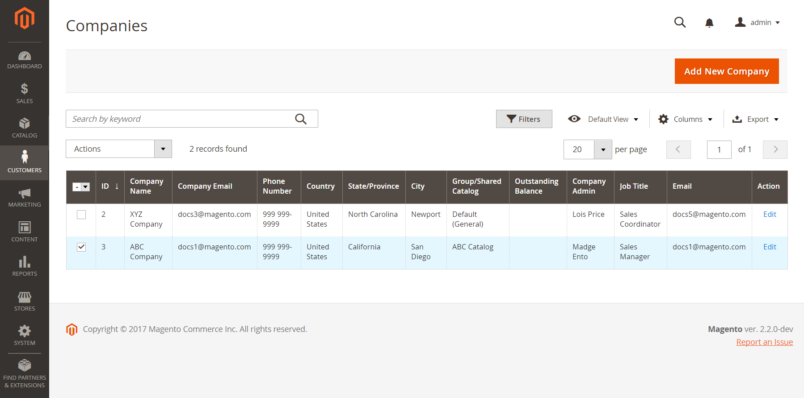
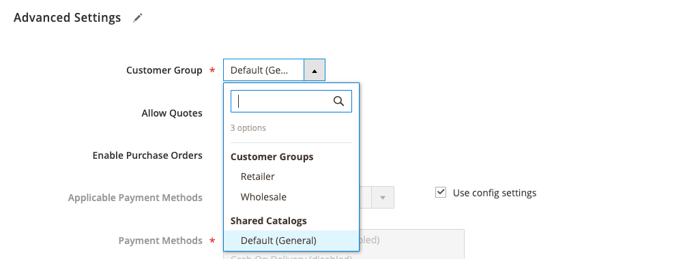

# Assign a customer group to a company

Assigning a customer group to a company is essentially the same as assigning a shared catalog. If Shared Catalog is not [enabled in the configuration](enable-basic-features.md), a Customer Group — rather than a Shared Catalog — is assigned to a company.

- Only one customer group or shared catalog can be assigned to a company at a time. A customer group that is associated with a shared catalog cannot be deleted.
- Changing the customer group assigned to the company updates the profiles of all company members.
- If the customer group assignment is changed from a shared catalog to a regular customer group, company members lose access to the shared catalog and the primary catalog becomes available to them from the storefront.
- After changing the company group, a company user must log out and log in on the Storefront to see new prices in the catalog.

## Change the customer group

1. On the _Admin_ sidebar, go to **[!UICONTROL Customers]** > **[!UICONTROL Companies]**.

1. Find the company in the grid and click **[!UICONTROL Edit]** in the _[!UICONTROL Action]_ column.

   {width="700" zoomable="yes"}

1. On the company page, scroll down and expand  the **[!UICONTROL Advanced Settings]** section.

1. Set the appropriate **[!UICONTROL Customer Group]**.
   
   The [!UICONTROL Customer Group] list includes all existing shared catalogs, even if Shared Catalogs is disabled in the configuration.

   {width="600"}

1. When prompted to confirm, click **[!UICONTROL Proceed]**.

1. Click **[!UICONTROL Save]**.
