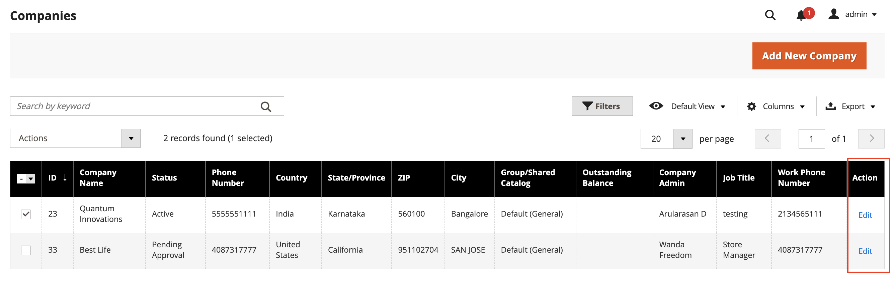

# Assign a Customer Group to a Company

Assigning a customer group to a company is essentially the same as assigning a shared catalog. If Shared Catalog is not [enabled in the configuration](enable-basic-features.md), a Customer Group — rather than a Shared Catalog — is assigned to a company.

>[!NOTE]
>
> Only one customer group or shared catalog can be assigned to a company at a time. A customer group that is associated with a shared catalog cannot be deleted.

1. On the _Admin_ sidebar, go to **[!UICONTROL Customers]** > **[!UICONTROL Companies]**.

2. Find the company in the grid and click **[!UICONTROL Edit]** in the _[!UICONTROL Action]_ column.

   <!-- zoom -->

3. On the company page, scroll down and expand  the **[!UICONTROL Advanced Settings]** section.

   <!-- zoom -->

4. Set the appropriate **[!UICONTROL Customer Group]**.

   >[!NOTE]
   >
   >The Customer Group list includes all existing shared catalogs, even if Shared Catalogs is disabled in the configuration.

   Changing the customer group assigned to the company updates the profiles of all company members.

   >[!NOTE]
   >
   >If the customer group assignment is changed from a shared catalog to a regular customer group, company members lose access to the shared catalog and the primary catalog becomes available to them from the storefront.

5. When prompted to confirm, click **[!UICONTROL Proceed]**.

6. Click **[!UICONTROL Save]**.
