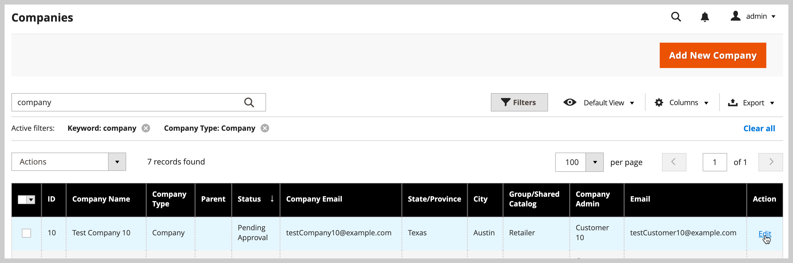
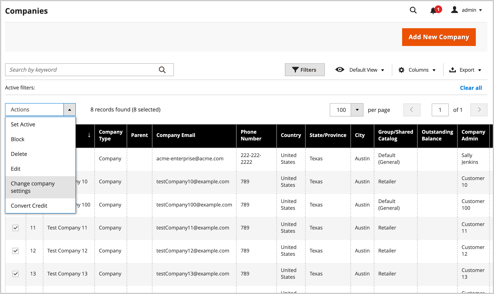
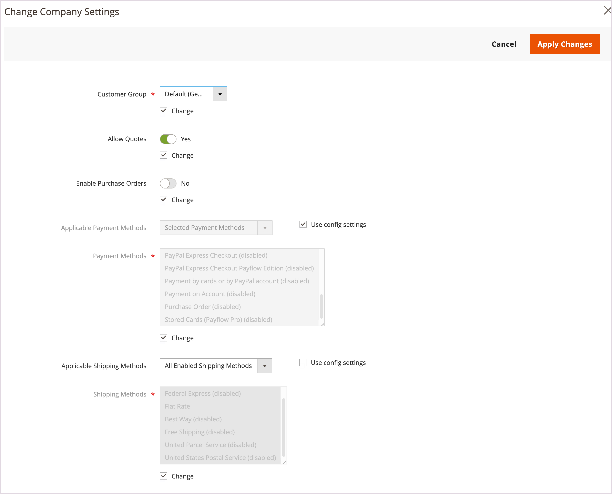
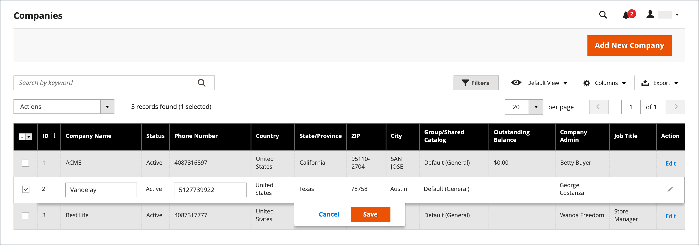
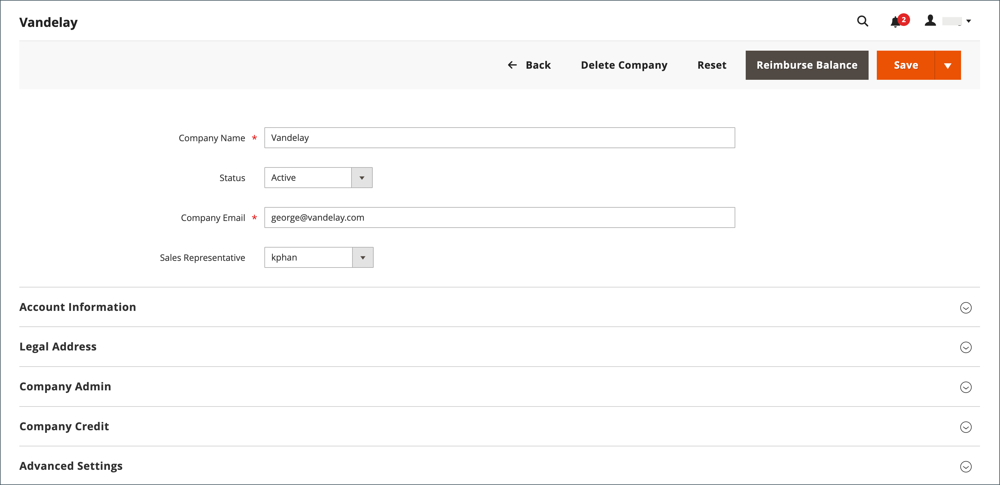

# Manage company accounts

The _[!UICONTROL Companies]_ page lists all current company accounts, regardless of status. Any pending requests for approval appear at the top of the list.

{width="700" zoomable="yes"}

Use the *[!UICONTROL Columns]* control to customize the columns displayed in the grid. Customize the company information displayed in the view using the search and filter capabilities.

- Find companies in the **Companies** grid by using the _[!UICONTROL Search]_. The search indexes the **Company Name** and **Parent** columns.

- Customize the view to include records that meet specific criteria by using the [!UICONTROL Filter]. For example, if the B2B site is configured to manage both single company accounts and [company hierarchies](manage-companies.md), you can filter by `[!UICONTROL Company Type - Company]` to display only single companies, or by `[!UICONTROL Company Type - Parent]` to show only the parent company for each hierarchy.

Apply an action to multiple company records by using the _[!UICONTROL Actions]_ control above the grid. For example, rather than approving each individual company request, you can select multiple requests to activate the accounts in a single action. The available actions depend on the [permissions](../systems/permissions.md) for the role that is assigned to your Admin user account.

## Company role resources

The [Role Resources](../systems/permissions-user-roles.md#role-resources) settings determine the ability to:

- Add a company
- Delete a company
- Apply a balance reimbursement
- View companies

These role resources must be set for the [User Role](../systems/permissions-user-roles.md) that is assigned to the Admin user account.

## Manage company accounts from the Companies grid

View and manage the user accounts for companies from the Admin menu by selecting **[!UICONTROL Customers]** > **[!UICONTROL Companies]** to open the *[!UICONTROL Companies]* page.

You can manage accounts individually or in groups.

- View or change configuration settings for an individual company account by selecting **[!UICONTROL Edit]** in the **[!UICONTROL Action]** column for the company account record.

  {width="675" zoomable="yes"}

- View or change a group of selected company accounts by using the options available from the [!UICONTROL Actions]** control above the grid.

  {width="675" zoomable="yes"}

See the following sections for instructions to apply each action.

### Activate company accounts

1. From the **[!UICONTROL Actions]** control, select **[!UICONTROL Set Active]**.

1. When prompted to confirm, click **[!UICONTROL OK]**.

### Set active/inactive

Customers with inactive accounts cannot log in or make purchases from their accounts. There are two methods to set a customer account as active or inactive:

Method 1: **From the Customers grid**

1. On the _Admin_ sidebar, go to [!UICONTROL **Customers**] > [!UICONTROL **All Customers**].

1. From the **[!UICONTROL Actions]** menu, select one of the following:

   - **[!UICONTROL Active]**
   - **[!UICONTROL Inactive]**

1. When prompted, select **[!UICONTROL OK]** to apply the change.

Method 2: **From the account edit page**

1. On the _Admin_ sidebar, go to [!UICONTROL **Customers**] > [!UICONTROL **All Customers**].

1. In the grid, find the customer record to be edited.

1. In the _Actions_ column on the far right, select [!UICONTROL **Edit**].

1. Select the [!UICONTROL **Account Information**] tab.

1. Set [!UICONTROL **Customer Active**] to `Yes` or `No`.

1. Click [!UICONTROL **Save Customer**].

### Block company accounts

Users who are associated with a blocked company account can log in and access the catalog, but cannot make purchases. A company with an account that is not in good standing might be blocked temporarily until the matter is resolved.

1. From the **[!UICONTROL Actions]** control, select **[!UICONTROL Block]**.

1. When prompted to confirm, click **[!UICONTROL OK]**.

### Delete company accounts

Deleted company accounts cannot be restored. The status of user accounts that are associated with the company is set to `Inactive` and the Company ID is removed from the profiles of user accounts. Information about company activity and transactions is retained in the system.

1. From the **[!UICONTROL Actions]** control, select **[!UICONTROL Delete]**.

1. When prompted to confirm, click **[!UICONTROL OK]**.

### Change company settings

Update the [Advanced Settings](account-company-create.md#advanced-settings) configuration to apply the same settings to multiple companies selected on the *Companies grid*.

>[!NOTE]
>
>Manage the advanced settings configuration for a company organization with a parent and associated child companies from the [Company Hierarchy view](manage-company-hierarchy.md#change-company-settings).

1. From the **[!UICONTROL Actions]** control, select **[!UICONTROL Change company settings]**.

   On the *[!UICONTROL Change company settings]* form, the initial configuration settings are set to the default values.

1. For each configuration setting to change, select the **[!UICONTROL Change]** checkbox to enable the setting. Then, update the setting as needed.

   {width="675" zoomable="yes"}

1. After updating the configuration settings, select **[!UICONTROL Apply Changes]**.

1. When prompted, select **[!UICONTROL Change settings]** to update the configuration for the selected companies.

>[!TIP]
>
>You can change the advanced settings configuration for a single company by selecting **[!UICONTROL Edit]** in the **[!UICONTROL Action]** column for the company account record.

### Convert the credit currency

The credit in the accounts of selected companies is converted to the current rate of the selected currency.

1. From the **[!UICONTROL Actions]** control, select **[!UICONTROL Convert Currency]**.

1. When prompted to confirm, click **[!UICONTROL OK]**.

1. Choose the **[!UICONTROL Credit Currency]** to be used for the selected company accounts.

   The amounts are recalculated according to the current conversion rates, if available. If not available, you can manually enter custom conversion rates. The system displays as many conversion calculations are needed for the credit currency that is used by the selected companies.

1. Click **[!UICONTROL Proceed]** to complete the conversion.

## Edit a company account

Method 1: **Quick edit**

1. In the first column, select the checkbox of the company account to be edited.

1. From the **[!UICONTROL Actions]** control, select **[!UICONTROL Edit]**.

   Each value that can be updated appears in a text box.

   {width="675" zoomable="yes"}

1. Update any of the following values as needed:

   - **[!UICONTROL Company Name]**

   - **[!UICONTROL Company Email]**

   - **[!UICONTROL Phone Number]**

1. Click **[!UICONTROL Save]**.

Method 2: **Full edit**

1. In the grid, find the company record to be edited.

1. Select **[!UICONTROL Edit]** from the _[!UICONTROL Action]_ column.

1. Make the necessary changes to the company information.

   For field descriptions, see [Create a company account](account-company-create.md).

1. When complete, click **[!UICONTROL Save]**.

## Assign a sales representative

The sales representative is an [Admin user](../systems/permissions.md) who is assigned as the point of contact for a company account and receives all automated [email messages](../b2b/enable-basic-features.md#configure-company-email-options) related to the company. Only one sales representative can be assigned per company account, but a single sales representative can manage multiple company accounts. The default Admin user account is assigned as the sales representative, unless a different Admin user is assigned.

The name and email address of the assigned sales representative is visible to company members from the company account and quotes page.

1. On the _Admin_ sidebar, go to **[!UICONTROL Customers]** > **[!UICONTROL Companies]**.

1. Find the company in the grid and open in edit mode.

1. Set **[!UICONTROL Sales Representative]** to the Admin user that you want to assign as the point of contact for the company.

1. When complete, click **[!UICONTROL Save]**.

   The assigned sales representative receives email notification of the assignment.

## Update a company profile

The company profile can be maintained from the storefront by the company administrator, and also from the Admin by a store administrator.

{width="700" zoomable="yes"}

1. On the _Admin_ sidebar, go to **[!UICONTROL Customers]** > **[!UICONTROL Companies]**.

1. Find the company in the grid and click **[!UICONTROL Edit]** in the _[!UICONTROL Action]_ column.

1. Update the field values in each section as needed using the field descriptions for reference.

1. When complete, click **[!UICONTROL Save]**.

## Company account demo

You can learn about managing company accounts by watching this video:

>[!VIDEO](https://video.tv.adobe.com/v/344447?quality=12)

## Company management

After a company is created, Admin users with appropriate permissions can use the [!UICONTROL Company Hierarchy] section to build a parent company organization by editing the designated parent company and assigning related companies.

If a company has been added to a hierarchy, the [!UICONTROL Company Hierarchy] grid displays the parent company and all assigned companies in the grid.

See [Manage company hierarchy](manage-company-hierarchy.md) for more information.

## Company options and columns

The following sections provide a reference for the available actions, options, and displayed information available for managing company accounts.

### Actions control options

| Option                               | Description                                                                                                                                                                                                                                                                     |
|--------------------------------------|---------------------------------------------------------------------------------------------------------------------------------------------------------------------------------------------------------------------------------------------------------------------------------|
| [!UICONTROL Set Active]              | Sets the status of all selected company records to `Active`. Company administrators receive instructions to set their passwords so they can access their accounts and manage their companies from the storefront.                                                               |
| [!UICONTROL Block]                   | Restricts company accounts that are not in good standing, while preserving the account. Company members can log in and access the catalog, but they cannot place orders on behalf of the company.                                                                               |
| [!UICONTROL Delete]                  | Deletes selected company accounts. The status of user accounts that are associated with a deleted company is set to `Inactive` and the Company ID is removed from the profiles of user accounts. Information about company activity and transactions is retained in the system. |
| [!UICONTROL Edit]                    | Allows some values of the selected company record to be edited from the grid. By default, the Company Name, Company Email, and Phone Number values are available for a quick edit.                                                                                              |
| [!UICONTROL Change company settings] | Opens the *Change company settings* form to update the [Advanced settings](account-company-create.md#advanced-settings) configuration and apply the changes to the selected companies.                                                                                          |
| [!UICONTROL Convert Credit]          | Converts the credit on account for the selected companies according to the rates of the specified currency.                                                                                                                                                                     |

{style="table-layout:auto"}

### Column descriptions

#### Default column layout

| Column                            | Description                                                                                                                                                                                                                                                                                                                                                                                                                                                              |
|-----------------------------------|--------------------------------------------------------------------------------------------------------------------------------------------------------------------------------------------------------------------------------------------------------------------------------------------------------------------------------------------------------------------------------------------------------------------------------------------------------------------------|
| [!UICONTROL Select]               | Checkboxes used to select company records that are to be subjects of an action or use the selection control in the column header to select/deselect all.                                                                                                                                                                                                                                                                                                                 |
| [!UICONTROL ID]                   | A unique numeric identifier that is assigned when the request to create a company is submitted.                                                                                                                                                                                                                                                                                                                                                                          |
| [!UICONTROL Company Name]         | The company name is entered when the company account is first created, and can be a shortened version of the full legal name.                                                                                                                                                                                                                                                                                                                                            |
| [!UICONTROL Company Type]         | The type of [company](manage-companies.md). Options:  **[!UICONTROL Company]** - By default new companies are created as single companies.  **[!UICONTROL Parent]** - The company is a parent company of other companies.  **[!UICONTROL Child]** - This company is related to a parent company.                                                                                                                                                             |
| [!UICONTROL Parent]               | Shows the parent company for this specific company line.                                                                                                                                                                                                                                                                                                                                                                                                                 |
| [!UICONTROL Company Email]        | The email address that is associated with the company account.                                                                                                                                                                                                                                                                                                                                                                                                           |
| [!UICONTROL Phone Number]         | The primary phone number of the company.                                                                                                                                                                                                                                                                                                                                                                                                                                 |
| [!UICONTROL Country]              | The country where the company is registered to conduct business.                                                                                                                                                                                                                                                                                                                                                                                                         |
| [!UICONTROL State Province]       | The state or province where the company is registered to conduct business.                                                                                                                                                                                                                                                                                                                                                                                               |
| [!UICONTROL City]                 | The city where the company is registered to conduct business.                                                                                                                                                                                                                                                                                                                                                                                                            |
| [!UICONTROL Group/Shared Catalog] | The column name depends on whether Shared Catalog is enabled in the configuration. Options:  **[!UICONTROL Customer Group]** - If Shared Catalog is not enabled in the configuration, specifies the name of the [customer group](../customers/customer-groups.md) to which the company belongs.  **[!UICONTROL Shared Catalog]** - If Shared Catalog is enabled in the configuration, specifies the name of the shared catalog that is assigned to the customer. |
| [!UICONTROL Outstanding Balance]  | The outstanding balance on the company account. the column is blank if the company does not have a credit history, and its credit limit is zero.                                                                                                                                                                                                                                                                                                                         |
| [!UICONTROL Company Admin]        | The first and last name of the company administrator.                                                                                                                                                                                                                                                                                                                                                                                                                    |
| [!UICONTROL Job Title]            | The job title of the company administrator.                                                                                                                                                                                                                                                                                                                                                                                                                              |
| [!UICONTROL Email]                | The email address of the company administrator.                                                                                                                                                                                                                                                                                                                                                                                                                          |
| [!UICONTROL Action]               | **[!UICONTROL Edit]** - Opens the company account in edit mode.                                                                                                                                                                                                                                                                                                                                                                                                          |

{style="table-layout:auto"}

#### Additional columns

The following columns are available by changing the [column layout](../getting-started/admin-grid-controls.md) of the grid.

| Column                          | Description                                                                                                                                                                                                                                                                                                                                                                                                                                                                                                                                                                                                                                                                                                                                                                                                                                                                                                                                            |
|---------------------------------|--------------------------------------------------------------------------------------------------------------------------------------------------------------------------------------------------------------------------------------------------------------------------------------------------------------------------------------------------------------------------------------------------------------------------------------------------------------------------------------------------------------------------------------------------------------------------------------------------------------------------------------------------------------------------------------------------------------------------------------------------------------------------------------------------------------------------------------------------------------------------------------------------------------------------------------------------------|
| [!UICONTROL Company Legal Name] | The full legal name of the company.                                                                                                                                                                                                                                                                                                                                                                                                                                                                                                                                                                                                                                                                                                                                                                                                                                                                                                                    |
| [!UICONTROL Street Address]     | The street address where the company is registered to conduct business.                                                                                                                                                                                                                                                                                                                                                                                                                                                                                                                                                                                                                                                                                                                                                                                                                                                                                |
| [!UICONTROL ZIP]                | The ZIP or postal code where the company  is registered to conduct business.                                                                                                                                                                                                                                                                                                                                                                                                                                                                                                                                                                                                                                                                                                                                                                                                                                                                           |
| [!UICONTROL Reseller ID]        | The resale number that is assigned to the company for tax reporting purposes.                                                                                                                                                                                                                                                                                                                                                                                                                                                                                                                                                                                                                                                                                                                                                                                                                                                                          |
| [!UICONTROL VAT/TAX ID]         | The [value-added tax](../stores-purchase/vat.md) number that is assigned to the company by some jurisdictions for tax reporting purposes. To configure the customer VAT/TAX ID to appear in the storefront, see [Create New Account Options](../configuration-reference/customers/customer-configuration.md).                                                                                                                                                                                                                                                                                                                                                                                                                                                                                                                                                                                                                                          |
| [!UICONTROL Credit Limit]       | The credit limit that is extended to the company account.                                                                                                                                                                                                                                                                                                                                                                                                                                                                                                                                                                                                                                                                                                                                                                                                                                                                                              |
| [!UICONTROL Credit Currency]    | The currency that is accepted by the store for purchases on company credit.                                                                                                                                                                                                                                                                                                                                                                                                                                                                                                                                                                                                                                                                                                                                                                                                                                                                            |
| [!UICONTROL Status]             | Indicates the [status](account-company-approve.md) of the company account. Options:  **[!UICONTROL Active]** - The company account is approved by the store administrator. The company administrator and associated members can log in the account from the storefront and make purchases.  **[!UICONTROL Pending Approval]** - A request to open a company account has been submitted, but is not yet approved by the store administrator.  **[!UICONTROL Rejected]** - A request to open a company account was submitted, but not approved by the store administrator. The initial login credentials that were used to submit the request are blocked.  **[!UICONTROL Blocked]** - Company members can log in and access the catalog, but cannot make purchases. The store administrator might block a company account that is not in good standing. The block on the account can be removed by the store administrator at any time. |
| [!UICONTROL Gender]             | The gender of the company administrator. Options: Male / Female / Not Specified                                                                                                                                                                                                                                                                                                                                                                                                                                                                                                                                                                                                                                                                                                                                                                                                                                                                        |
| [!UICONTROL Comment]            | Notes about the company account for reference and visible only from the Admin.                                                                                                                                                                                                                                                                                                                                                                                                                                                                                                                                                                                                                                                                                                                                                                                                                                                                         |

{style="table-layout:auto"}

### Button bar

| Button                         | Description                                                                                                                                                                                                                                                         |
|--------------------------------|---------------------------------------------------------------------------------------------------------------------------------------------------------------------------------------------------------------------------------------------------------------------|
| [!UICONTROL Back]              | Returns to the Companies page without saving changes.                                                                                                                                                                                                               |
| [!DNL Delete Company]          | Deletes the company account. The status of user accounts that are associated with the company is set to `Inactive` and the Company ID is removed from the profiles of user accounts. Information about company activity and transactions is retained in the system. |
| [!DNL Reset]                   | Restores the original values to any fields with unsaved changes.                                                                                                                                                                                                    |
| [!DNL Reimburse Balance]       | Allows the administrator to reimburse the balance from store credit, referenced by PO number.                                                                                                                                                                       |
| [!DNL Save]                    | Saves changes to the company and keeps the profile open.                                                                                                                                                                                                            |
| [!UICONTROL Save & Close]      | Saves changes to the company and closes the profile.                                                                                                                                                                                                                |

{style="table-layout:auto"}

### Field descriptions

| Field                             | Description                                                                                                                                                                                                                                                                                                                                                                                                                                                                                                                                                                                                                                                                                                                                                                                                                                                                                                                                            |
|-----------------------------------|--------------------------------------------------------------------------------------------------------------------------------------------------------------------------------------------------------------------------------------------------------------------------------------------------------------------------------------------------------------------------------------------------------------------------------------------------------------------------------------------------------------------------------------------------------------------------------------------------------------------------------------------------------------------------------------------------------------------------------------------------------------------------------------------------------------------------------------------------------------------------------------------------------------------------------------------------------|
| [!UICONTROL Company Name]         | The company name is entered when the company account is first created, and can be a shortened version of the full legal name.                                                                                                                                                                                                                                                                                                                                                                                                                                                                                                                                                                                                                                                                                                                                                                                                                          |
| [!UICONTROL Status]               | Indicates the [status](account-company-approve.md) of the company account. Options:  **[!UICONTROL Active]** - The company account is approved by the store administrator. The company administrator and associated members can log in the account from the storefront and make purchases.  **[!UICONTROL Pending Approval]** - A request to open a company account has been submitted, but is not yet approved by the store administrator.  **[!UICONTROL Rejected]** - A request to open a company account was submitted, but not approved by the store administrator. The initial login credentials that were used to submit the request are blocked.  **[!UICONTROL Blocked]** - Company members can log in and access the catalog, but cannot make purchases. The store administrator might block a company account that is not in good standing. The block on the account can be removed by the store administrator at any time. |
| [!UICONTROL Company Email]        | The email address that is associated with the company account.                                                                                                                                                                                                                                                                                                                                                                                                                                                                                                                                                                                                                                                                                                                                                                                                                                                                                         |
| [!UICONTROL Sales Representative] | The Admin user who is the primary contact for the company account.                                                                                                                                                                                                                                                                                                                                                                                                                                                                                                                                                                                                                                                                                                                                                                                                                                                                                     |

{style="table-layout:auto"}

#### [!UICONTROL Account Information]

| Field                           | Description                                                                                                                |
|---------------------------------|----------------------------------------------------------------------------------------------------------------------------|
| [!UICONTROL Company Legal Name] | The full legal name of the company.                                                                                        |
| [!UICONTROL VAT / TAX ID]       | The tax or [value-added tax](../stores-purchase/vat.md) number that is assigned to the company for tax reporting purposes. |
| [!UICONTROL Reseller ID]        | The resale number that is assigned to the company for tax reporting purposes.                                              |
| [!UICONTROL Comment]            | These notes about the company account are for reference and visible only from the Admin.                                   |

{style="table-layout:auto"}

#### [!UICONTROL Company Hierarchy]

| Columns                     | Description                                                                                                                                          |
|-----------------------------|------------------------------------------------------------------------------------------------------------------------------------------------------|
| [!UICONTROL Company ID]     | The ID number of the company.                                                                                                                        |
| [!UICONTROL Company Name]   | The full name of the company.  A `current company indicator` appears in the company line being edited.                                           |
| [!UICONTROL Company Email]  | The email address that is associated with the company account.                                                                                       |
| [!UICONTROL Phone Number]   | The primary phone number of the company.                                                                                                             |
| [!UICONTROL State/Province] | The state or province where the company is registered to conduct business.                                                                           |
| [!UICONTROL City]           | The city where the company is registered to conduct business.                                                                                        |
| [!UICONTROL Customer Group] | (Admin Only) Indicates the [customer group](../customers/customer-groups.md) or [shared catalog](catalog-shared.md) that is assigned to the company. |
| [!UICONTROL Company Admin]  | The full name of the company administrator.                                                                                                          |
| [!UICONTROL Action]         | The list of possible actions for that company line.                                                                                                  |

{style="table-layout:auto"}

#### [!UICONTROL Legal Address]

| [!UICONTROL Street Address]     | The street address where the company is registered to conduct business.                                                    |
| [!UICONTROL City]               | The city where the company is registered to conduct business.                                                              |
| [!UICONTROL Country]            | The country where the company is registered to conduct business.                                                           |
| [!UICONTROL State/Province]     | The state or province where the company is registered to conduct business.                                                 |
| [!UICONTROL ZIP/Postal Code]    | The ZIP or postal code where the company is registered to conduct business.                                                |
| [!UICONTROL Phone Number]       | The primary phone number of the company.                                                                                   |

{style="table-layout:auto"}

#### [!UICONTROL Company Admin]

| Field                            | Description                                                                                                                                                                                                                                      |
|----------------------------------|--------------------------------------------------------------------------------------------------------------------------------------------------------------------------------------------------------------------------------------------------|
| [!UICONTROL Job Title]           | The title of the company administrator who manages the company account.                                                                                                                                                                          |
| [!UICONTROL Email]               | The email address of the company administrator can be the same as the company email address. If a different email address is entered, a separate individual account is created for the company administrator in addition to the company account. |
| [!UICONTROL Prefix]              | If applicable, the prefix that is associated with the name of the company administrator (such as `Mr.`, `Ms.`, `Mrs.`, or `Dr.`). Depending on the configuration, the input field might be a text field or list.                                 |
| [!UICONTROL First Name]          | The first name of the company administrator.                                                                                                                                                                                                     |
| [!UICONTROL Middle Name/Initial] | The middle name or initial of the company administrator.                                                                                                                                                                                         |
| [!UICONTROL Last Name]           | The last name of the company administrator.                                                                                                                                                                                                      |
| [!UICONTROL Suffix]              | If applicable, the suffix that is associated with the name of the company administrator (such as `Jr.`, `Sr.`, or `III`). Depending on the configuration, the input field might be a text field or list.                                         |
| [!UICONTROL Gender]              | The gender of the company administrator. Options: `Male` / `Female` / `Not Specified`                                                                                                                                                            |

{style="table-layout:auto"}

#### [!UICONTROL Company Credit]

| Field                                     | Description                                                                                                                                                                    |
|-------------------------------------------|--------------------------------------------------------------------------------------------------------------------------------------------------------------------------------|
| [!UICONTROL Credit Currency]              | The currency that is accepted by the store for purchases on company credit.                                                                                                    |
| [!UICONTROL Credit Limit]                 | The credit limit that is extended to the company account.                                                                                                                      |
| [!UICONTROL Allow to Exceed Credit Limit] | Indicates if the company has permission to exceed the credit limit. Options: Yes / No                                                                                          |
| [!UICONTROL Reason for Change]            | A note that explains the circumstances when the company can or cannot exceed the credit limit. This field is active only if the permission to exceed the credit limit changes. |

{style="table-layout:auto"}

#### [!UICONTROL Advanced Settings]

| Field                                   | Description                                                                                                                                                                                          |
|-----------------------------------------|------------------------------------------------------------------------------------------------------------------------------------------------------------------------------------------------------|
| [!UICONTROL Customer Group]             | Indicates the [customer group](../customers/customer-groups.md) or [shared catalog](catalog-shared.md) that is assigned to the company.                                                              |
| [!UICONTROL Allow Quotes]               | Determines if company members can prepare and submit negotiable quotes on behalf of the company.                                                                                                     |
| [!UICONTROL Enable Purchase Orders]     | Determines if Purchase Orders are permitted for the company. For purchase orders to function for company member accounts, the company administrator must also enable this feature on the storefront. |
| [!UICONTROL Applicable Payment Methods] | Indicates the payment methods that are available for company purchases. Options: `B2B Payment Methods` / `All Enabled Payment Methods` / `Specific Payment Methods`                                  |
| [!UICONTROL Payment Methods]            | (Admin Only) Becomes active if specific payment methods are indicated. To select multiple payment methods, hold down the Ctrl key (PC) or the Command key (Mac) and click each option.               |

{style="table-layout:auto"}
