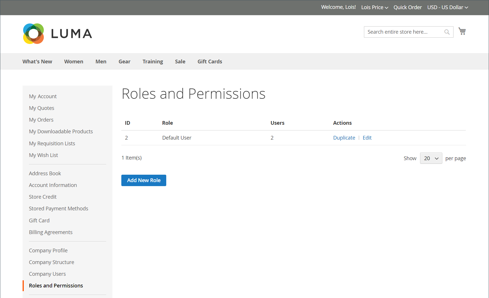
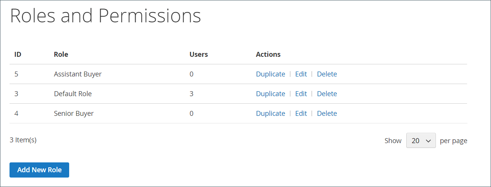
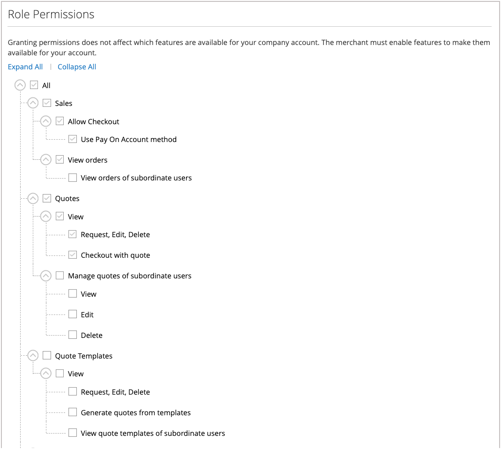

# Company Roles and Permissions

Roles for company users are set up with various levels of permission to access sales information and resources. By default, the company administrator is a _super user_ with full permissions. The [Access Denied](../content-design/pages.md#access-denied) page appears if the user does not have permission to access the page.

{width="700" zoomable="yes"}

The system has one predefined Default User role, which you can use _as is_ or modify to suit your needs. You can create as many roles as necessary to match your company structure and organizational responsibilities, such as the following:

- **Default User** — The default user has full access to activities related to sales and quotes, and view-only access to company profile and credit information.

- **Senior Buyer** — A senior buyer might have access to all Sales and Quotes resources, and view-only permissions to the Company Profile, User and Teams, Payment Information, and Company Credit.

- **Assistant Buyer** — An assistant buyer might have permission to place an order using _Checkout with Quote_, and to view orders, quotes, and information in the company profile.

## Manage roles and permissions

1. The company administrator signs in to their store account.

1. In the left panel, chooses **[!UICONTROL Roles and Permissions]**.

1. Completes any of the following tasks.

### Create a role

1. Clicks **[!UICONTROL Add New Role]**.

   {width="600" zoomable="yes"}

1. Enters a descriptive **[!UICONTROL Role Name]**.

1. Under _[!UICONTROL Role Permissions]_, does one of the following:

   - Selects the checkbox of each resource or activity that users assigned the role have permission to access.

   - Selects the **[!UICONTROL All]** checkbox and clears the checkbox of each resource or activity that users assigned to the role do not have permission to access.

1. Clicks **[!UICONTROL Save Role]**.

1. Creates as many roles as necessary by repeating these steps.

### Modify a role

1. For the role to be modified, the company administrator clicks **[!UICONTROL Edit]** in the _[!UICONTROL Actions]_ column.

1. Makes the necessary changes to the name and permission settings.

1. When complete, clicks **[!UICONTROL Save Role]**.

### Duplicate a role

1. For the role to be duplicated, the company administrator clicks **[!UICONTROL Duplicate]** in the _[!UICONTROL Actions]_ column.

1. Makes the necessary changes to the name and permission settings.

1. When complete, clicks **[!UICONTROL Save Role]**.

### Delete a role

1. The company administrator finds the role to be deleted In the list of roles.

   Only roles without assigned users can be deleted.

1. Clicks **[!UICONTROL Delete]** in the _[!UICONTROL Actions]_ column.

1. When prompted to confirm, clicks **[!UICONTROL OK]**.

## Actions

| Action    | Description |
|-----------| ----------- |
| [!UICONTROL Duplicate] | Creates a copy of the selected role. The name of the duplicate role has `- Duplicated` added to the end. |
| [!UICONTROL Edit]      | Change the name and/or set of permissions.                                                               |
| [!UICONTROL Delete ]   | Delete the role. Only roles without assigned users can be deleted.                                       |

{style="table-layout:auto"}

## Role permissions

Company administrators can update the permission configuration for a role by selecting the [!UICONTROL Edit action], and then selecting or removing permissions in the **Role Permissions** list.

{width="700" zoomable="yes"}

## Assign a role to a company user

After defining the roles that are needed, the company administrator assigns a role to each company user.

1. Logs in to their company account as the company administrator.

1. In the left panel, chooses **[!UICONTROL Company Users]**.

   {width="700" zoomable="yes"}

1. Finds the user in the list and clicks **[!UICONTROL Edit]**.

1. Chooses the appropriate **[!UICONTROL User Role]** for the user.

   {width="700" zoomable="yes"}

1. Clicks **[!UICONTROL Save]**.
