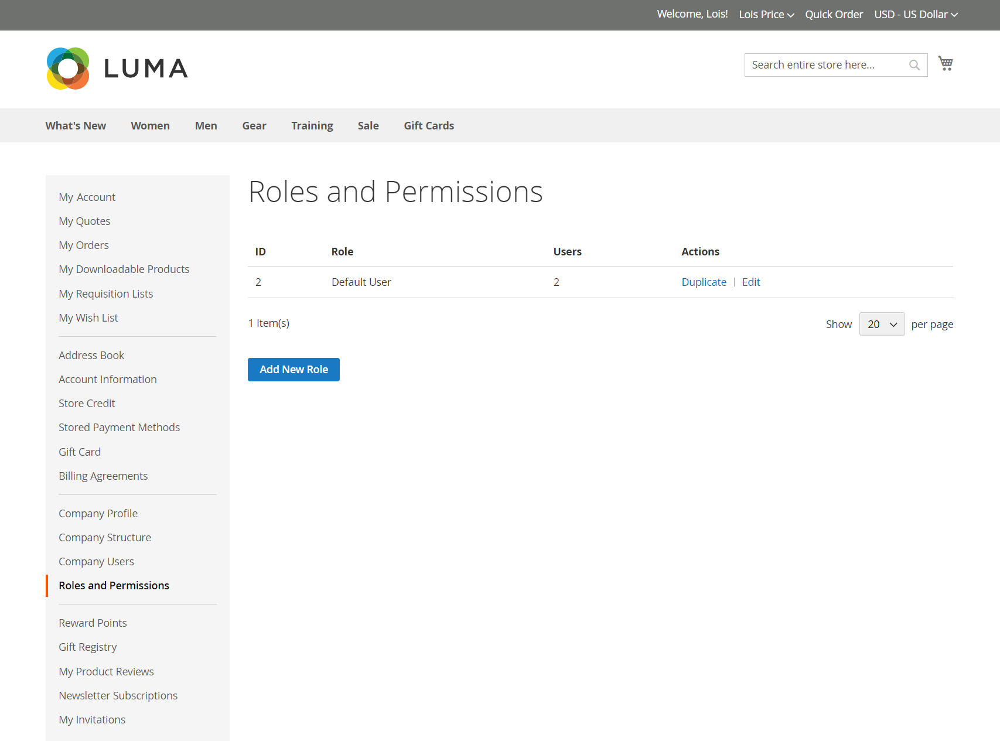
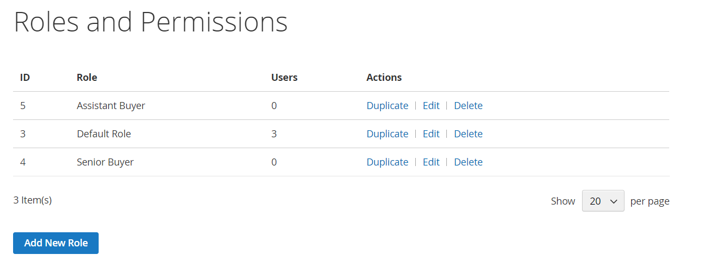
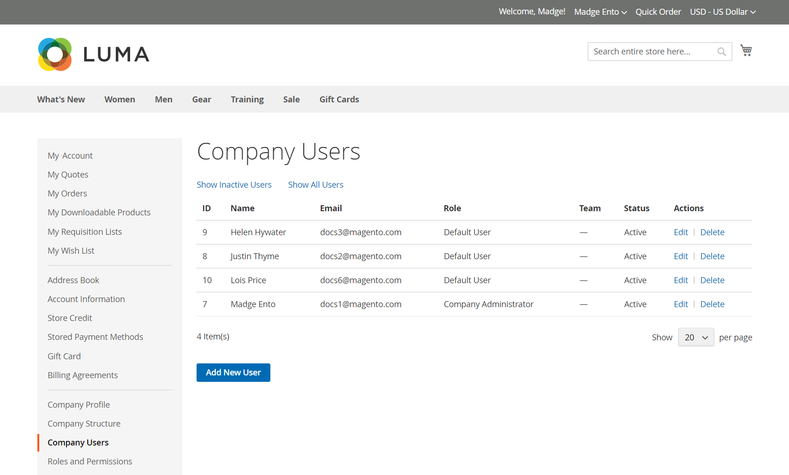

# Company roles and permissions

You set up roles for company users with various levels of permission to access sales information and resources. By default, the company administrator is a *super user* with full permissions. The [Access Denied](../content-design/pages.md#access-denied) page appears if a user does not have permission to access the page.

{width="700" zoomable="yes"}

The system has one predefined Default User role, which you can use *as is* or modify to suit your needs. You can create as many roles as necessary to match your company structure and organizational responsibilities, such as the following:

- **Default User** — The default user has full access to activities related to sales and quotes, and view-only access to the company profile and credit information.

- **Senior Buyer** — A senior buyer might have access to all Sales and Quotes resources, and view-only permissions to the Company Profile, Users and Teams, Payment Information, and Company Credit.

- **Assistant Buyer** — An assistant buyer might have permission to place an order using **[!UICONTROL Checkout with quote]**, and to view orders, quotes, and information in the company profile.

## Manage roles and permissions

Manage company roles from the company administrator's storefront account.

**To open Roles and Permissions:**

1. Sign in to the storefront as the company administrator.

1. In the left panel, select **[!UICONTROL Roles and Permissions]**.

1. Complete one of the following tasks.

### Create a role

1. Click **[!UICONTROL Add New Role]**.

   {width="600" zoomable="yes"}

1. Enter a descriptive **[!UICONTROL Role Name]**.

1. Under **[!UICONTROL Role Permissions]**, do one of the following:

   - Select the checkbox of each resource or activity that users assigned to the role have permission to access.

   - Select the **[!UICONTROL All]** checkbox and clear the checkbox of each resource or activity that users assigned to the role do not have permission to access.

1. Click **[!UICONTROL Save Role]**.

1. Repeat these steps to create as many roles as you need.

### Modify a role

1. Locate the role that you want to modify and click **[!UICONTROL Edit]** in the **[!UICONTROL Actions]** column.

1. Make the necessary changes to the name and permission settings.

1. When you finish, click **[!UICONTROL Save Role]**.

### Duplicate a role

1. Locate the role that you want to duplicate and click **[!UICONTROL Duplicate]** in the **[!UICONTROL Actions]** column.

1. Make the necessary changes to the name and permission settings.

1. When you finish, click **[!UICONTROL Save Role]**.

### Delete a role

1. In the list of roles, find the role to delete.

   Only roles without assigned users can be deleted.

1. Click **[!UICONTROL Delete]** in the **[!UICONTROL Actions]** column.

1. When prompted to confirm, click **[!UICONTROL OK]**.

## Role list actions {#actions}

| Action | Description |
| --- | --- |
| [!UICONTROL Duplicate] | Creates a copy of the selected role. The name of the duplicate role has `- Duplicated` added to the end. |
| [!UICONTROL Edit] | Changes the name and permission set. |
| [!UICONTROL Delete] | Deletes the role. Only roles without assigned users can be deleted. |

{style="table-layout:auto"}

## Role permissions

B2B capabilities are gated by **permissions** (ACL resources). When a company user opens a page or runs an action on the storefront, the application checks whether their role includes the required permission.

Company administrators can update the permission configuration for a role by selecting **[!UICONTROL Edit]** and then selecting or clearing permissions in the **[!UICONTROL Role Permissions]** list.

{width="700" zoomable="yes"}

Assign these resources when you **create or edit a company role** in the company account. Users with permission to manage roles can open the role form and set the permission tree.

Role permissions are organized in a tree structure, with main options and subordinate options. Selecting a main option automatically selects all subordinate options. Clearing a main option automatically clears all subordinate options. You can also select or clear subordinate options individually.

### All permissions

| Permission label | Description |
| --- | --- |
| All | Root node for **all** permissions assigned to this storefront role. |

### Sales permissions

| Permission label | Description |
| --- | --- |
| Sales | Parent for checkout and order visibility for company users. |
| Allow Checkout | Place orders at checkout. |
| Use Pay On Account method | Use **Pay on Account** (company credit) at checkout when it is available. |
| View orders | View the user's own orders. |
| View orders of subordinate users | View orders placed by users below this user in the hierarchy. |

### Quotes permissions

Parent node in the company permission tree: **Quotes**.

| Permission label | Description |
| --- | --- |
| Quotes | Parent for storefront negotiable quote actions. |
| View (quotes) | View negotiable quotes. |
| Request, Edit, Delete | Request new quotes, edit quotes, and delete quotes according to business rules. |
| Checkout with quote | Complete checkout using an approved quote. |
| Manage quotes of subordinate users | Parent for actions on subordinates' quotes. |
| View (subordinates' quotes) | View subordinates' quotes. |
| Edit (subordinates' quotes) | Edit subordinates' quotes. |
| Delete (subordinates' quotes) | Delete subordinates' quotes. |

### Quote templates

Parent node: **Quote Templates** (under **Quotes** in the company tree).

| Permission label | Description |
| --- | --- |
| Quote Templates | Parent for quote template capabilities on the storefront. |
| View (templates) | View quote templates. |
| Request, Edit, Delete | Create, update, cancel, and manage quote templates. |
| Generate quotes from templates | Generate negotiable quotes from templates. |
| Manage quote templates of subordinate users | Parent for subordinate template actions. |
| View (subordinates' templates) | View subordinates' quote templates. |
| Edit (subordinates' templates) | Edit subordinates' quote templates. |
| Delete (subordinates' templates) | Delete subordinates' quote templates. |

### Order approvals

Parent node: **Order Approvals**. Purchase order and approval rule permissions are nested under this branch in the tree.

### Purchase orders

| Permission label | Description |
| --- | --- |
| Order Approvals | Parent for purchase order and approval features. |
| View my Purchase Orders | View purchase orders that this user created. |
| View for subordinates | View purchase orders for users below this user in the hierarchy. |
| View for all company | View purchase orders across the company. |
| Auto-approve POs created within this role | Automatically approve purchase orders created by users in this role when rules allow. |

### Purchase order rules

| Permission label | Description |
| --- | --- |
| Approve Purchase Orders without other approvals | Approve purchase orders even when other approvals would normally be required (per approval rules). |
| View Approval Rules | View purchase order approval rules. |
| Create, Edit and Delete | Create, edit, and delete approval rules. |

### Company profile and contacts

Storefront permissions for company profile sections. Nested **Edit** entries apply only under the **View** permission above them in the role tree.

| Permission label | Description |
| --- | --- |
| Company Profile | Access company profile areas as a group. |
| Account Information (View) | View company account information. |
| Edit | Edit company account information (under Account Information). |
| Legal Address (View) | View the company legal address. |
| Edit | Edit the company legal address (under Legal Address). |
| Contacts (View) | View company contacts. |
| Payment Information (View) | View payment information on the company profile. |
| Shipping Information (View) | View shipping information on the company profile. |

## Company user management

| Permission label | Description |
| --- | --- |
| Company User Management | Parent for roles and for users or teams. |
| View roles and permissions | View company roles and their permissions. |
| Manage roles and permissions | Create or edit roles and assign permissions. |
| View users and teams | View company users and teams. |
| Manage users and teams | Add, edit, or remove users and teams. |

## Company credit

| Permission label | Description |
| --- | --- |
| Company Credit | Access the company credit area. |
| View (credit history) | View company credit history and related balance information. |

## Assign a role to a company user

After you define the roles you need, assign a role to each company user.

**To assign a role:**

1. Sign in to the storefront as the company administrator.

1. In the left panel, select **[!UICONTROL Company Users]**.

   {width="700" zoomable="yes"}

1. Find the user in the list and click **[!UICONTROL Edit]**.

1. Select the appropriate **[!UICONTROL User Role]** for the user.

   {width="700" zoomable="yes"}

1. Click **[!UICONTROL Save]**.

>[!MORELIKETHIS]
>
>- [Manage company users](account-company-users.md)
>- [Company account structure](account-company-structure.md)
>- [Company administrator role](account-company-admin.md)
>- [Manage companies](manage-companies.md)
>- [Enable B2B features](enable-basic-features.md)
