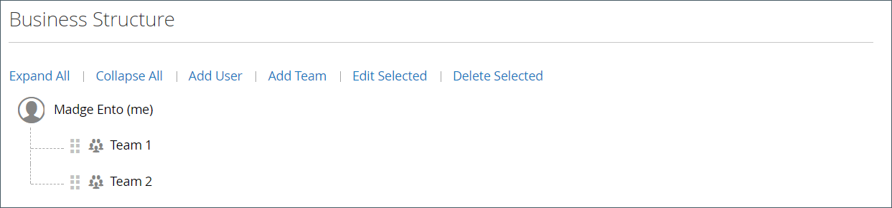
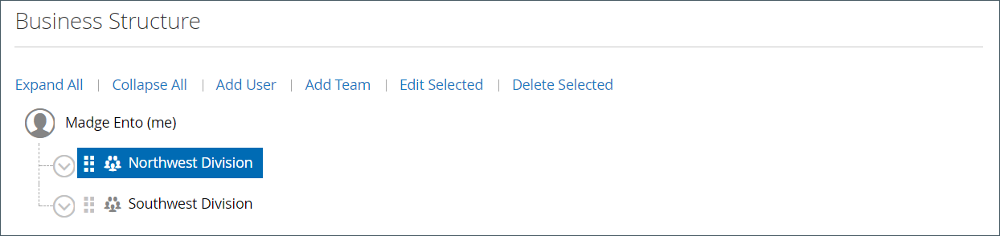
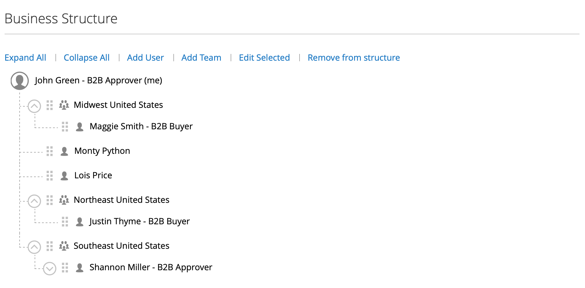
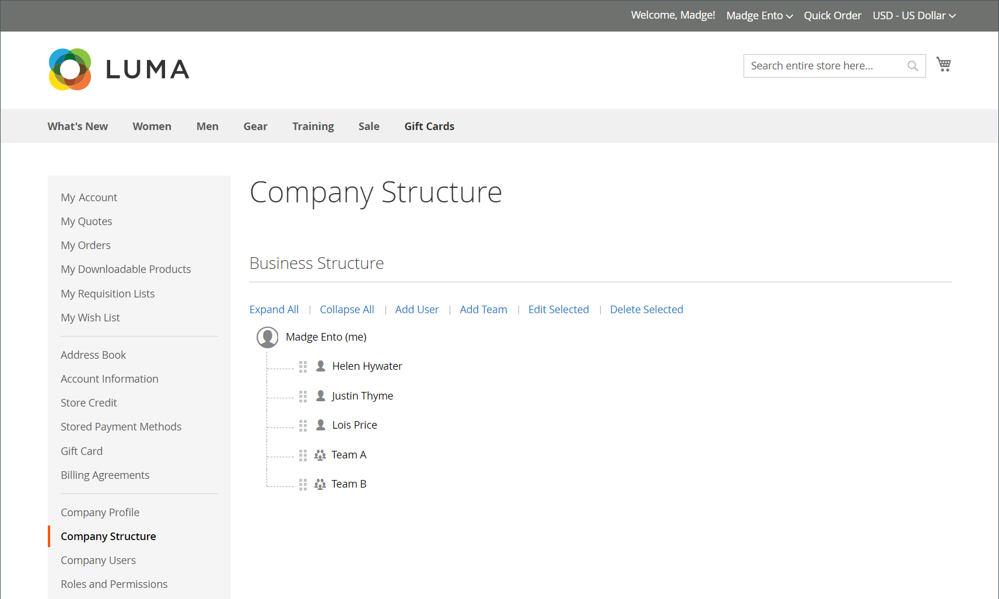
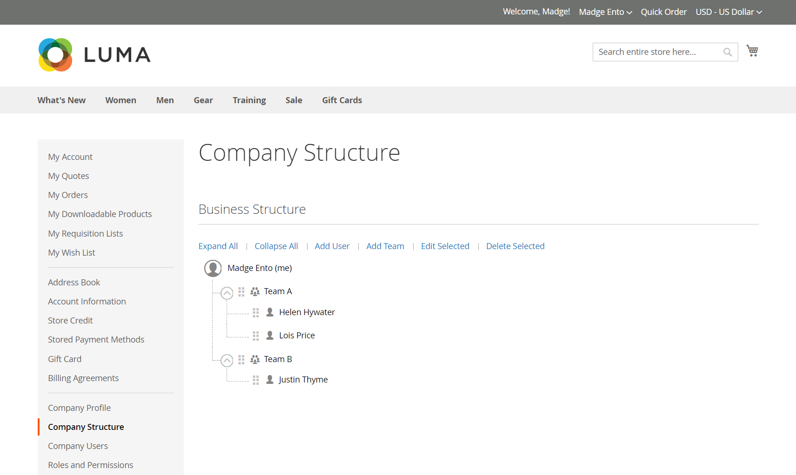

# Company account structure

A company account can be set up to reflect the structure of the business. Initially, the company structure includes only the company administrator, but can be expanded to include teams of users. The users can be associated with teams or organized within a hierarchy of divisions and subdivisions within the company.

{width="500"}

In the company administrator's account dashboard, the company structure is represented as a tree and initially consists of only the company administrator.

{width="600" zoomable="yes"}

When the account is created and approved, the company administrator can use the company email address or be assigned a different email address.

It is possible that the person who serves as company administrator has multiple roles within the company. If a separate email address is entered for the company administrator, the initial company structure includes the company administrator plus an individual user account in the name of the company administrator. In such a case, the company administrator can sign in to the account as the company or as an individual user.

{width="600" zoomable="yes"}

For merchants, the full company structure is reflected in the _Companies_ and _Customers_ grids within the Admin. The Companies grid lists all companies regardless of status. The following example shows accounts for two companies: the _ACME_ company and the _Vendelay_ company.

{width="700" zoomable="yes"}

The following example shows the [!UICONTROL Customers] grid with the initial company administrator accounts for these companies.

{width="700" zoomable="yes"}

After creating the account, the company administrator must define the company structure of [teams](account-company-structure.md), set up the [company users](account-company-users.md), and establish [roles and permissions](account-company-roles-permissions.md) for each.

## Company structure icons

| Icon | Description       |
| ---- | ----------------- |
|  | Represents the company administrator in the company structure. |
|  | Represents a team in the company structure. |
|  | Represents a user in the company structure. |
|  | Moves a team to another position in the company structure. |
|  | Expands a team in the company structure. |
|  | Collapses a team in the company structure. |

{style="table-layout:auto"}

## Create company teams

The structure of a company account should reflect the purchasing organization, whether it is simple and flat or a complex organization with different teams for each subdivision and division of the company.

If the store is [configured](enable-basic-features.md) to allow companies to manage their own accounts, setting up the company structure is one of the first tasks for a company administrator to complete after the account is approved. In the company account, the structure of the company is represented as a tree with the company administrator at the top.

{width="450"}

1. The company administrator signs in to their account.

1. In the left panel, chooses **[!UICONTROL Company Structure]**.

1. Under **[!UICONTROL Business Structure]**, clicks **[!UICONTROL Add Team]** and does the following:

   - Enters the **[!UICONTROL Team Title]** and **[!UICONTROL Description]**.

      The Team Title can be anything that represents the structure of the company, such as a team, office, or division within the company

      {width="700" zoomable="yes"}

   - When complete, clicks **[!UICONTROL Save]**.

   - Creates as many teams as need.

      {width="600" zoomable="yes"}

1. To create a hierarchy of teams, does the following:

   - Selects the parent team, and click **[!UICONTROL Add Team]**.

      {width="600" zoomable="yes"}

   - Enters the **[!UICONTROL Team Title]** and **[!UICONTROL Description]**.

   - Clicks **[!UICONTROL Save]**.

1. Repeats these steps to create as many teams, or divisions and subdivisions as needed.

   {width="600" zoomable="yes"}

## Move a team

As the company administrator works with the company structure, they can drag teams or divisions to other locations in the structure.

1. The company administrator locates the team to be moved.

1. Clicks and drags the team to a new position in the company structure.

## Delete a team

>[!NOTE]
>
>Before deleting a team, it is recommended to make sure that the correct team is selected---deleted teams cannot be restored.

1. The company administrator selects the team to be deleted.

1. Clicks **[!UICONTROL Delete Selected]**.

1. When prompted to confirm, clicks **[!UICONTROL Delete]**.

## Expand or collapse the team structure

As the company administrator works with the company structure, they can collapse or expand the tree:

- Clicks **[!UICONTROL Collapse All]** or **[!UICONTROL Expand All]**.

- Clicks  to collapse a team or  to expand a team.

## Assign users to teams

When teams and users are first added to the [company structure](account-company-structure.md), they are placed at the same level under the company administrator.

{width="700" zoomable="yes"}

|Control|Description|
|--- |--- |
|[!UICONTROL Collapse All / Expand All] |Either collapses or expands the business structure tree|
|[!UICONTROL Add User]|Creates a user below the current team|
|[!UICONTROL Add Team]|Creates a team|
|[!UICONTROL Edit Selected / Delete Selected]|Edits or removes users from the business tree|

{style="table-layout:auto"}

1. In the left panel, the company administrator chooses **[!UICONTROL Company Structure]**.

1. To assign a user to an existing team, they drag () the user under the appropriate team.

   {width="700" zoomable="yes"}
