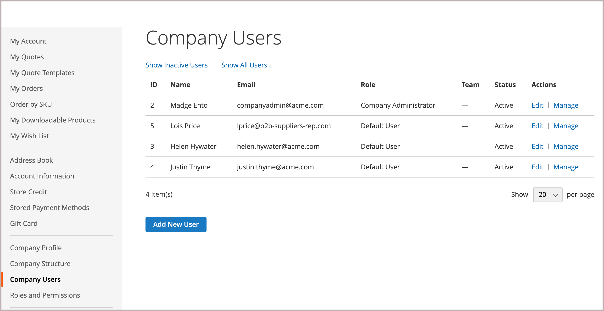
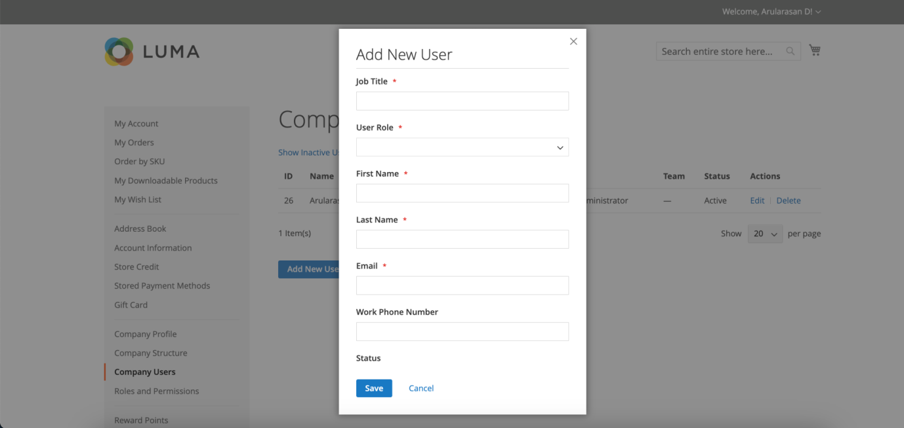
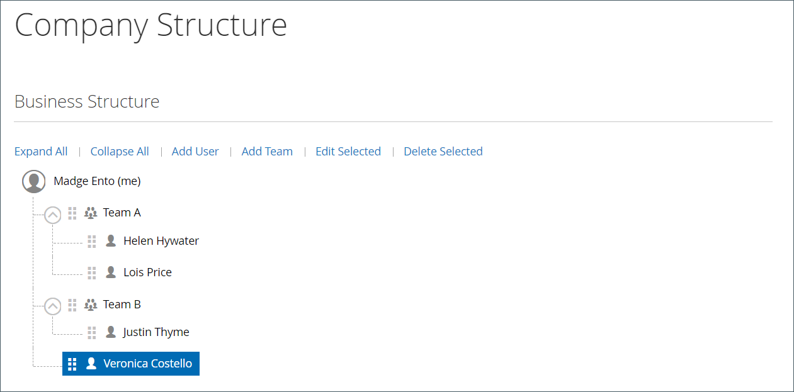

# Manage company user accounts

Company users are assigned by the company administrator, and are visible from the Admin in the _[!UICONTROL Customers]_ grid by the customer type, _[!UICONTROL Company User]_. These individuals are typically buyers with varying levels of permission to access store services and resources.

The company administrator first sets up the [company structure](account-company-structure.md), and then completes the following tasks, as needed:

- Create company users and assign users to teams

- Define roles and permissions, and assign users to roles

>[!IMPORTANT]
>
>Company users can be added, edited, or removed only by the company administrator. Removal cannot be reversed because the user is removed from the company structure.

## Add company users

1. From the storefront, the company administrator signs in to their account.

1. In the left panel, chooses **[!UICONTROL Company Users]**.

   {width="700" zoomable="yes"}

1. Clicks **[!UICONTROL Add New User]** and does the following:

   - Enters the **[!UICONTROL Job Title]** of the new user.

   - Chooses the appropriate **[!UICONTROL User Role]** if the roles and permissions are defined. Otherwise, they can return later to assign the role.

      {width="700" zoomable="yes"}

   - Completes the remaining fields as needed for the user:

      - **[!UICONTROL First Name]** and **[!UICONTROL Last Name]**
      - **[!UICONTROL Email]**
      - **[!UICONTROL Phone Number]**

   By default, the **[!UICONTROL Status]** of the account is `Active`.

1. When complete, clicks **[!UICONTROL Save]**.

1. Repeats the process to create as many company users as needed.

   The new users appear in the Company Users list, along with the Company Administrator.

To save time during their first order, the company administrator can remind each company user to add the default company billing and shipping address to their [address book](../customers/account-dashboard-address-book.md).

## Edit company users

1. From the storefront, the company administrator signs in to their account.

1. In the left panel, chooses **[!UICONTROL Company Users]**.

1. Finds the user record to be updated, and clicks **[!UICONTROL Edit]**.

1. Makes the needed changes.

1. When complete, clicks **[!UICONTROL Save]**.

## Remove a company user

1. From the storefront, the company administrator signs in to their account.

1. In the left panel, chooses **[!UICONTROL Company Structure]**.

1. Selects the company user in the company structure.

1. Clicks **[!UICONTROL Delete Selected]**.

   {width="600" zoomable="yes"}

1. When prompted to confirm, clicks **[!UICONTROL Delete]**.

In the Admin, the company user remains listed in the [Customers](../customers/customers-all.md) grid, but with an `Inactive` status.

## Field descriptions

| Field        | Description |
|--------------|---------------|
| [!UICONTROL Job Title]    | The job title of the company user. |
| [!UICONTROL User Role]    | The [role](account-company-roles-permissions.md) assigned to the company user. Options: `Default User` / (other roles) |
| [!UICONTROL First Name]   | The first name of the company user.  |
| [!UICONTROL Last Name]    | The last name of the company user.   |
| [!UICONTROL Email]        | The email address of the company user.  |
| [!UICONTROL Phone Number] | The phone number of the company user.  |
| [!UICONTROL Status]       | The status of the company user account. Options: `Active` / `Inactive`  |

{style="table-layout:auto"}
