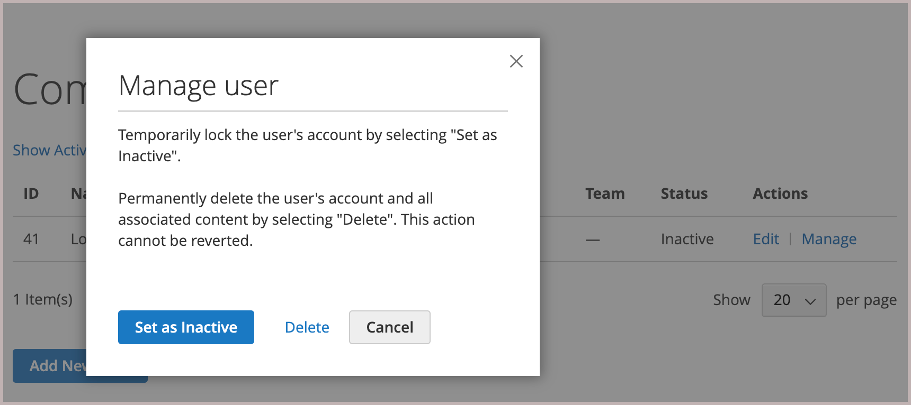

# Manage company user accounts

On the storefront, company users are assigned by the company administrator, and are visible from the _[!UICONTROL Company Users]_ page. These individuals are typically buyers with varying levels of permission to access store services and resources.

The company administrator first sets up the [company structure](account-company-structure.md), and then completes the following tasks, as needed:

- Create company users and assign users to teams

- Define roles and permissions, and assign users to roles

Company users can be added, edited, inactivated, or deleted only by the company administrator.

- When a user is removed, the account status changes to *inactive*, and the customer can no longer log in to the company. Administrators can still access all content associated with the user. The account administrator can restore access by changing the account status to *[!UICONTROL Active]* from the [!UICONTROL Company Users] page.

- When a user account is deleted, the account and any associated content is deleted from the storefront. This action cannot be reverted.

## Add company users

1. From the storefront, the company administrator signs in to their account.

1. In the left panel, chooses **[!UICONTROL Company Users]**.

   {width="700" zoomable="yes"}

1. Clicks **[!UICONTROL Add New User]** and does the following:

   - Enters the **[!UICONTROL Job Title]** of the new user.

   - Chooses the appropriate **[!UICONTROL User Role]** if the roles and permissions are defined. Otherwise, they can return later to assign the role.

      {width="700" zoomable="yes"}

   - Adds the user information in the remaining fields:
      - **[!UICONTROL First Name]** and **[!UICONTROL Last Name]**
      - **[!UICONTROL Email]**
      - **[!UICONTROL Phone Number]**

   By default, the **[!UICONTROL Status]** of the account is `Active`.

1. When complete, clicks **[!UICONTROL Save]**.

1. Repeats the process to create as many company users as needed.

   The new users appear in the Company Users list, along with the Company Administrator.

To save time during their first order, the company administrator can remind each company user to add the default company billing and shipping address to their [address book](../customers/account-dashboard-address-book.md).

## Remove a user from the [!UICONTROL Company structure]

Company administrators can remove a user from the [!UICONTROL Company Structure].

After an account is removed, the user account status changes to *inactive*, and the user can no longer log into the storefront.
The administrator can reactivate an account by editing the user account information from the Company Users page.

1. From the storefront, the company administrator signs in to their account.

1. In the left panel, chooses **[!UICONTROL Company Structure]**.

1. Selects the company user in the company structure.

1. Clicks **[!UICONTROL Remove from Structure]**.

   {width="600" zoomable="yes"}

1. When prompted to confirm, clicks **[!UICONTROL Remove]**.

   In the Admin, the company user remains listed in the [Customers](../customers/customers-all.md) grid, but with an `Inactive` status.

## View and manage company user accounts

Company administrators can view and manage company user accounts using the view filters on the [!UICONTROL Company Users] page.

{width="700" zoomable="yes"}

- View only inactive users by selecting **[!UICONTROL Show Inactive Users]**.
- View only active users by selecting **[!UICONTROL Show Active Users]**.
- View all users by selecting **[!UICONTROL Show All Users]**.

The company administrator can manage an individual account using the line item *[!UICONTROL Actions]* to edit the account information, manage account status, or delete an account.

### Edit company user account information

Company administrators can update user account profile information and change the account status.

1. On the [!UICONTROL Company Users] page, find the user account to update. Click **[!UICONTROL Edit]**.

1. Make any required changes to the user account information, including changing the account status.

1. Apply the changes by clicking  **[!UICONTROL Save]**.

>[!NOTE]
>
>If you edit a company user account and notice that the profile is missing required account information such as job title and phone number, it indicates that the account was added by a Commerce site administrator. These accounts cannot be edited from the storefront. To update information or change the account status, contact your site administrator.

### Deactivate or delete an active account

1. On the [!UICONTROL Company Users] page, find the user account to update. Click **[!UICONTROL Manage]**.

   {width="600" zoomable="yes"}

1. When prompted, inactivate or delete the user account as required.

>[!IMPORTANT]
>
>Deleting a company user account removes the account and all associated content from the system. This action cannot be reverted.

## Company user account profile field descriptions

| Field        | Description |
|--------------|---------------|
| [!UICONTROL Job Title]    | The job title of the company user. |
| [!UICONTROL User Role]    | The [role](account-company-roles-permissions.md) assigned to the company user. Options: `Default User` / (other roles) |
| [!UICONTROL First Name]   | The first name of the company user.  |
| [!UICONTROL Last Name]    | The last name of the company user.   |
| [!UICONTROL Email]        | The email address of the company user.  |
| [!UICONTROL Phone Number] | The phone number of the company user.  |
| [!UICONTROL Status]       | The status of the company user account. Options: `Active` / `Inactive`  |

{style="table-layout:auto"}
