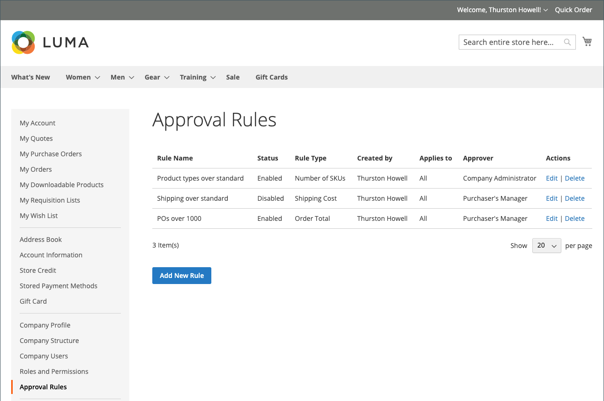
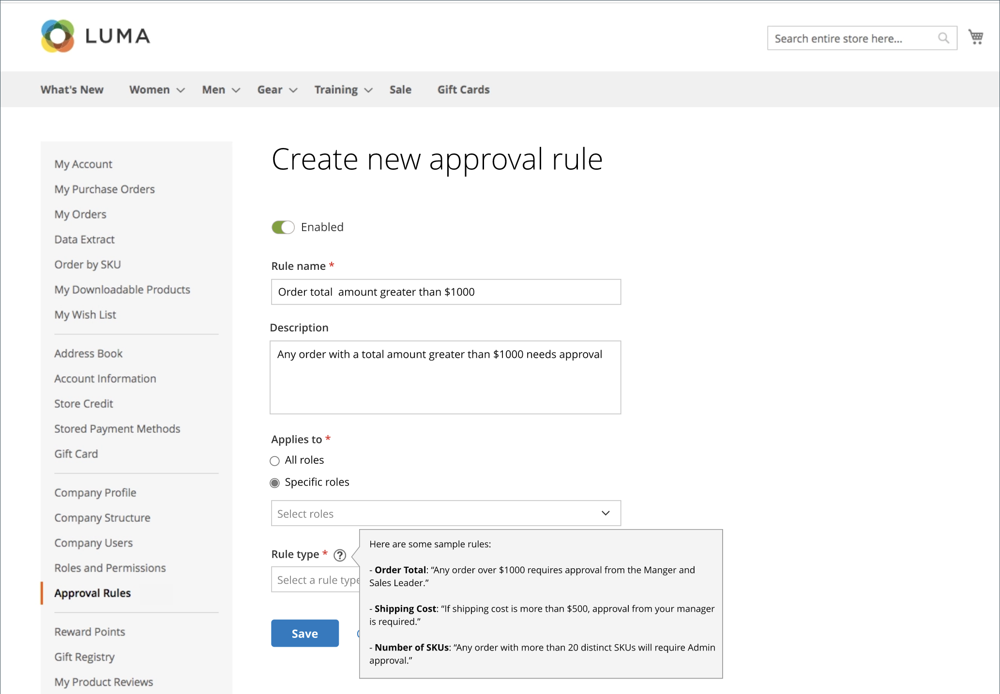
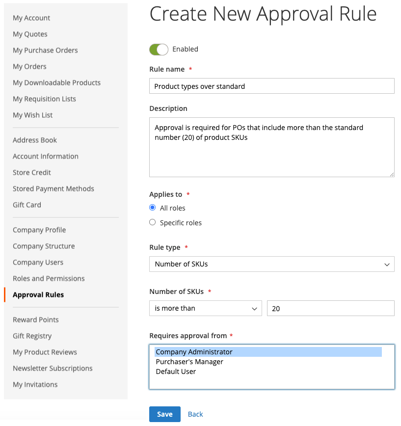

# Purchase Order Approval Rules

Most companies require order approval for purchase orders. By adding approval rules for their company account, they can control who can create purchase orders and how much they can spend. For example:

* Any PO less than X value is automatically approved.
* POs over X value but less than Q must be approved by Y.
* Any PO over X value must be approved by Y and Z.
* A PO created by anyone at the Director level or above is automatically approved.

Depending on the company role and permissions, users can create, edit, delete, or view approval rules.

>[!IMPORTANT]
>
>Approval rule setup requires a defined [company structure](account-company-structure.md) in order to specify approval by the purchasing customer's manager.

## Payment methods

Purchase order approval flows support both online and offline payment methods. All default offline payment methods are supported for purchase order approvals. For online payments, the following methods are supported:

* PayPal Express
* Braintree payments

## Approval rule setup

With the required [permissions for their role](account-company-roles-permissions.md), B2B customers can set up approval rules to enforce company policies by clicking **Approval Rules** in the left panel for their customer account.

<!--- zoom --->

To create an approval rule, a customer completes the following steps:

1. Clicks **Add New Rule** to create a rule.

1. If needed, changes the rule from **Enabled** to **Disabled**.

   The rule is as enabled as the default, but a customer can create the rule using a disabled setting and then enable it later when they are ready to enforce it.

1. For **Rule name**, enters a short but descriptive name for the Rule, such as `Orders less than $100`.

   Rule names must be unique.

1. For **Description**, enters a longer explanation of the rule.

1. For **Applies to**, chooses one or more company roles used for applying the rule.

1. Chooses the **Rule Type** and defines the rule.

   The following sections provide a detailed explanation and example for each rule type.

   <!--- zoom --->

1. For **Requires approval from**, chooses one or more required approvers according to the type of approval.

   >[!NOTE]
   >
   >* When assigning a role as an approver, ensure that there is at least one user in that role.
   >* If there are two or more users with the same approver role, the creator of the purchase order cannot approve it. In this case, manual approval is required by any other user with this approver role. However, if `Auto-approve POs created within this role` option is set in the [Role Permissions](account-company-roles-permissions.md), the purchase order is approved automatically.
   >* If there is only one user with the approver role and that user is the creator, the purchase order is always approved automatically---the `Auto-approve POs created within this role` permission setting is ignored.

1. Click **Save**.

### Order Total

This rule type is used to require a PO approval based on the order total, including tax.

1. Chooses an **Order Total amount** option:

   * is more than
   * is less than
   * is more than or equal to
   * is less than or equal to

1. Selects the currency type and enter the amount.

<!--- zoom --->

### Shipping cost

This rule type is used to require a PO approval based on shipping cost, which many companies require.

1. Sets the **Shipping cost value**:

   * is more than
   * is less than
   * is more than or equal to
   * is less than or equal to

1. Sets the desired shipping amount.

<!--- zoom --->

### Number of SKUs

This rule type is used to require a PO approval based on the number of SKUs or unique products in the order. It controls the number of distinct item types, not the number of items being ordered. For example, a PO could include:

* Two large white shirts
* Three medium white shirts

This example specifies five items, but two distinct SKUs.

1. Sets the **Number of SKUs** value:

   * is more than
   * is less than
   * is more than or equal to
   * is less than or equal to

1. Sets the quantity of SKUs.

<!--- zoom --->

## Edit approval rules

To modify an existing approval rule, a customer completes the following steps:

1. In the sidebar of their account, selects **Approval Rules**.

1. Finds the approval rule entry to be edited.

1. Clicks **Edit**.

1. Makes all needed changes and clicks **Save**.

## Delete approval rules

To remove an existing approval rule, a customer completes the following steps:

1. In the sidebar of their account, selects **Approval Rules**.

1. Finds the approval rule entry to be deleted.

1. Clicks **Delete**.

1. To confirm the action, clicks **OK**.
