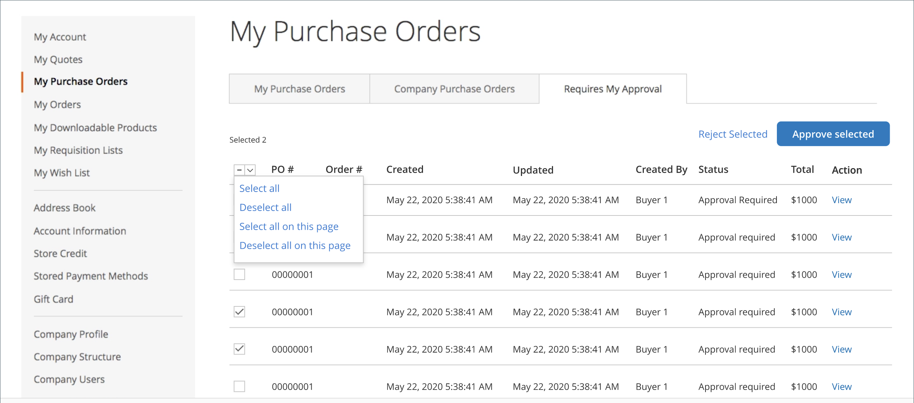

# [!UICONTROL My Purchase Orders]

When purchase orders are [enabled for a company](purchase-order-flow.md), any order for a customer signed into a company user account is automatically created as a purchase order (PO). Company users with the required permissions can create, edit, and delete POs that they create, along with the POs created by subordinate users.

{width="700" zoomable="yes"}

>[!NOTE]
>
>Purchase Orders create a _snapshot_ of item prices, discounts, and shipping prices at the time the order was created. If the price of an item changes after the PO is created, the original price is used.

## Manage purchase orders

From the _View Purchase Order_ page, the customer can manage the PO, depending on their [role permissions](account-company-roles-permissions.md).

- To see the PO, click **[!UICONTROL View]**.
- To see any comments about the PO, click the **[!UICONTROL Comments]** tab.
- To see a complete order history, click the **[!UICONTROL History Log]** tab.

>[!IMPORTANT]
>
>If an item in a purchase order is out of stock, or has insufficient quantity available, when the purchase order is converted into an actual order, an error occurs. If backorders are enabled, the order is processed normally.

## New purchase order from existing purchase order

If the customer has an existing purchase order and would like to add new items, they can generate a duplicate purchase order with new products added to the new PO. The customer completes the following steps:

1. On the _My Purchase Order_ page, the customer locates the purchase order and clicks the **[!UICONTROL View]** link.

1. The customer clicks **[!UICONTROL Add Items to Shopping Cart]**.

   The Shopping Cart page opens with all the items listed.

1. Makes any additions or changes.
   
1. (Optional) Uses the **[!UICONTROL Custom Reference Number]** to add an internal Invoice/PO number to the order.

1. Follows the normal checkout workflow and clicks **[!UICONTROL Place Purchase Order]**.

If they have items in their shopping cart when they click _[!UICONTROL Add Items to Shopping Cart]_, the system displays a dialog. This dialog allows them to choose between merging the cart items with the new items or replacing the items in the shopping cart with the items in the PO.

The original purchase order can be closed if it is no longer needed.

## Purchase order approvals

For a customer that is designated as an approver based on company structure or assigned company role, the _[!UICONTROL My Purchase Orders]_ dashboard page displays the **[!UICONTROL Requires My Approval]** tab. The customer clicks this tab to review POs that are waiting for their approval. The counter shows how many orders are awaiting approval.

After clicking **[!UICONTROL View]** for a purchase order and reviewing the details, the approver can click **[!UICONTROL Approve]** or **[!UICONTROL Reject]**.

### Bulk approval/rejection

Starting with Adobe Commerce 2.4.1, approvers can approve or reject multiple purchase orders at one time.

1. On the _[!UICONTROL My Purchase Order]_ page, clicks the **[!UICONTROL Requires My Approval]** tab.

1. Select the checkbox for each purchase order to be approved or rejected.

1. Clicks **[!UICONTROL Approve Selected]** or **[!UICONTROL Reject Selected]**.

A customer can select only the purchase orders with a status that allows an action. Company administrators can make bulk approvals or rejections for any active purchase orders in their company.
