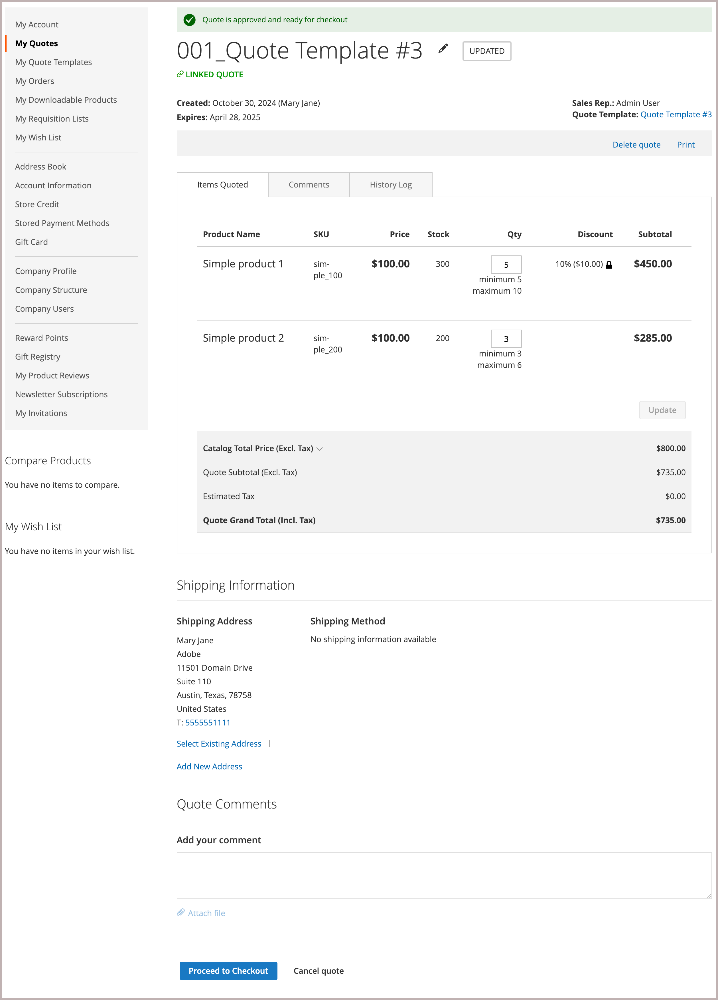

# [!UICONTROL My Quote Templates]

If quotes are enabled, the _[!UICONTROL My Quotes Template]_ section of the customer account dashboard lists all quote templates associated with the customer account. Depending on their permissions, only buyers who make purchases on behalf of a company can request a quote template and negotiate quote pricing and terms for recurring orders.

 {width="700" zoomable="yes"}

The quote template list organizes templates by status.

- **[!UICONTROL Active Quote Templates]** lists templates that have been negotiated and approved for use. Information includes minimum quote total and orders placed if these options were configured during the negotiation process. Buyers can generate a linked quote from the template to submit an order based on quote terms.

- **[!UICONTROL In Review]** lists templates in the negotiation process showing the current status and providing a link to open the template.

- **[!UICONTROL Inactive]** lists templates that have expired, been canceled, or are no longer valid because a buyer has used up the number of committed orders permitted.

For the buyer, the *[!UICONTROL My Quotes Templates]* page is the focal point for all communication between buyer and seller during the negotiation process.

A buyer who accepts the negotiated terms offered by the seller can accept the template, and then use it to generate pre-approved linked quotes that can be used to place orders.

- Actions related to managing the quote template:

   - Cancel a template
   - Send to seller for review
   - Accept the quote template
   - Change the quote template expiration date
   - Add a shipping address

- Actions for updating quote template detail during the negotiation process:

  - Review item pricing and updates.
  - If quantity thresholds have been configured on the quote template, adjust the minimum and maximum values.
  - Track the negotiation process from [!UICONTROL Comments] and [!UICONTROL History] sections.
  - For templates still being reviewed, the buyer can modify the quote template by removing items.
  - Communicate and negotiate with the seller by adding notes at the line item and quote level.

  After making changes, the buyer returns the template to the seller for review.

- General actions during negotiation:

  - Send quote template to seller for review
  - Accept the quote template
  - Cancel to end negotiation and close the quote

The following example shows a quote template that has been updated by the buyer and sent back to the seller for review.

{width="700" zoomable="yes"}

Templates with the `Submitted` status are locked until the seller reviews and updates the template and returns it to the buyer.

## Create a quote template

The buyer can begin the quote template negotiation process using either of the following methods:

- Create a template from an existing quote by clicking **[!UICONTROL Create quote template]** action.

- Submit a quote request from the storefront and add comments asking the sales representative to create a quote template from the quote request.

## View a quote template

1. The buyer logs in to their account.

1. In the left panel, chooses **[!UICONTROL My Quote Templates]**.

1. Finds the quote template in the list and clicks **[!UICONTROL View]** in the _[!UICONTROL Action]_ column.

## Add a shipping address

The buyer cannot accept a quote template until it has a shipping address.

1. The buyer logs in to their account.

1. In the left panel, chooses **[!UICONTROL My Quote Templates]**.

1. Selects the desired quote template.

1. In the **[!UICONTROL Shipping Information]** section, clicks **[!UICONTROL Add New Address]**.

1. Fills in details for the new address.

1. Clicks **[!UICONTROL Save Address]**.

After the buyer adds the address, they send the template back to the seller for review. The seller provides the shipping and delivery options. These updates can affect the negotiated quote pricing. The shipping options are locked on checkout.

## Generate a linked quote

After the buyer accepts a quote template, they can use it to generate pre-approved, linked quotes from the *[!UICONTROL My Quote Templates dashboard]*, or from the quote template by using the  **[!UICONTROL Generate a quote]** action.

The linked quote includes a notification indicating that it is approved and ready for checkout. It also provides a link to the quote template in the header information.

{width="700" zoomable="yes"}

If the quote template was configured with an order threshold, the count is incremented when the linked quote is generated.

Buyers can complete the following actions from a linked quote:

- If the quote is configured with quantity thresholds, adjust the order quantity for line items.
- Proceed to checkout to submit an order.
- Delete or print the quote.
- Open the quote template used to generate the quote.

## Cancel a quote template

From the quote template page, click **[!UICONTROL Cancel Quote Template]**.

The quote template is canceled, and the quote status changes to `Closed`. The closed quote remains in your list of *[!UICONTROL Inactive]* quotes, and remains listed in the _[!UICONTROL Quote Templates]_ grid in the Admin.
