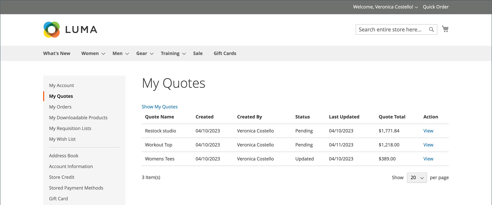
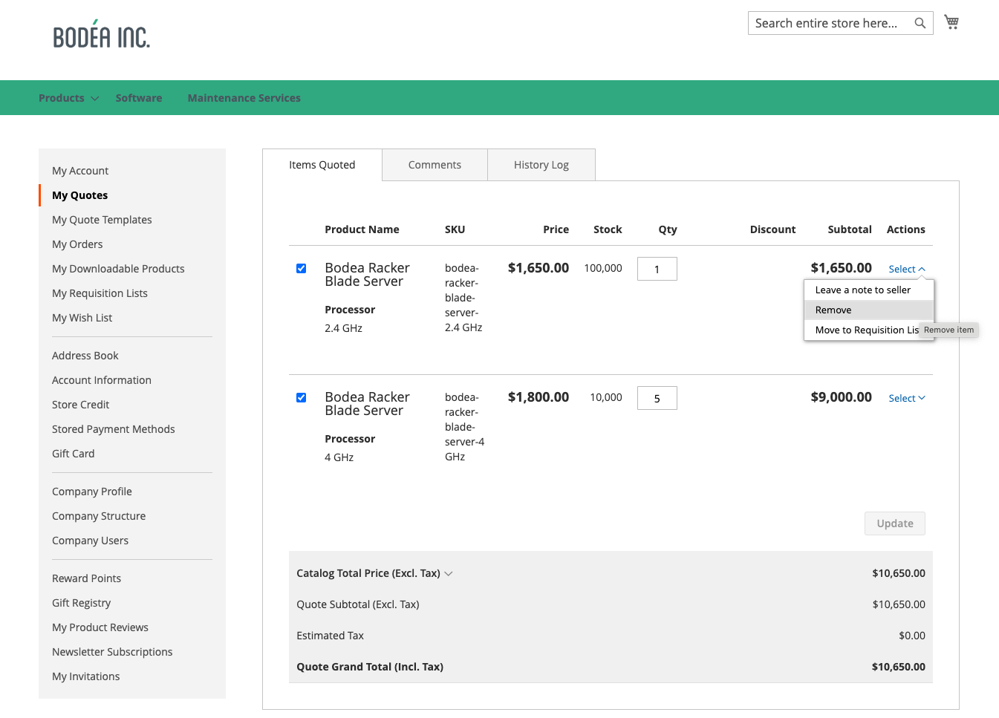

# [!UICONTROL My Quotes]

If quotes are enabled, the _[!UICONTROL My Quotes]_ section of the customer account dashboard lists all quotes submitted by the customer. Depending on their permissions, only buyers who make purchases on behalf of a company can submit requests to negotiate the price of a purchase.

{width="700" zoomable="yes"}

The buyer begins the process by [submitting a request](quote-request.md) for a quote from the shopping cart. Email is exchanged between the buyer and seller during the [negotiation process](quote-price-negotiation.md). For the buyer, the [!UICONTROL My Quotes] page is the focal point for all communication between buyer and seller during the negotiation process. A buyer who accepts the negotiated price offered by the seller can proceed directly to the checkout page from the quote. Additional discounts cannot be added to the negotiated quote.

When negotiating a quote, a buyer has several options to either manage the quote or update the quote detail.

* Actions related to managing the quote:

   * Create a copy of the quote
   * Close the quote
   * Delete the quote
   * Rename the quote
   * Print the quote
   * Create a template

* Actions for updating quote detail:

  * Review item pricing and updates
  * Track the negotiation process from [!UICONTROL Comments] and [!UICONTROL History] sections
  * Modify the quote to remove items
  * Communicate and negotiate with the seller by adding notes at the line item and quote level
  * Add a shipping address
  * Move line items to a requisition list
  * Convert the quote to an order if the terms are acceptable

* General actions during negotiation:

  * Send quote to seller for review
  * Proceed to Checkout

The following example shows a quote that has been updated by the buyer and sent back to the seller for review.

{width="700" zoomable="yes"}

Quotes with the `Updated` status are locked until the seller returns the quote.

## Show quotes

With the required [permissions for their role](account-company-roles-permissions.md), buyers associated with a company account can see quotes requested by [subordinate users](account-company-structure.md). Company administrators can see all quotes for the company account.

1. The buyer logs in to their account on the storefront.

1. Clicks **[!UICONTROL My Quotes]** in the left navigation.

1. To see all the quotes that they have created, clicks the **[!UICONTROL Show My Quotes]** link (displayed only for the company administrator or account with subordinate users).

1. To see all the quotes of all company users, clicks **[!UICONTROL Show All Quotes]**.

## View a quote

1. The buyer logs in to their account.

1. In the left panel, chooses **[!UICONTROL My Quotes]**.

1. Finds the quote in the list and clicks **[!UICONTROL View]** in the _[!UICONTROL Action]_ column.

## Copy a quote

1. The buyer logs in to their company account on the storefront.

1. In the left panel, chooses **[!UICONTROL My Quotes]**.

1. Find and access the desired quote in the list and click **[!UICONTROL Create Copy]** from the original quote.

## Create Template

1. The buyer logs in to their account.

1. In the left panel, chooses **[!UICONTROL My Quote Templates]**.

1. Finds the quote in the **[!UICONTROL My Quotes]** list and clicks **[!UICONTROL Create Quote Template]** in the _[!UICONTROL Action]_ column.

## Move line items from a quote to a requisition list

1. The buyer logs in to their account.

1. In the left panel, chooses **[!UICONTROL My Quotes]**.

1. Find and access the desired quote in the list.

1. Select the line items.

1. Click **[!UICONTROL Move to Requisition list]** in the _[!UICONTROL Actions]_ dropdown.

1. Select an existing requisition list to move the selected items.

1. Click **[!UICONTROL Move item]**.

See [Add products to a requisition list](requisition-lists.md) to learn more about this process.

>[!NOTE]
>
> You cannot create a new requisition list when you move items. Items can only be moved to an existing requisition list.

## Move line items to a new quote

1. The buyer logs in to their account.

1. In the left panel, chooses **[!UICONTROL My Quotes]**.

1. Find and access the desired quote in the list.

1. Select the line items.

1. Click **[!UICONTROL Move item to new quote]** in the _[!UICONTROL Actions]_ dropdown.

1. Name the new quote in the modal.

1. Select **[!UICONTROL Move to quote]** to move the selected item to the new quote.

>[!NOTE]
>
> When selecting several items, modal displays as **[!UICONTROL Move selected items to new quote]**.

## Adding a shipping address

1. The buyer logs in to their account.

1. In the left panel, chooses **[!UICONTROL My Quotes]**.

1. Selects the desired quote.

1. In the **[!UICONTROL Shipping Information]** section, clicks **[!UICONTROL Add New Address]**.

1. Fills in details for the new address.

1. Clicks **[!UICONTROL Save Address]**.

When the buyer adds the address, the seller provides the shipping and delivery options. These updates can affect the negotiated quote pricing. The shipping options are locked on checkout.

## Print a quote

1. In the open quote to the right of the _[!UICONTROL Items Quoted]_ section, the buyer clicks **[!UICONTROL Print]**.

1. Verifies the **[!UICONTROL Destination]** as either a printer or PDF.

1. Clicks **[!UICONTROL Print]**.

## Cancel a quote request

1. In the open quote just above the Items Quoted section, clicks **[!UICONTROL Close quote]**.

   The request is canceled, and the quote status changes to `Closed`. The closed quote remains in your list of quotes, and remains listed in the _[!UICONTROL Quotes]_ grid from the Admin.

1. To remove the canceled quote from the list of quotes, clicks **[!UICONTROL Delete]**.

1. When prompted to confirm, clicks **[!UICONTROL OK]**.

   The closed quote is removed from their list of quotes. However, it remains listed on the _[!UICONTROL Quotes]_ grid in the Admin, with the `Closed` status.

## Quote Actions

| Action        | Description                                                                                                                                                                                                                  |
|---------------|------------------------------------------------------------------------------------------------------------------------------------------------------------------------------------------------------------------------------|
| Rename        | Change the name of the quote                                                      |
| Create copy | A buyer can create a new quote from the current quote by copying and renaming it. |
| Close quote   | After a buyer closes a quote, it cannot be reopened it. If needed, the buyer can recreate it by using the [!UICONTROL Create Copy] action. This option is not available if the quote status is `Draft`.                      |
| Create Template   | Create a quote template based on the current quote. Quote templates streamline quote negotiation by allowing buyers and sellers to agree on contract and pricing terms once. On agreement, the buyer can generate a pre-approved, linked quote from the template for subsequent orders instead of restarting the request for quote (RFQ) process.                      |
| Delete quote  | When a buyer deletes a quote, it is removed from the system, and is no longer available.                                                                                                                                     |
| Print         | Opens a print form to save the quote as a PDF, file, or print it to a configured printer.                                                                                                                                    |

## Column descriptions

| Column                  | Description                                                                                                                                                                                                                                                                                                                                                                                                                                                                                                                                                                                                                                                                                                                                                                                                                                                                                                                                                                                                                                                                                                                                                                                                                                                                                                                                                                                                                                                                                                                                                                                                                                                                                                                                                                                                                                                                                                                                                                                                                                                                                                                                                                                                                                                                                                                                                                                                                                                                                                                               |
|-------------------------|-------------------------------------------------------------------------------------------------------------------------------------------------------------------------------------------------------------------------------------------------------------------------------------------------------------------------------------------------------------------------------------------------------------------------------------------------------------------------------------------------------------------------------------------------------------------------------------------------------------------------------------------------------------------------------------------------------------------------------------------------------------------------------------------------------------------------------------------------------------------------------------------------------------------------------------------------------------------------------------------------------------------------------------------------------------------------------------------------------------------------------------------------------------------------------------------------------------------------------------------------------------------------------------------------------------------------------------------------------------------------------------------------------------------------------------------------------------------------------------------------------------------------------------------------------------------------------------------------------------------------------------------------------------------------------------------------------------------------------------------------------------------------------------------------------------------------------------------------------------------------------------------------------------------------------------------------------------------------------------------------------------------------------------------------------------------------------------------------------------------------------------------------------------------------------------------------------------------------------------------------------------------------------------------------------------------------------------------------------------------------------------------------------------------------------------------------------------------------------------------------------------------------------------------|
| [!UICONTROL Quote Name] | The name assigned to the quote request by the buyer.                                                                                                                                                                                                                                                                                                                                                                                                                                                                                                                                                                                                                                                                                                                                                                                                                                                                                                                                                                                                                                                                                                                                                                                                                                                                                                                                                                                                                                                                                                                                                                                                                                                                                                                                                                                                                                                                                                                                                                                                                                                                                                                                                                                                                                                                                                                                                                                                                                                                                      |
| [!UICONTROL Created]    | The date the quote request was first submitted.                                                                                                                                                                                                                                                                                                                                                                                                                                                                                                                                                                                                                                                                                                                                                                                                                                                                                                                                                                                                                                                                                                                                                                                                                                                                                                                                                                                                                                                                                                                                                                                                                                                                                                                                                                                                                                                                                                                                                                                                                                                                                                                                                                                                                                                                                                                                                                                                                                                                                           |
| [!UICONTROL Created By] | The first and last name of the buyer who submitted the quote request.                                                                                                                                                                                                                                                                                                                                                                                                                                                                                                                                                                                                                                                                                                                                                                                                                                                                                                                                                                                                                                                                                                                                                                                                                                                                                                                                                                                                                                                                                                                                                                                                                                                                                                                                                                                                                                                                                                                                                                                                                                                                                                                                                                                                                                                                                                                                                                                                                                                                     |
| [!UICONTROL Status]     | Indicates the status of the quote. The status of a quote can be changed only by action on the part of either the buyer or seller.  **[!UICONTROL Submitted]** - The buyer's request for a quote hasn't yet been opened by the seller. While in this state, the buyer can still modify the request for a quote. Available actions: `View` / `Close` / `Edit Quantity` / `Delete SKU` / `Add Comments` / `Edit Shipping Address`  **[!UICONTROL Pending]** - The seller has opened the request and is in the process of reviewing it and preparing a response. Available actions: `View` / `Close`  **[!UICONTROL Updated]** - The seller has sent a response to the buyer, and the _[!UICONTROL Proceed to Checkout]_ button is enabled. While in this state, the buyer can continue to modify the quote. Available actions: `View` / `Send for Review` / `Proceed to Checkout` / `Delete Quote` / `Close` / `Edit Quantity` / `Delete SKU` / `Add comments` / `Edit Shipping Address`  **[!UICONTROL Open]** - The buyer is still updating the quote, and the _[!UICONTROL Proceed to Checkout]_ button is disabled. Available actions: `View` / `Send for Review` / `Delete Quote` / `Edit quantity` / `Delete SKU` / `Add Comments` / `Edit Shipping Address`  **[!UICONTROL Ordered]** - The buyer has submitted an order based on the negotiated quote. The quote is locked, and cannot be edited. Available action: View  **[!UICONTROL Closed]** - The buyer has ended the negotiation and cancels the quote. The quote is locked, and cannot be edited by either buyer or seller. Available actions: `View` / `Delete`  **[!UICONTROL Declined]** - The seller has declined the request for a quote, or to make a proposed change during the negotiation process. A quote can be declined at any stage of the workflow. Any custom pricing is removed from the quote. The buyer can continue editing the quote and resubmit it, or make the purchase with standard catalog prices. Available actions: `View` / `Send for Review` / `Delete Quote` / `Edit Quantity` / `Delete SKU` / `Add Comments` / `Edit Shipping Address`  **[!UICONTROL Expired]** - The lifetime of the quote has expired. Any proposed prices are reset. The buyer can either complete the purchase based on standard catalog prices, or initiate another round of negotiations. Available actions: `View` / `Send for Review` / `Delete Quote` / `Edit Quantity` / `Delete SKU` / `Add Comments` / `Edit Shipping Address` |

{style="table-layout:auto"}
