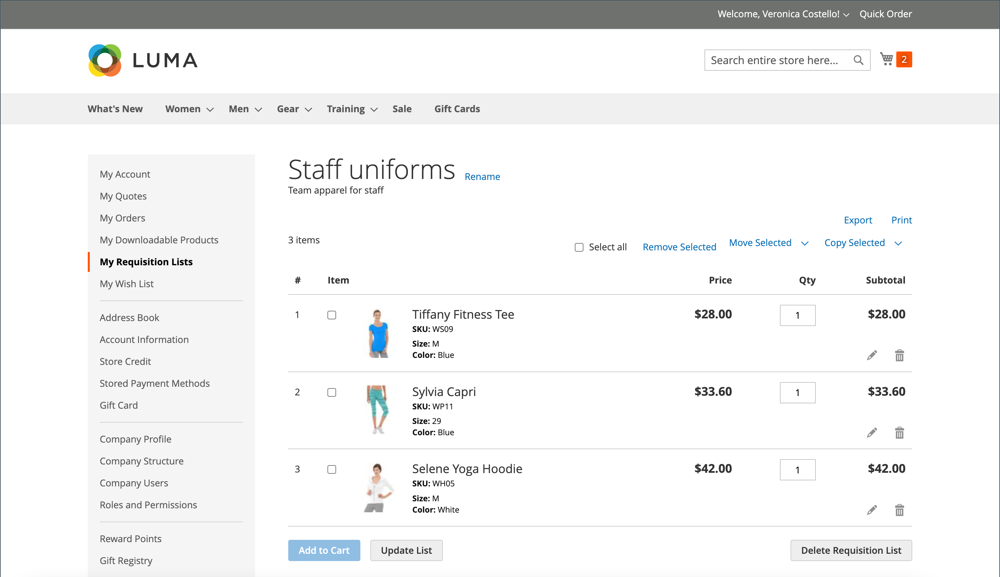
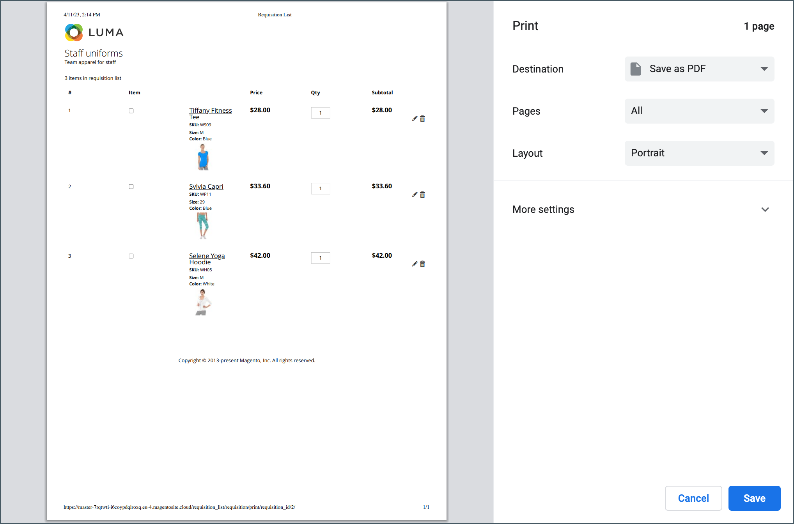
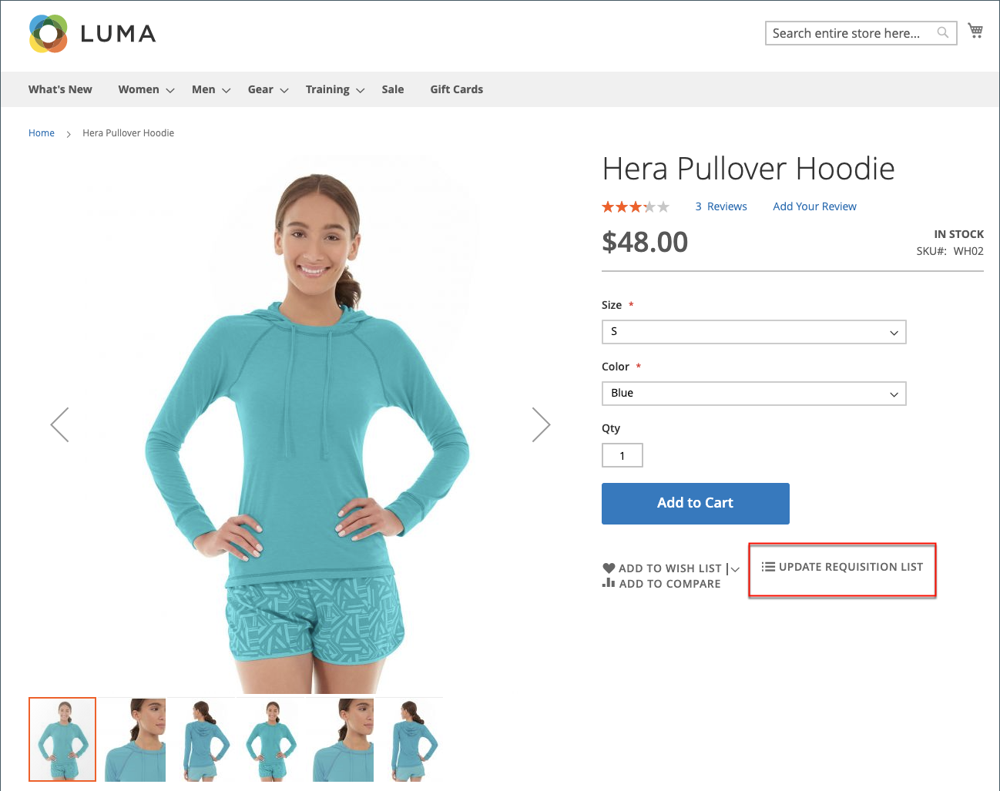
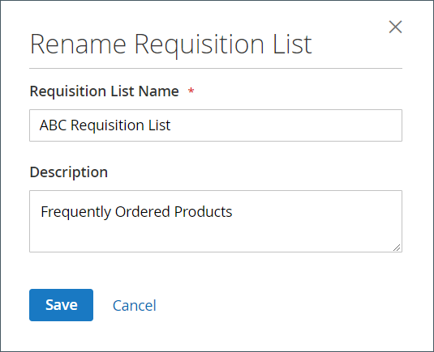

# My Requisition Lists

The primary reason to maintain a requisition list is to make it easy to reorder products. Authorized customers can easily reorder items from a requisition list by adding them to the shopping cart, and move or copy items from one list to another.

<!-- zoom -->

## View a requisition list

1. From their account dashboard, the customer chooses **My Requisition Lists**.

1. Locates the requisition list that they want to open, and clicks **View** and do any of the following:

### Add products to cart

1. The customer does one of the following to select the products to be added:

   - Selects the checkbox of each item.
   - Clicks **Select All**.

1. Enters the **Qty** to be added to the cart.

1. To change any product options, does the following:

   - In the line item, clicks **Edit** ().
   - Changes any options that are necessary.
   - Clicks **Update Requisition List**.

1. Clicks **Add to Cart**.

   <!-- zoom -->

### Copy items to a different list

1. The customer selects the checkbox of each item to be moved.

1. Clicks **Copy Selected** and does one of the following:

   - Chooses an existing requisition list.
   - Clicks **Create New Requisition List**.

### Export a list

1. The customer opens the requisition list to be exported.

1. Clicks the **Export** link.

Adobe Commerce generates and downloads a CSV list with `sku` and `qty` values.

### Move items to a different list

1. The customer selects the checkbox of each item to be moved.

1. Clicks **Move Selected** and do one of the following:

   - Chooses an existing requisition list.
   - Clicks **Create New Requisition List**.

### Print a list

1. In the upper-right corner of the list, the customer clicks **Print**.

1. Verifies the output device, and clicks **Print**.

   <!-- zoom -->

### Edit product options

To edit product options in the list, the customer does the following:

1. Clicks the _Pencil_ () icon to open the product page.

1. Changes any options that are necessary.

1. Clicks **Update Requisition List**.

   <!-- zoom -->

A product in the Requisition List can be edited when:

- Th product has **all options set** (when it is a [configured product](https://docs.magento.com/user-guide/catalog/product-create-configurable.html) in the Requisition List).

   The product is **added to this Requisition List**.

- The product is [a simple product with options](https://docs.magento.com/user-guide/catalog/settings-advanced-custom-options.html)

- Edit is allowed for the product type.

### Remove items

1. The customer selects the checkbox of each item to be removed.

1. Clicks **Remove Selected**.

1. When prompted to confirm, clicks **Delete**.

### Rename a list

1. After the list title, the customer clicks **Rename**.

1. Enters a different **Requisition List Name**.

1. Clicks **Save**.

   <!-- zoom -->

### Remove a requisition list

1. The customer opens the requisition list to be deleted.

1. Clicks **Delete Requisition List**.

1. When prompted to confirm, clicks **Delete**.

>[!NOTE]
>
>This action cannot be undone.

## Actions

|Action|Description|
|--- |--- |
|Rename|Gives you the ability to rename the requisition list, and update the description.|
|Export|Exports the requisition list into a CSV file. |
|Print|Prints the current requisition list.|
|Select|Manages the item selections that are to be the subject of an action.  **Select All** - Selects all items in the requisition list.  **Remove Selected** - Removes all selected items from the requisition list.  **Copy Selected** - Copies all selected items to another requisition list.|
|Add to Cart|Adds selected items to the shopping cart.|
|Update List|Recalculates the subtotal to reflect a change in quantity.|
|Delete Requisition List|Deletes the requisition list from the company user’s account.|

{style="table-layout:auto"}
