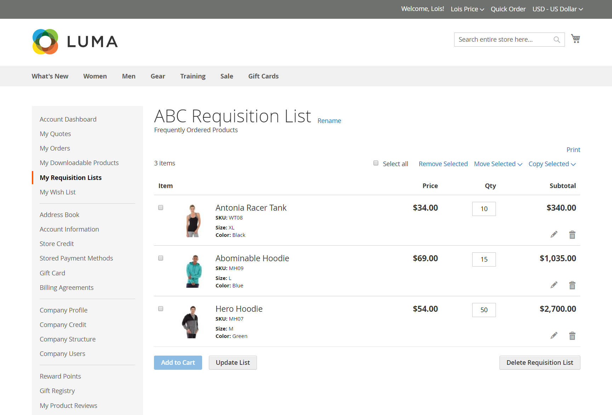
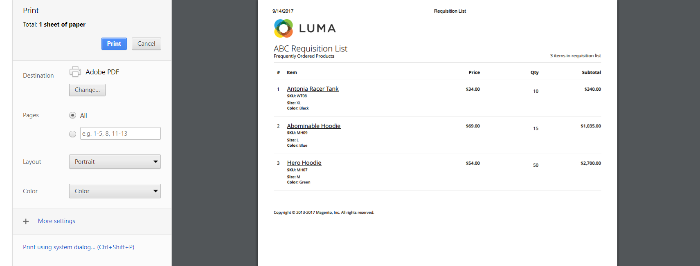
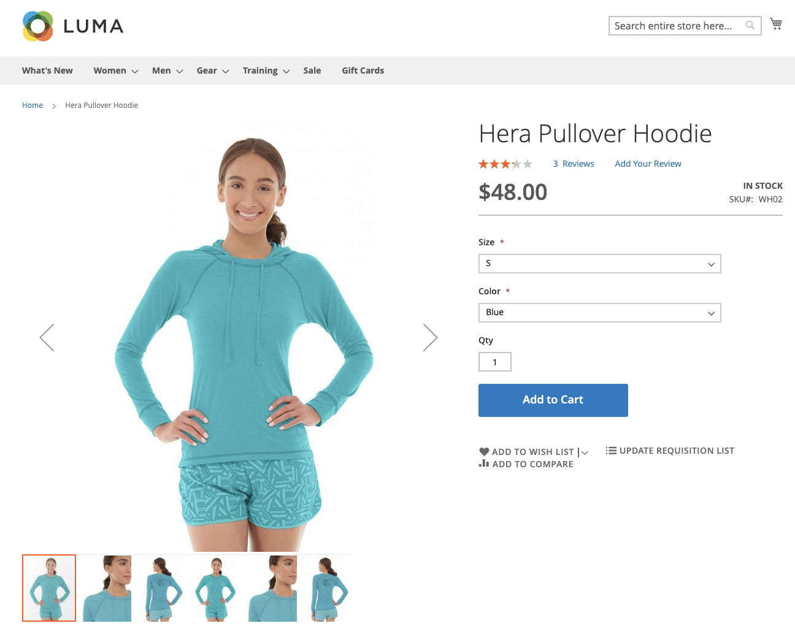
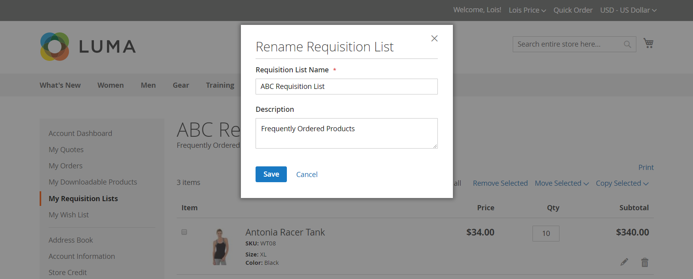

# [!UICONTROL My Requisition Lists]

The primary reason to maintain a requisition list is to make it easy to reorder products. Authorized customers can easily reorder items from a requisition list by adding them to the shopping cart, and move or copy items from one list to another.

{width="700" zoomable="yes"}

## Open a requisition list

1. From their account dashboard, the customer chooses **[!UICONTROL My Requisition Lists]**.

1. Locates the requisition list that they want to open, and clicks **[!UICONTROL View]** and do any of the following:

### Add products to cart

1. The customer does one of the following to select the products to be added:

   - Selects the checkbox of each item.
   - Clicks **[!UICONTROL Select All]**.

1. Enters the **[!UICONTROL Qty]** to be added to the cart.

1. To change any product options, does the following:

   - In the line item, clicks the _Edit_ () icon.
   - Changes any options that are necessary.
   - Clicks **[!UICONTROL Update Requisition List]**.

1. Clicks **[!UICONTROL Add to Cart]**.

   {width="700" zoomable="yes"}

### Copy items to a different list

1. The customer selects the checkbox of each item to be moved.

1. Clicks **[!UICONTROL Copy Selected]** and does one of the following:

   - Chooses an existing requisition list.
   - Clicks **[!UICONTROL Create New Requisition List]**.

### Export a list

1. The customer opens the requisition list to be exported.

1. Clicks the **[!UICONTROL Export]** link.

Adobe Commerce generates and downloads a CSV list with `sku` and `qty` values.

### Move items to a different list

1. The customer selects the checkbox of each item to be moved.

1. Clicks **[!UICONTROL Move Selected]** and do one of the following:

   - Chooses an existing requisition list.
   - Clicks **[!UICONTROL Create New Requisition List]**.

### Print a list

1. In the upper-right corner of the list, the customer clicks **[!UICONTROL Print]**.

1. Verifies the output device, and clicks **[!UICONTROL Print]**.

   {width="500" zoomable="yes"}

### Edit product options

To edit product options in the list, the customer does the following:

1. Clicks the _Pencil_ () icon to open the product page.

1. Changes any options that are necessary.

1. Clicks **[!UICONTROL Update Requisition List]**.

   {width="700" zoomable="yes"}

A product in the requisition list can be edited when:

- The product has **[!UICONTROL all options set]** (when it is a [configured product](../catalog/product-create-configurable.md) in the Requisition List).

   The product is **[!UICONTROL added to this Requisition List]**.

- The product is [a simple product with options](../catalog/settings-advanced-custom-options.md)

- Edit is allowed for the product type.

### Remove items

1. The customer selects the checkbox of each item to be removed.

1. Clicks **[!UICONTROL Remove Selected]**.

1. When prompted to confirm, clicks **[!UICONTROL Delete]**.

### Rename a list

1. After the list title, the customer clicks **[!UICONTROL Rename]**.

1. Enters a different **[!UICONTROL Requisition List Name]**.

1. Clicks **[!UICONTROL Save]**.

   {width="300"}

### Remove a requisition list

1. The customer opens the requisition list to be deleted.

1. Clicks **[!UICONTROL Delete Requisition List]**.

1. When prompted to confirm, clicks **[!UICONTROL Delete]**.

>[!NOTE]
>
>This action cannot be undone.

## Actions

|Action|Description|
|--- |--- |
|[!UICONTROL Rename]|Gives you the ability to rename the requisition list, and update the description.|
|[!UICONTROL Export]|Exports the requisition list into a CSV file. |
|[!UICONTROL Print]|Prints the current requisition list.|
|[!UICONTROL Select]|Manages the item selections that are to be the subject of an action.  **[!UICONTROL Select All]** - Selects all items in the requisition list.  **[!UICONTROL Remove Selected]** - Removes all selected items from the requisition list.  **[!UICONTROL Copy Selected]** - Copies all selected items to another requisition list.|
|[!UICONTROL Add to Cart]|Adds selected items to the shopping cart.|
|[!UICONTROL Update List]|Recalculates the subtotal to reflect a change in quantity.|
|[!UICONTROL Delete Requisition List]|Deletes the requisition list from the company user's account.|

{style="table-layout:auto"}

## Pagination controls

Pagination controls appear at the bottom of the list when the total number of requisition list items exceeds the selected items per page.

{width="700" zoomable="yes"}

>[!NOTE]
>
> Products that require your attention (for example, out-of-stock products) are displayed at the top of the list if they fall within the current page of the pagination. The number of products requiring your attention is shown above the list.
> {width="500"}

### Storefront pagination controls

| Control                                                        | Description                                                                                                                                                                      |
|----------------------------------------------------------------|----------------------------------------------------------------------------------------------------------------------------------------------------------------------------------|
|  | [!UICONTROL Show Per Page] - Determines how many requisition list items appear per page. You can choose 20, 50, 100, 500, or 1000 requisition list items to be shown on the page. |
|            |  [!UICONTROL Pagination links] - Provides navigation links to other pages.                                                                                                                              |