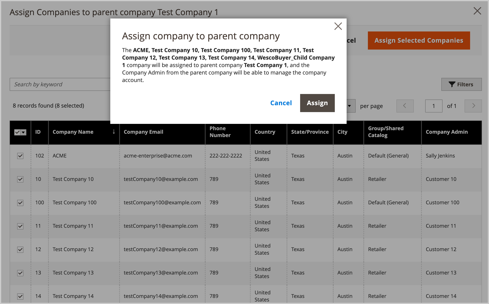

# Manage the [!UICONTROL Company Hierarchy]

[!BADGE 1.5.0-beta]{type=Informative url="/help/b2b/release-notes.md" tooltip="Available only for Beta program participants"}

Administrators can build a [!UICONTROL Company Hierarchy] by assigning related companies to a designated parent company, which is the company at the top of the organization. If the [!UICONTROL Company Type] is `Company`, the company is not part of an organization and is eligible to become a parent company, or to be assigned to an existing parent company.

In the Admin, you manage company assignments by editing a company, and then updating the [!UICONTROL Company Hierarchy] configuration to assign or unassign companies.

{width="700"}

>[!NOTE]
>
>For details about the [!UICONTROL Company Hierarchy] grid, see [Company Hierarchy](account-company-create.md#company-hierarchy) field descriptions.

## Assign companies to an organization

1. From the _Admin_ sidebar, navigate to **[!UICONTROL Customers]** > **[!UICONTROL Companies]**.

    {width="700" zoomable="yes"}

1. In the [!UICONTROL Companies] grid, open the company detail page to create the assignments.

   - To assign additional companies to an existing parent company, select the **[!UICONTROL Edit]** action for the parent company.
   - To create a parent company, select the **[!UICONTROL Edit]** action for the company to designate as the parent.

     You cannot create a parent company from an existing parent or child company.

1. On the company detail page, expand **[!UICONTROL Company Hierarchy]**.

    {width="700" zoomable="yes"}

    The grid shows existing company assignments, if any exist. The parent company is always positioned at the top of the [!UICONTROL Company Hierarchy] grid. The `[!UICONTROL Current]` flag indicates the company being edited.

1. Add companies to the parent organization.

   - Choose from a list of available companies by selecting **[!UICONTROL Assign Companies]**.

   - **Select All on This Page**, or select one or more specific company line items.

   - Select **[!UICONTROL Assign Selected Companies]**.

   - Complete the company assignment by selecting **[!UICONTROL Assign]**.

     {width="675" zoomable="yes"}

## Unassign companies from a parent company

1. On the _Admin_ sidebar, navigate to **[!UICONTROL Customers]** > **[!UICONTROL Companies]**.

    {width="700" zoomable="yes"}

1. In the [!UICONTROL Companies] grid, open the company detail page for the parent company by selecting **[!UICONTROL Edit]**.

1. View the list of assigned companies by expanding **[!UICONTROL Company Hierarchy]**.

1. From the [!UICONTROL Company Hierarchy] grid, unassign a company using the **[!UICONTROL Select]** action control to choose **[!UICONTROL Unassign from parent]**.

   {width="700" zoomable="yes"}

1. When prompted, remove the assigned company from the hierarchy by selecting **[!UICONTROL Unassign]**.
