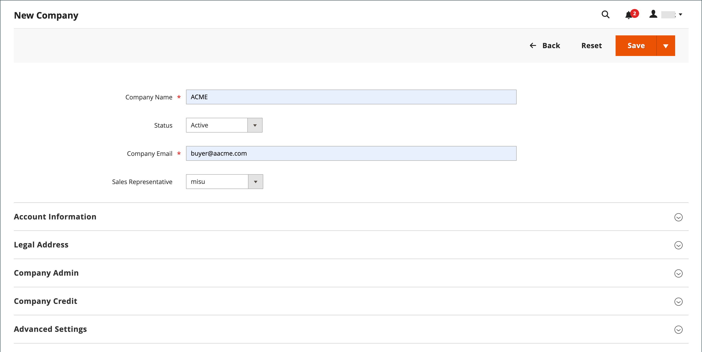

# Assign or unassign companies

The process of assigning a company to a parent company in the Admin can only be done when the companies have already been created in the Admin.

## Assign companies to a parent company

1. On the _Admin_ sidebar, navigate to **[!UICONTROL Customers]** > **[!UICONTROL Companies]**.

    {width="700" zoomable="yes"}

1. Click **[!UICONTROL Edit]** in your **[!UICONTROL Companies]** view under the **[!UICONTROL Actions]** column:

    {width="700" zoomable="yes"}

1. You can **[!UICONTROL Assign Child Companies]** by selecting the desired companies that you want to assign to that parent company.

1. Click **[!UICONTROL Confirm]** on the pop-up modal to confirm selection.

## Unassign companies to a parent company

1. On the _Admin_ sidebar, navigate to **[!UICONTROL Customers]** > **[!UICONTROL Companies]**.

    {width="700" zoomable="yes"}

1. Click **[!UICONTROL Edit]** in your **[!UICONTROL Companies]** view under the **[!UICONTROL Actions]** column:

    {width="700" zoomable="yes"}

1. You can **[!UICONTROL Unassign Child Companies]** by selecting the desired companies that you want to unassign to that parent company.

1. Click **[!UICONTROL Confirm]** on the pop-up modal to confirm selection.

>[!IMPORTANT]
>
> You can perform bulk actions to assign or unassign companies to a parent company.

