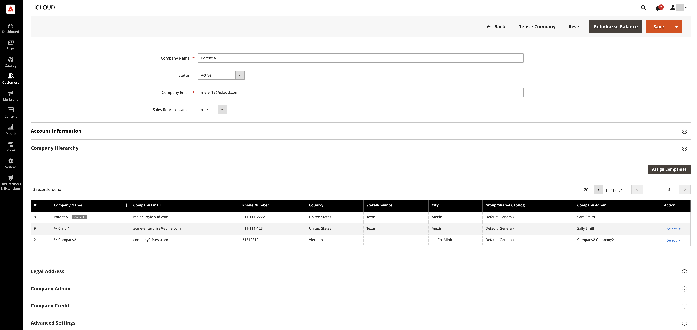
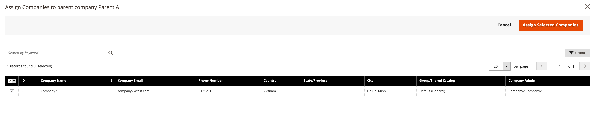

# Manage the [!UICONTROL Company Hierarchy]

[!BADGE 1.5.0-beta]{type=Informative url="/help/b2b/release-notes.md" tooltip="Available only for Beta program participants"}

Administrators can build a [!UICONTROL Company Hierarchy] by assigning related companies to a designated parent company, which is the company at the top of the organizational hierarchy.

Create a parent company by editing a company that has not been assigned to an existing [!UICONTROL Company Hierarchy], and assigning related companies.

{width="700"}

After a company has been assigned to a hierarchy, the [!UICONTROL Company type] column in the **Companies** grid identifies the company as  a `Parent` or  `Child` company.  If the [!UICONTROL Company Type] is `Company`, the company is not part of a company hierarchy and is eligible to become a parent company, or to be assigned to an existing parent company.

>[!NOTE]
>
>For details about the [!UICONTROL Company Hierarchy] grid, see [Company Hierarchy](account-company-create.md#company-hierarchy) field descriptions.

In the Admin, you manage company assignments by editing a company, and then using the [!UICONTROL Company Hierarchy] section of the [!UICONTROL Company] page to assign or unassign companies.

## Assign companies to a parent company

1. On the _Admin_ sidebar, navigate to **[!UICONTROL Customers]** > **[!UICONTROL Companies]**.

    {width="700" zoomable="yes"}

1. In the Companies grid, open the company detail page to create the assignments.

   - To assign additional companies to an existing parent company, select the **[!UICONTROL Edit]** action for the parent company.
   - To create a new parent company, select the **[!UICONTROL Edit]** action for the company designated as the parent.
   
     You cannot create a new parent company from an existing parent or child company.

    {width="700" zoomable="yes"}

1. On the Company detail page, expand the **[!UICONTROL Company Hierarchy]** dropdown, and select **[!UICONTROL Assign Companies]**.

    {width="700" zoomable="yes"}

    When you expand this view, you can see existing company assignments, if any exist. The parent company always appear on top of the _[!UICONTROL Company Hierarchy]_ grid with a `current company indicator` shown in the company line being edited.

1. Companies available for assignment are listed in the grid. Select the companies to assign, then select **[!UICONTROL Assign Selected Companies]**.

1. You can **Select All on This Page** or one specific company line item and click **[!UICONTROL Assign Selected Companies]**.

    {width="700" zoomable="yes"}

1. When prompted, complete the company assignment by selecting **[!UICONTROL Assign]**.

## Unassign companies from a parent company

1. On the _Admin_ sidebar, navigate to **[!UICONTROL Customers]** > **[!UICONTROL Companies]**.

    {width="700" zoomable="yes"}

1. On the Companies page, open the company detail page for the parent company by selecting the **[!UICONTROL Edit]** action.

    {width="700" zoomable="yes"}

1. View the list of assigned companies by expanding the **[!UICONTROL Company Hierarchy]** dropdown.

1. From the company hierarchy grid, unassign a company by selecting the **[!UICONTROL Select]** action for the company, and then choose **[!UICONTROL Unassign from parent]**.

    {width="700" zoomable="yes"}

1. When prompted, remove the assigned company from the hierarchy by selecting **[!UICONTROL Unassign]**.
