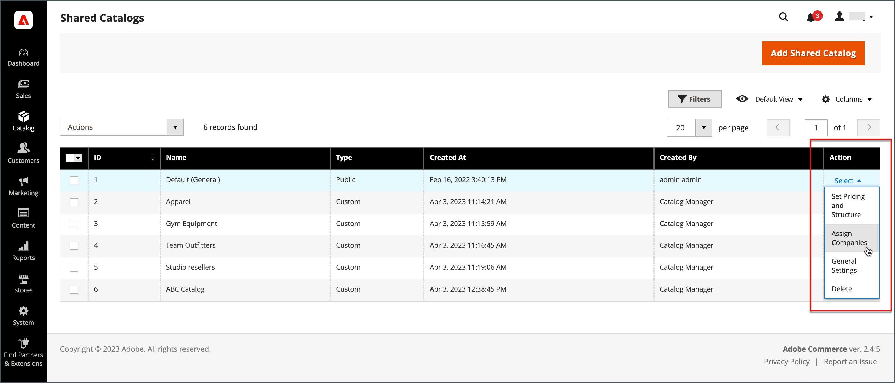
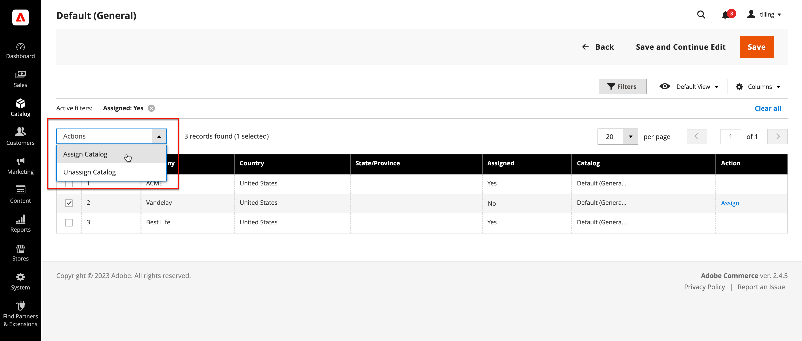
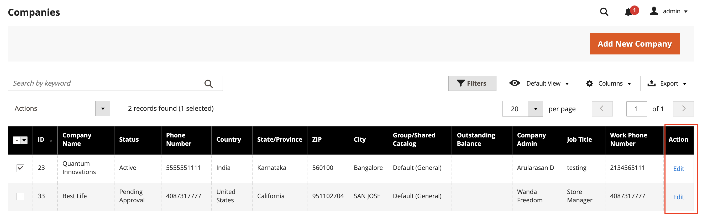
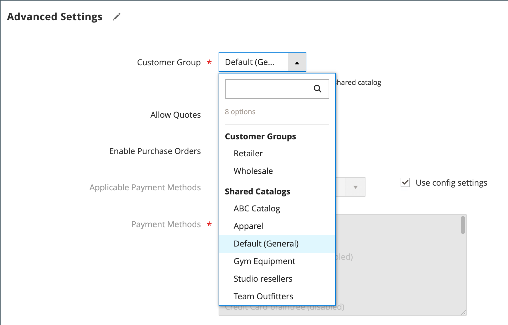

# Assign companies to a shared catalog

There are two ways to assign a company to a shared catalog. You can make the assignment from the _[!UICONTROL Shared Catalogs]_ grid, or edit the company and assign the shared catalog as you would choose a customer group.

{width="700" zoomable="yes"}

## Method 1: Assign companies from the shared catalog

1. On the _Admin_ sidebar, go to **[!UICONTROL Catalog]** > **[!UICONTROL Shared Catalogs]**.

1. For the shared catalog in the grid where you want to assign a company, go to the **[!UICONTROL Action]** column and select **[!UICONTROL Assign Companies]**.

   The list of available companies appears in the grid.

1. Select the company that you want to assign to the shared catalog, click the **[!UICONTROL Actions]** menu, and choose **[!UICONTROL Assign Catalog]**.

   {width="700" zoomable="yes"}

   As an alternative, you can click **[!UICONTROL Assign]** in the **[!UICONTROL Action]** column for any company that is not assigned to the catalog.

1. Repeat for each company that you want to assign to the shared catalog.

   The company is assigned to the shared catalog.

1. When complete, click **[!UICONTROL Save]**.

## Method 2: Edit the company

1. On the _Admin_ sidebar, go to **[!UICONTROL Customers]** > **[!UICONTROL Companies]**.

1. For the company displayed in the grid, go to the **[!UICONTROL Action]** column and click **[!UICONTROL Edit]**.

   {width="700" zoomable="yes"}

1. On the company page, scroll down and expand  the **[!UICONTROL Advanced Settings]** section.

1. Set **[!UICONTROL Customer Group]** to the appropriate shared catalog.

   Changing the shared catalog assignment also changes the customer group assignment for all company members.

   {width="600"}

1. When prompted to confirm, click **[!UICONTROL Proceed]** and then **[!UICONTROL Save]**.
