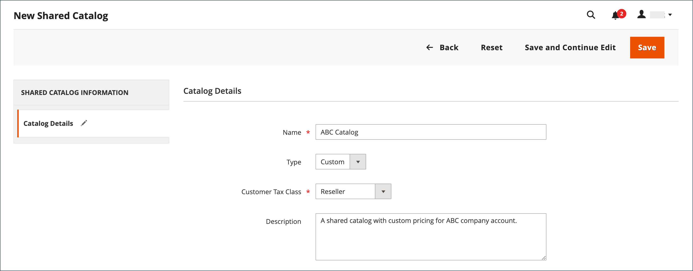
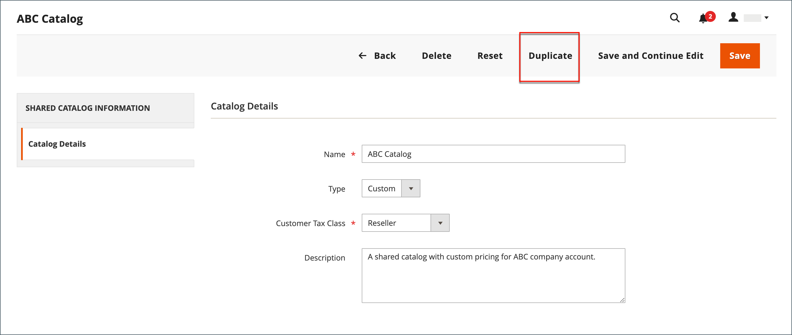

# Create a shared catalog

When a [shared catalog](catalog-shared.md) is created, the system automatically creates a [customer group](account-company-customer-group.md) by the same name. For example, if you create a shared catalog called _ABC Catalog_, the system also creates a corresponding _ABC Catalog_ customer group. Assigning a company to the shared custom catalog is essentially the same as assigning them to a customer group.

A new shared catalog does not include products, custom pricing, or company associations. A public catalog, which is the default shared catalog that is created when shared catalogs are enabled, is automatically assigned to guests and to customers who are not associated with a company.

{width="700" zoomable="yes"}

The following aspects of a shared catalog must be set up before it can be used:

- Catalog scope
- Product selection
- Custom prices
- Company assignments

## Price scope

If you have a multisite installation, make sure to configure the price scope before you create your shared catalogs. The [price scope](../catalog/catalog-price-scope.md) can be set to `Global` or `Website`. However, it can be set only at the beginning of the setup process. The website chooser appears during step 2 of the [shared catalog setup](catalog-shared-pricing-structure.md).

{width="600" zoomable="yes"}

1. On the _Admin_ sidebar, go to **[!UICONTROL Stores]** > _[!UICONTROL Settings]_ > **[!UICONTROL Configuration]**.

1. In the left panel, expand **Catalog** and choose **Catalog** underneath.

1. Expand  the **Price** section.

1. Set **Catalog Price Scope** to `Website`.

   {width="600" zoomable="yes"}

1. Click **[!UICONTROL Save Config]**.

## Step 1: Create the shared catalog

There are two ways to create a shared catalog. You can create a shared catalog of either type, or duplicate an existing shared catalog. A new shared catalog does not include any products, and is not yet assigned to a company.

### Method 1: Add a new shared catalog

1. On the _Admin_ sidebar, go to **[!UICONTROL Catalog]** > **[!UICONTROL Shared Catalogs]**.

1. In the upper-right corner, click **[!UICONTROL Add Shared Catalog]** and do the following:

   - Enter a **[!UICONTROL Name]** for the shared catalog.

      The name you assign is used throughout the Admin and customer dashboard, if applicable, to refer to the shared catalog. It also becomes the name of the corresponding customer group.

   - Select **[!UICONTROL Type]** : `Custom` or `Public`.

   - Choose the appropriate **[!UICONTROL Customer Tax Class]** that applies to purchases made from the shared catalog.

      For more information about tax class setup and definition, see [Tax classes](../stores-purchase/tax-class.md).

      The following example shows a new custom catalog for a specific wholesale customer.

      {width="600" zoomable="yes"}

   - Enter **[!UICONTROL Description]**

1. When complete, Click **[!UICONTROL Save]**.

   The new catalog appears in the _[!UICONTROL Shared Catalogs]_ grid.

### Method 2: Duplicate an existing shared catalog

A duplicate custom catalog retains the pricing model and structure of the original, but not the company associations. A corresponding customer group is also created with the same name as the duplicate catalog. By default, a duplicate catalog is named _Duplicate of_ the original catalog.

If a public shared catalog is duplicated, the type of the duplicate catalog changes to `custom`.

1. On the _Admin_ sidebar, go to **[!UICONTROL Catalog]** > **[!UICONTROL Shared Catalogs]**.

1. For the shared catalog in the grid that you want to duplicate, go to the **[!UICONTROL Action]** column and select **[!UICONTROL General Settings]**.

1. In the options across the top of the page, click **[!UICONTROL Duplicate]**.

   {width="600" zoomable="yes"}

1. Update the following fields for the new catalog:

   - **[!UICONTROL Name]**
   - **[!UICONTROL Type]**
   - **[!UICONTROL Customer Tax Class]**
   - **[!UICONTROL Description]**

1. When complete, Click **[!UICONTROL Save]**.

   The duplicate appears in the _[!UICONTROL Shared Catalogs]_ grid, with a unique ID.

## Step 2: Complete the setup

After creating a new shared catalog, it must be configured with the appropriate product selection, [company assignments](catalog-shared-assign-companies.md), and [category permissions](../catalog/category-permissions.md). To continue, see [Set pricing and structure](catalog-shared-pricing-structure.md).

>[!NOTE]
>
>**[B2B release 1.3.0](release-notes.md#b2b-v130) and later** -- When you create a shared catalog, each [category permission](../catalog/category-permissions.md) for the catalog is set to _[!UICONTROL Allow for the Display Product Prices]_ and _[!UICONTROL Add to Cart]_ for customer groups that are assigned this access in the catalog permission settings. Previously, these settings were automatically set to `Deny` even when catalog permissions were set to `Allow`.

## Shared catalog demo

To see a demonstration of shared catalog management, watch this video:

>[!VIDEO](https://video.tv.adobe.com/v/344446?quality=12&learn=on)

## Shared catalog page reference

### Button bar

|Button|Description|
|--- |--- |
| [!UICONTROL Back] |Returns to the Shared Catalogs page without saving the new shared catalog.|
| [!UICONTROL Reset] |Clears the form of any unsaved changes, and restores the original catalog detail information.|
| [!UICONTROL Save and Continue Edit] |Saves all changes, and keeps the form open in edit mode.|
| [!UICONTROL Save] |Saves changes, closes the form, and returns to the Shared Catalogs page.|

{style="table-layout:auto"}

### Catalog details

|Field|Description|
|--- |--- |
|[!UICONTROL Name]|Identifies the shared catalog throughout the Admin, and in the customer accounts where it is available. The catalog name should be descriptive and no more than 32 characters in length. You cannot have two shared catalogs with the same name. Maximum characters: 32|
|[!UICONTROL Type]|**[!UICONTROL Custom]** - Identifies a catalog with custom pricing that is available only to the specific companies to which it is assigned. **[!UICONTROL Public]** - Identifies the shared catalog that is available to all guest visitors and to logged-in customers who are not associated with a company. A default public shared catalog is created when [!DNL B2B for Adobe Commerce] is installed, but must be configured by a store administrator. Only one public shared catalog can exist at a time.|
|[!UICONTROL Customer Tax Class]|Determines the tax class that is used for purchases made from the catalog. The options include all available tax classes.|
|[!UICONTROL Description]|A brief explanation of how the catalog is to be used.|

{style="table-layout:auto"}

### Grid columns

|Field|Description|
|--- |--- |
|[!UICONTROL ID]|A unique numeric identifier that is assigned to shared catalog entity.|
|[!UICONTROL Name]|The name of the shared catalog.|
|[!UICONTROL Type]|Indicates the type of shared catalog. Can be `Public` or `Custom`.|
|[!UICONTROL Created At]|The date when the shared catalog was created in the system.|
|[!UICONTROL Created By]|The name of admin user who created a shared catalog.|
|[!UICONTROL Action]|The list of actions. Options: `Set Pricing and Structure`, `Assign Companies`, `General Settings`, `Delete`.|

{style="table-layout:auto"}
