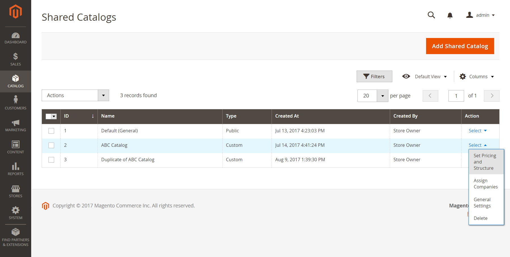
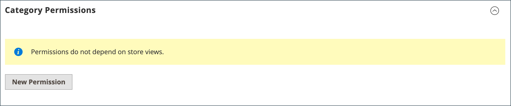
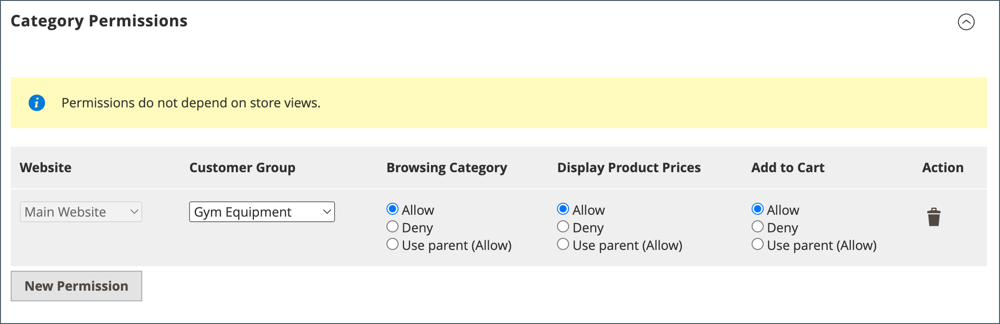
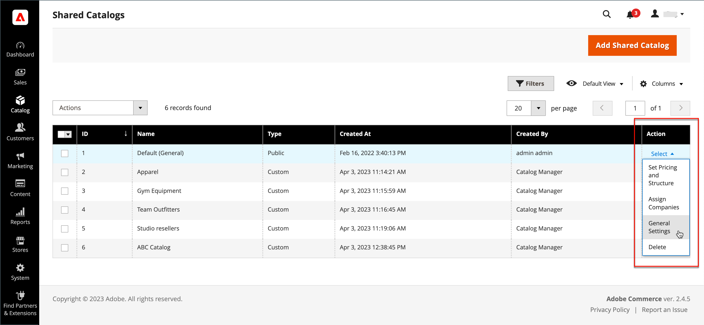
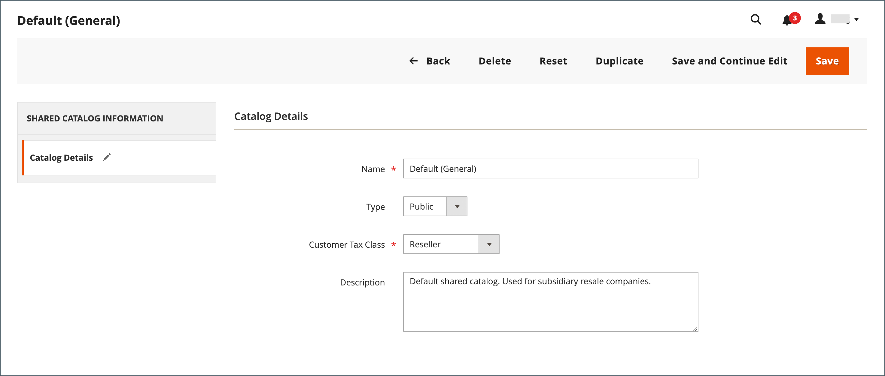

# Manage Your Shared Catalogs

The Shared Catalogs page provides access to the tools needed for managing your shared catalogs. The page is similar to the standard Admin workspace, with filters and action controls. The grid lists all shared catalogs, including the default public shared catalog, and any custom catalogs that you have set up.

## Update the product selection

The selection of products in any shared catalog can be easily updated from the Action column of the Shared Catalogs grid. The changes you make are visible to members of any associated company accounts. The process is essentially the same as choosing products for a new [catalog structure](catalog-shared-pricing-structure.md), except that the scope of the configuration cannot be changed.

<!--- zoom --->

1. On the _Admin_ sidebar, go to **Catalog** > **Shared Catalogs**.

1. For the shared catalog in the grid, go to the **Action** column and select **Set Pricing and Structure**.

1. Follow the instructions in [Step 2: Choose Products](catalog-shared-pricing-structure.md).

   You can skip the first item, because the scope of a shared catalog cannot be changed after it is saved for the first time.

If you are working with a specific product, the _Products In Shared Catalog section list each shared catalog where the product is available. To learn more, see [Adding Products to a Shared Catalog](catalog-shared-product-add.md).

<!--- zoom --->

## Update custom pricing

The custom pricing of products in any shared catalog can be easily updated from the Action column of the Shared Catalogs grid. The changes you make are visible to in the storefront to members of the associated company or customer group. The process is essentially the same as setting custom pricing for a new [shared catalog](catalog-shared-pricing-structure.md), except that the scope of the configuration cannot be changed.

<!--- zoom --->

1. On the _Admin_ sidebar, go to **Catalog** > **Shared Catalogs**.

1. For the shared catalog in the grid that you want to update, go to the **Action** column and select **Set Pricing and Structure**.

1. On the _Catalog Structure_ page, click **Configure** and do one of the following:

   - In the progress indicator at the top of the page, click **Pricing**.
   - In the upper-right corner, click **Next**.

1. Follow the instructions in [Step 2: Set Custom Prices](catalog-shared-pricing-structure.md).

## Update category permissions

[Category permissions](https://docs.magento.com/user-guide/catalog/category-permissions.html) are automatically set to `Allow` for products that are added from the category tree to a shared catalog. You can later adjust the permissions, or create additional rules, as needed.

>[!NOTE]
>
>When the [shared catalog](enable-basic-features.md) feature is enabled in the configuration, each category permission for the catalog is set to `Deny` for all customer groups automatically. Also, when a new category is created, it has the `Deny` category permissions by default to prevent showing that category on the storefront site before assignment to the shared catalog.

1. On the _Admin_ sidebar, go to **Catalog** > **Categories**.

1. In the category tree, select the category of the products that you want to update.

   To include all products, select the top-level category in the tree.

1. Scroll down and expand  the **Category Permissions** section.

1. Click **New Permission** and do the following:

   <!--- zoom --->

   - Choose the **Customer Group** that corresponds to the shared catalog and change the permission settings as needed.

      <!--- zoom --->

   - To create a permissions rule for another customer group, click **New Permissions** and repeat the process.

   - To delete a permission rule, click the  icon.

1. When complete, click **Save**.

## Update the catalog details

The detail information of any shared catalog can be easily updated from the Action column of the Shared Catalogs grid. The changes you make are reflected in any associated company accounts.

<!--- zoom --->

1. On the _Admin_ sidebar, go to **Catalog** > **Shared Catalogs**.

1. For the shared catalog that you want to update, go to the **Action** column and select **General Settings**.

   <!--- zoom --->

1. Update the catalog detail information as needed.

   - Changing the name of a shared catalog, also changes the name of the corresponding customer group.
   - Changing the catalog type from `Custom` to `Public` converts the existing public catalog to a custom catalog. Any companies associated with the original public catalog are reassigned to the replacement. A public catalog cannot be converted to a custom catalog.

1. When complete, click **Save**.

## Shared Catalog page reference

### Button bar

|Button|Description|
|--- |--- |
|**Back**|Returns to the Shared Catalogs page without saving the new shared catalog.|
|**Delete**|Deletes the catalog and reassigns any associated companies and their members to the public shared catalog.|
|**Reset**|Clears the form of any unsaved changes, and restores the original catalog detail information.|
|**Duplicate**|Creates a [duplicate copy of the catalog](catalog-shared-create.md). For a custom catalog, the  pricing model and structure of the original, but without the company associations. If a public shared catalog is duplicated, the type of the duplicate catalog changes to `custom`. A corresponding customer group is also created with the same name as the duplicate catalog. By default, a duplicate catalog is named _Duplicate of_ the original catalog.|
|**Save and Continue Edit**|Saves all changes, and keeps the form open in edit mode.|
|**Save**|Saves changes, closes the form, and returns to the Shared Catalogs page.|

{style="table-layout:auto"}

### Catalog details

|Field|Description|
|--- |--- |
|Name|Identifies the shared catalog throughout the Admin, and in the customer accounts where it is available. The catalog name should be descriptive and no more than 32 characters in length. You cannot have two shared catalogs with the same name. Maximum characters: 32|
|Type|**Custom** - Identifies a catalog with custom pricing that is available only to the specific companies to which it is assigned. **Public** - Identifies the shared catalog that is available to all guest visitors and to logged-in customers who are not associated with a company. A “default” public shared catalog is created when B2B for Adobe Commerce is installed, but must be configured by the administrator. Only one public shared catalog can exist at a time.|
|Customer Tax Class|Determines the tax class that is used for purchases made from the catalog. The options include all available tax classes.|
|Description|A brief explanation of how the catalog is to be used.|

{style="table-layout:auto"}
