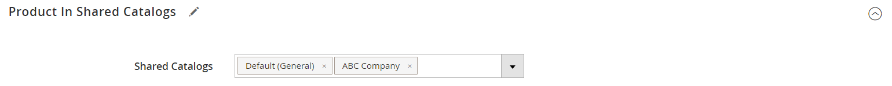
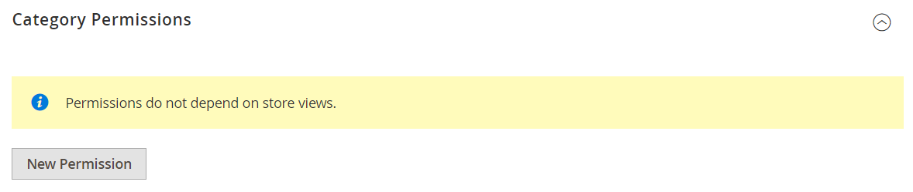
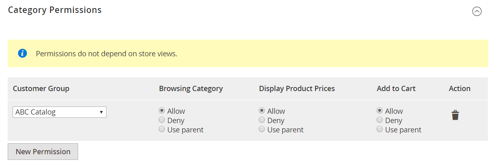
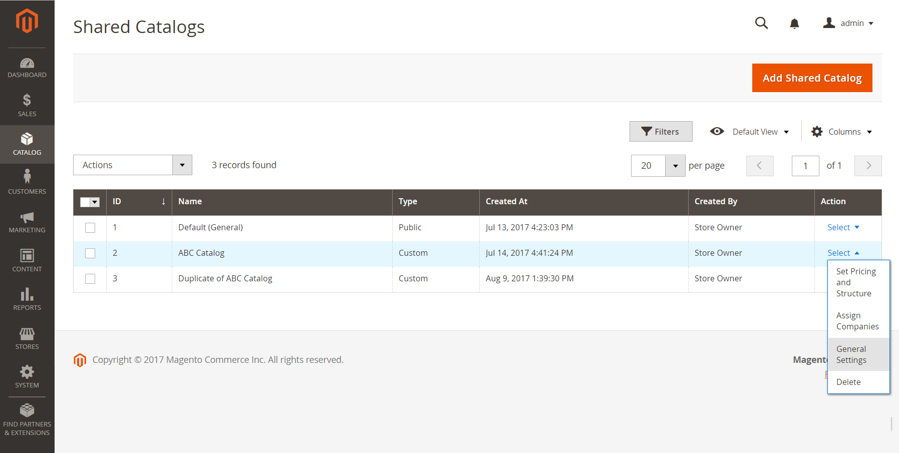
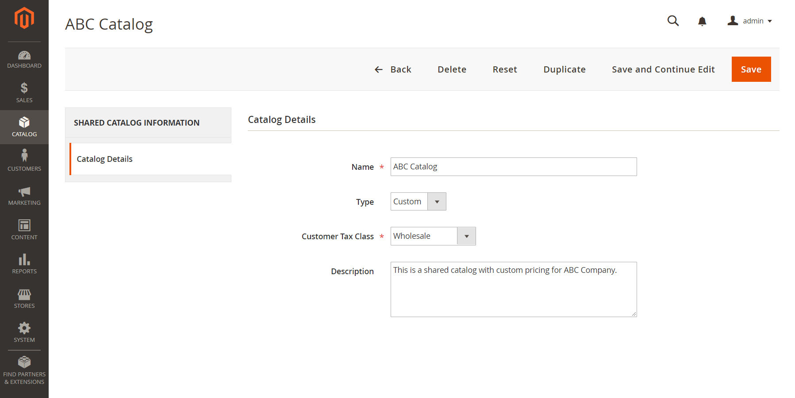

# Manage your shared catalogs

The _[!UICONTROL Shared Catalogs]_ page provides access to the tools needed for managing your shared catalogs. The page is similar to the standard Admin workspace, with filters and action controls. The grid lists all shared catalogs, including the default public shared catalog, and any custom catalogs that you have set up.

## Update the product selection

The selection of products in any shared catalog can be easily updated from the _[!UICONTROL Action]_ column of the shared catalogs grid. The changes you make are visible to members of any associated company accounts. The process is essentially the same as choosing products for a new [catalog structure](catalog-shared-pricing-structure.md), except that the scope of the configuration cannot be changed.

1. On the _Admin_ sidebar, go to **[!UICONTROL Catalog]** > **[!UICONTROL Shared Catalogs]**.

1. For the shared catalog in the grid, go to the **[!UICONTROL Action]** column and select **[!UICONTROL Set Pricing and Structure]**.

   {width="700" zoomable="yes"}

1. Follow the instructions in [Step 2: Choose products](catalog-shared-pricing-structure.md#step-2-choose-the-products).

   You can skip the first item, because the scope of a shared catalog cannot be changed after it is saved for the first time.

If you are working with a specific product, the _[!UICONTROL Products In Shared Catalog]_ section list each shared catalog where the product is available. To learn more, see [Add products to a shared catalog](catalog-shared-product-add.md).

{width="600" zoomable="yes"}

## Update custom pricing

The custom pricing of products in any shared catalog can be easily updated from the Action column of the Shared Catalogs grid. The changes you make are visible to in the storefront to members of the associated company or customer group. The process is essentially the same as setting custom pricing for a new [shared catalog](catalog-shared-pricing-structure.md), except that the scope of the configuration cannot be changed.

1. On the _Admin_ sidebar, go to **[!UICONTROL Catalog]** > **[!UICONTROL Shared Catalogs]**.

1. For the shared catalog in the grid that you want to update, go to the **[!UICONTROL Action]** column and select **[!UICONTROL Set Pricing and Structure]**.

1. On the _[!UICONTROL Catalog Structure]_ page, click **[!UICONTROL Configure]** and do one of the following:

   - In the progress indicator at the top of the page, click **[!UICONTROL Pricing]**.
   - In the upper-right corner, click **[!UICONTROL Next]**.

1. Follow the instructions in [Step 3: Set custom prices](catalog-shared-pricing-structure.md#step-3-set-custom-prices).

## Update category permissions

[Category permissions](../catalog/category-permissions.md) are automatically set to `Allow` for products that are added from the category tree to a shared catalog. You can later adjust the permissions, or create additional rules, as needed.

>[!NOTE]
>
>**[B2B release 1.3.0](release-notes.md#b2b-v130) and later** -- When you create a shared catalog, each [category permission](../catalog/category-permissions.md) for the catalog is set to `Allow` for the _[!UICONTROL Display Product Prices]_ and _[!UICONTROL Add to Cart]_ for customer groups that are assigned this access in the catalog permission settings. Previously, these settings were automatically set to `Deny` even when catalog permissions were set to `Allow`.

>[!IMPORTANT]
>
>All existing [group permission settings](../configuration-reference/catalog/catalog.md#category-permissions) are ignored by **_all_** categories in the catalog when the **_[!UICONTROL Shared Catalog]_** feature is enabled. [!UICONTROL Shared Catalog] fully controls all category permissions in the catalog when it is enabled.

1. On the _Admin_ sidebar, go to **[!UICONTROL Catalog]** > **[!UICONTROL Categories]**.

1. In the category tree, select the category of the products that you want to update.

   To include all products, select the top-level category in the tree.

1. Scroll down and expand  the **[!UICONTROL Category Permissions]** section.

1. Click **[!UICONTROL New Permission]** and do the following:

   {width="600" zoomable="yes"}

   - Choose the **[!UICONTROL Customer Group]** that corresponds to the shared catalog and change the permission settings as needed.

      {width="600" zoomable="yes"}

   - To create a permissions rule for another customer group, click **[!UICONTROL New Permissions]** and repeat the process.

   - To delete a permission rule, click the _Delete_  icon.

1. When complete, Click **[!UICONTROL Save]**.

## Update the catalog details

The detail information of any shared catalog can be easily updated from the Action column of the Shared Catalogs grid. The changes you make are reflected in any associated company accounts.

{width="700" zoomable="yes"}

1. On the _Admin_ sidebar, go to **[!UICONTROL Catalog]** > **[!UICONTROL Shared Catalogs]**.

1. For the shared catalog that you want to update, go to the **[!UICONTROL Action]** column and select **[!UICONTROL General Settings]**.

   {width="600" zoomable="yes"}

1. Update the catalog detail information as needed.

   - Changing the name of a shared catalog, also changes the name of the corresponding customer group.
   - Changing the catalog type from `Custom` to `Public` converts the existing public catalog to a custom catalog. Any companies associated with the original public catalog are reassigned to the replacement. A public catalog cannot be converted to a custom catalog.

1. When complete, Click **[!UICONTROL Save]**.

## Shared catalog page reference

### Button bar

|Button|Description|
|--- |--- |
|[!UICONTROL Back]|Returns to the Shared Catalogs page without saving the new shared catalog.|
|[!UICONTROL Delete]|Deletes the catalog and reassigns any associated companies and their members to the public shared catalog.|
|[!UICONTROL Reset]|Clears the form of any unsaved changes, and restores the original catalog detail information.|
|[!UICONTROL Duplicate]|Creates a [duplicate copy of the catalog](catalog-shared-create.md). For a custom catalog, the  pricing model and structure of the original, but without the company associations. If a public shared catalog is duplicated, the type of the duplicate catalog changes to `custom`. A corresponding customer group is also created with the same name as the duplicate catalog. By default, a duplicate catalog is named _Duplicate of_ the original catalog.|
|[!UICONTROL Save and Continue Edit]|Saves all changes, and keeps the form open in edit mode.|
|[!UICONTROL Save]|Saves changes, closes the form, and returns to the Shared Catalogs page.|

{style="table-layout:auto"}

### Catalog details

|Field|Description|
|--- |--- |
|[!UICONTROL Name]|Identifies the shared catalog throughout the Admin, and in the customer accounts where it is available. The catalog name should be descriptive and no more than 32 characters in length. You cannot have two shared catalogs with the same name. Maximum characters: 32|
|[!UICONTROL Type]|**[!UICONTROL Custom]** - Identifies a catalog with custom pricing that is available only to the specific companies to which it is assigned. **[!UICONTROL Public]** - Identifies the shared catalog that is available to all guest visitors and to logged-in customers who are not associated with a company. A "default" public shared catalog is created when Adobe Commerce B2B is installed, but must be configured by the administrator. Only one public shared catalog can exist at a time.|
|[!UICONTROL Customer Tax Class]|Determines the tax class that is used for purchases made from the catalog. The options include all available tax classes.|
|[!UICONTROL Description]|A brief explanation of how the catalog is to be used.|

{style="table-layout:auto"}
