# Set Pricing and Structure

Setting up the pricing and structure of a shared catalog is a two-step process. Your current place in the process is highlighted with a number in the progress bar at the top of the page. You can view the other step in the process at any time by clicking the progress bar. For example, if you're working on custom pricing, you might want to return to the product selection page for reference. Simply click **[!UICONTROL Products]** in the progress bar at the top of the page, and then click **[!UICONTROL Pricing]** to return to the custom pricing page. Your work is not lost in this process.

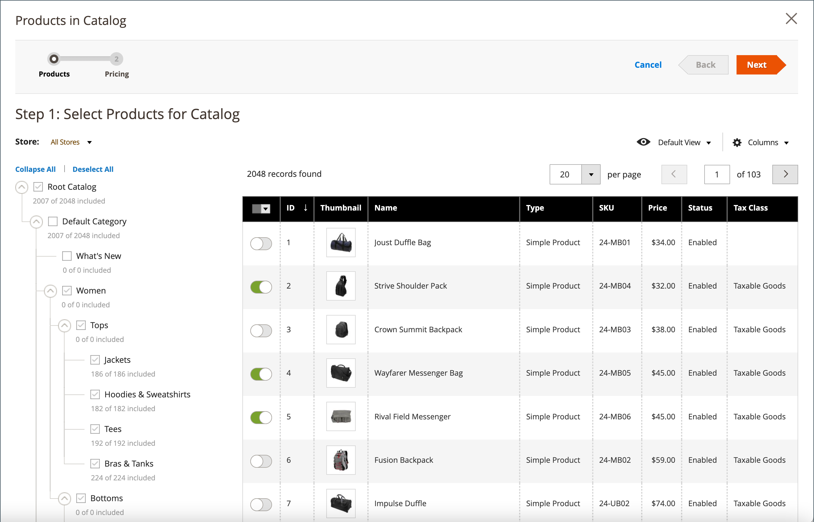<!-- zoom -->

In the standard category tree, the root category is the topmost container and is referred to as _Default Category_ in the sample data. However, when shared catalogs are enabled, the category tree has an outer container called _Root Catalog_. The root catalog encompasses all other category structures that exist in the system. For more information, see [Catalog Scope](../catalog/introduction.md#catalog-scope).

## Step 1: Open the shared catalog pricing and structure configuration

1. On the _Admin_ sidebar, go to **[!UICONTROL Catalog]** > **[!UICONTROL Shared Catalogs]**

1. For the shared catalog in the grid, go to the _[!UICONTROL Action]_ column and click **[!UICONTROL Set Pricing and Structure]**.

1. The first time the shared catalog is configured, click **[!UICONTROL Configure]** to continue with the following steps.

## Step 2: Choose the products

The first step in the process is to choose the products that you want to include in the shared catalog. The product selection page features the [category tree](../catalog/category-create.md) on the left, and a synchronized product grid on the right. If you click a category in the tree, the products in the category appear in the grid.

Only categories with selected products appear in the [top navigation](../catalog/navigation-top.md) when the shared catalog is viewed from the storefront. By default, only the first three category levels are included in the storefront navigation, not including the root category.

1. Use the **Store** chooser to set the [scope](../catalog/introduction.md#product-scope) of the configuration.

   The scope of the configuration can be set only before the shared catalog is saved for the first time. If you later edit the product selection, the Store chooser is not available.

   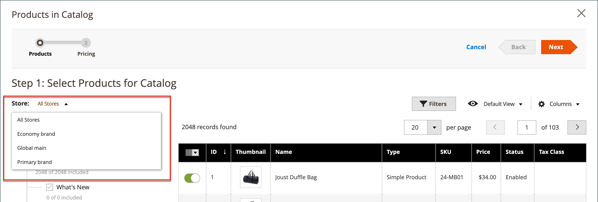<!-- zoom -->

1. In the category tree, do any of the following:

   - To include all products, click **[!UICONTROL Select all]** or select the checkbox of the parent category.
   - To include specific categories of products, select the checkbox of each category that you want to include.
   - To include or exclude an individual product, select or deselect the checkbox of product.

   The notation below each category in the tree shows the number of products from the category that are currently included in the shared catalog. The notation below the [root category](../catalog/category-root.md) shows the total number of products from all categories that are currently selected for the shared catalog.

1. To view category products in the grid, click the name of the category in the tree. When a category is selected, the following occurs:

   - The toggle in the first column of the grid is set to the green _On_ position for each selected product.
   - If a product is assigned to multiple categories and is not selected in one of them, it remains available through the other categories, and also when using [catalog search](../catalog/search.md).
   - The system automatically sets [Category Permissions](../catalog/category-permissions.md) to `Allow` for the selected products.

1. If necessary, use the filters and other grid controls to find the products that you want to include in the shared catalog.

   You can individually select or omit individual products by clicking the toggle in the first column.

   If you select a category that has no products, but is linked to CMS content or an external link, it is displayed in the top navigation on the storefront.

   The category settings that you make are not permanently recorded in the database until the configuration is saved. However, they are saved temporarily as you work on the structure and pricing.

1. Click **[!UICONTROL Next]**.

   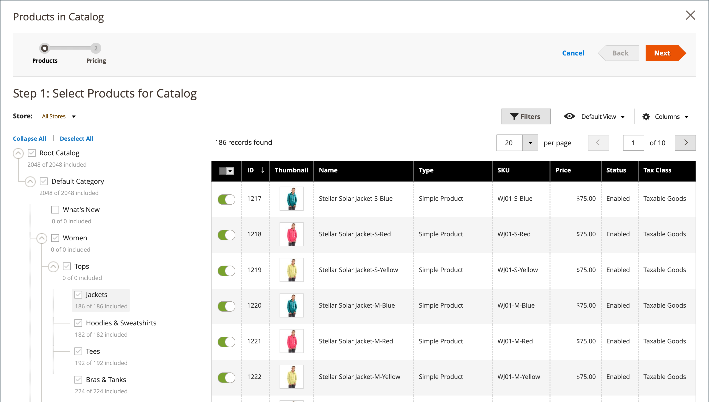<!-- zoom -->

## Step 3: Set custom prices

You can set custom pricing for each product individually or use the Action control to set custom pricing as a fixed amount or percentage for multiple product records.

- **[!UICONTROL Fixed]**: Specifies the final product price. For example, if you enter a fixed price of $10.00, the price in the storefront for the corresponding company is $10.00. 

   >[!NOTE]
   >
   >The minimum value between the Base Price and the entered Fixed value is used as the final product price.

- **[!UICONTROL Percentage]**: Determines the custom price based on the discount percent. For example, to offer a 10 percent discount, set the custom price type to `Percentage` and enter `10`. The discounted custom price is 90 percent of the original product price. |

To set the discount to a fixed amount or a percentage for the following product types, use the _[!UICONTROL Custom Price]_ column in the grid:

- [Simple](../catalog/product-create-simple.md) (including configurable product variations)
- [Bundle](../catalog/product-create-bundle.md)
- [Downloadable](../catalog/product-create-downloadable.md)
- [Virtual](../catalog/product-create-virtual.md)

The Custom Price column is blank for [configurable](../catalog/product-create-configurable.md) and [grouped](../catalog/product-create-grouped.md) products types and for [gift cards](../catalog/product-gift-card.md).

The selection of products in the grid cannot be changed from the _Custom Prices_ page. However, you can use the progress indicator at the top of the page to return to the previous step and change the selection of products.

### Apply a custom price

1. For a multi-site installation, set **[!UICONTROL Website]** to the website where the custom prices apply.

   <!-- zoom -->

1. Use one of the following methods to select the products where the custom pricing is to apply.

   - Use the category tree to select all products in a specific category.
   - Set the _[!UICONTROL Mass Actions]_ control in the header to `Select All`.
   - Select the checkbox of individual products.

   The grid displays the products in the currently selected categories, and you can use the standard controls to find products and filter the list.

   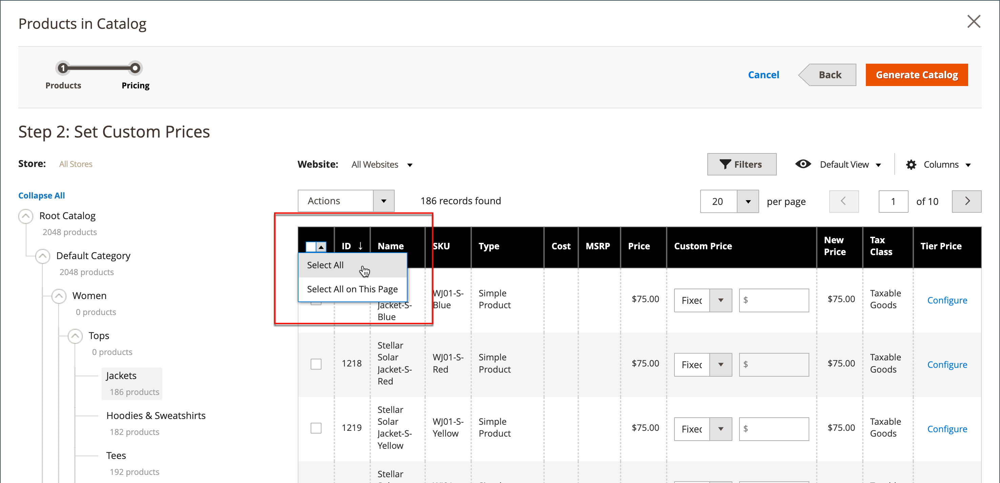<!-- zoom -->

1. Set **[!UICONTROL Actions]** to one of the following:

   - `Set Discount` - Applies a discount percent to all selected products.
   - `Adjust Fixed Price` - Applies a fixed price to all selected products.

   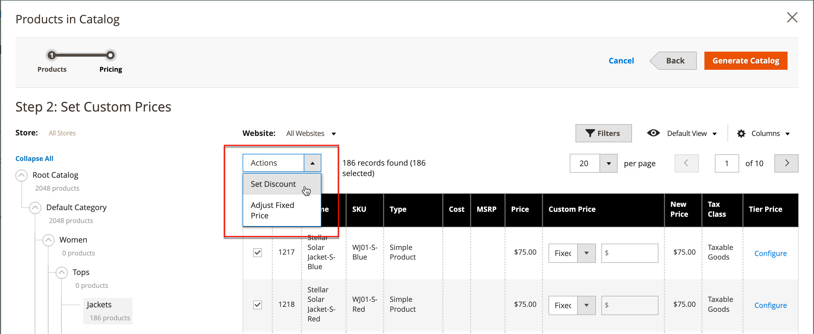<!-- zoom -->

1. When prompted, enter the discount and click **[!UICONTROL Apply]**.

   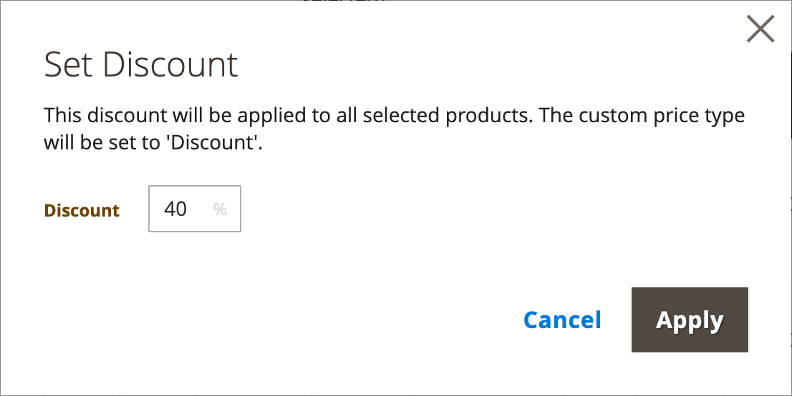<!-- zoom -->

   The discount is applied to all selected products, and the _Custom Price_ column reflects the type of discount and amount applied.

   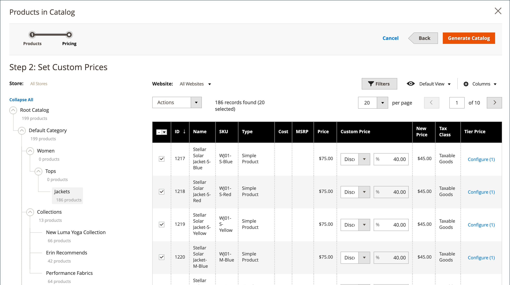<!-- zoom -->

1. When the custom pricing is complete, click **[!UICONTROL Generate Catalog]** then **[!UICONTROL Save]**.

### Apply a tier price

[Tier pricing](../catalog/product-price-tier.md) lets you offer a quantity discount for products in the shared catalog. The _Tier Price_ column of the grid contains a link to the _Advanced Pricing_ options that apply specifically to the shared catalog. If the product already includes tier pricing, the number of existing tiers appears in parentheses after the link.

The following instructions show how to apply tier pricing to a single product. To apply tier pricing to multiple products, refer to [Importing Tier Prices](https://docs.magento.com/user-guide/system/data-import-price-tier.html).

1. For the product in the grid, go to the _Tier Price_ column and click **[!UICONTROL Configure]**.

   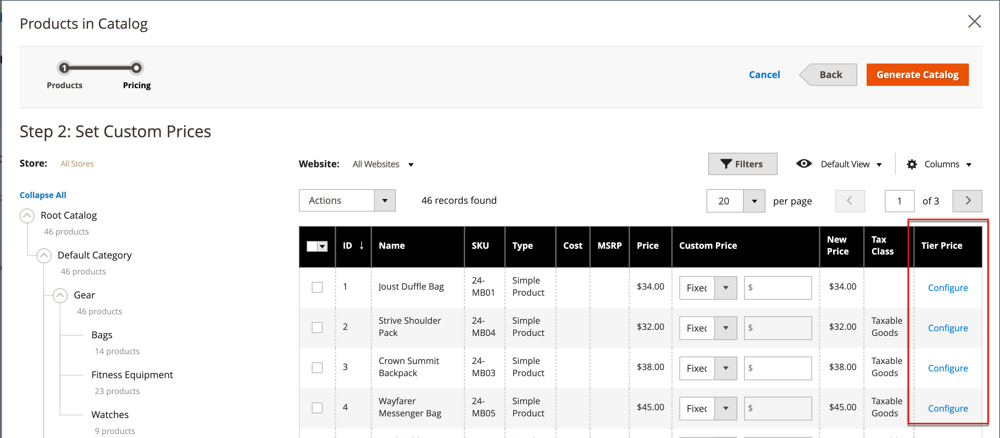<!-- zoom -->

1. On the _Advanced Pricing_ page, click **[!UICONTROL Add Price]** and do the following:

   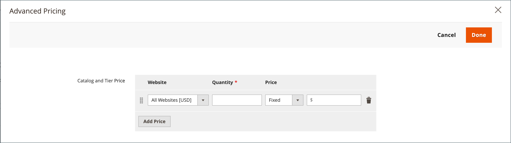<!-- zoom -->

   - Set **[!UICONTROL Website]** to the website where the tier price applies.
   - Enter the quantity of the product that must be purchased to receive the discount.
   - Set **[!UICONTROL Price]** to one of the following discount types:
      - `Fixed`
      - `Discount`
   - Enter the amount of the discount.
   - To enter another tier, click **Add Price** and repeat the process.

   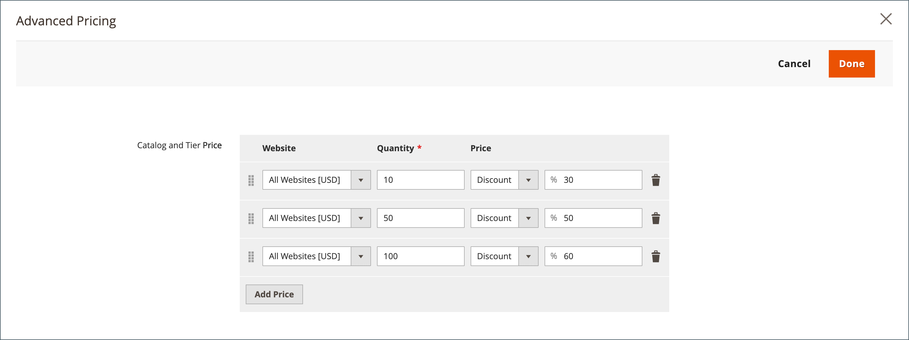<!-- zoom -->

1. When complete, click **[!UICONTROL Done]**.

   In the grid, the number of tiers is shown in parentheses in the _[!UICONTROL Tier Price]_ column.

   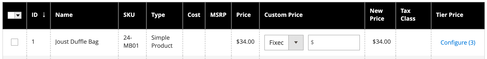<!-- zoom -->

The shared catalog is now saved to the database. Its name appears in the _[!UICONTROL Shared Catalog]_ column of the _[!UICONTROL Products]_ grid. The next step is to assign the shared catalog to a company.
