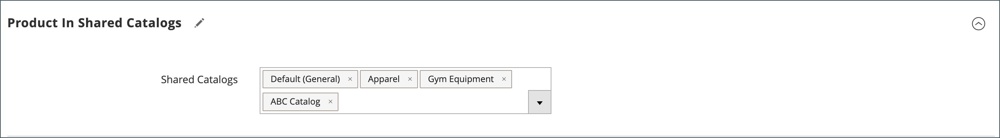

# Add Products to a Shared Catalog

Products can be added to a shared catalog either individually or in groups of multiple products by category.

The following requirements must be met for a complex product (such as bundle, grouped, or configurable) to be visible from the storefront in a shared catalog:

- All [associated products](https://docs.magento.com/user-guide/catalog/product-configurations.html) and options must be assigned to the same shared catalog and enabled in the primary catalog.
- For [configurable](https://docs.magento.com/user-guide/catalog/product-create-configurable.html) and [grouped](https://docs.magento.com/user-guide/catalog/product-create-grouped.html) products, only the enabled associated products are visible.
- For a [bundle](https://docs.magento.com/user-guide/catalog/product-create-bundle.html) product, all options must be included in the shared catalog.

   <!-- zoom -->

## Method 1: Add a single product

1. On the _Admin_ sidebar, go to **[!UICONTROL Catalog]** > **[!UICONTROL Products]**.

1. For the product in the grid that you want to add, go to the _[!UICONTROL Action]_ column and click **[!UICONTROL Edit]**.

1. Scroll down, expand  the _Product in Shared Catalogs_ section, and do the following:

   - Select the checkbox of each shared catalog where the product should appear. To choose all catalogs, click **[!UICONTROL Select all]**.

      <!-- zoom -->

      The name of each selected catalog appears in the _Shared Catalogs_ field.

      <!-- zoom -->

   - Click **[!UICONTROL Done]** to save the settings.

1. When complete, Click **[!UICONTROL Save]**.

## Method 2: Add multiple products

1. On the _Admin_ sidebar, go to **[!UICONTROL Catalog]** > **[!UICONTROL Shared Catalogs]**.

1. For the shared catalog in the grid, go to the _[!UICONTROL Action]_ column and select **[!UICONTROL Set Pricing and Structure]**.

1. In the category tree, do any of the following:

   - To include all products, click **[!UICONTROL Select all]** or select the checkbox of the parent category.
   - To include specific categories of products, select the checkbox of each category that you want to include.
   - To include or exclude an individual product, select or deselect the checkbox of product.

   The notation below each category in the tree shows the number of products from the category that are currently included in the shared catalog. The notation below the [root category](https://docs.magento.com/user-guide/catalog/category-root.html) shows the total number of products from all categories that are currently selected for the shared catalog.

1. To view category products in the grid, click the name of the category in the tree.

   When a category is selected, the following occurs:

   - The toggle in the first column of the grid is set to `On` for each selected product.
   - If a product is assigned to multiple categories and is omitted in one of them, it remains available through the other categories and through [catalog search](https://docs.magento.com/user-guide/catalog/search.html).
   - The system automatically sets [Category Permissions](https://docs.magento.com/user-guide/catalog/category-permissions.html) to `Allow` for the selected products.
