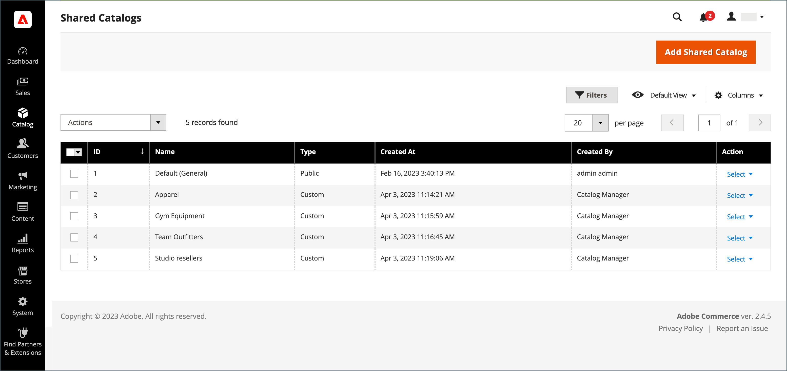
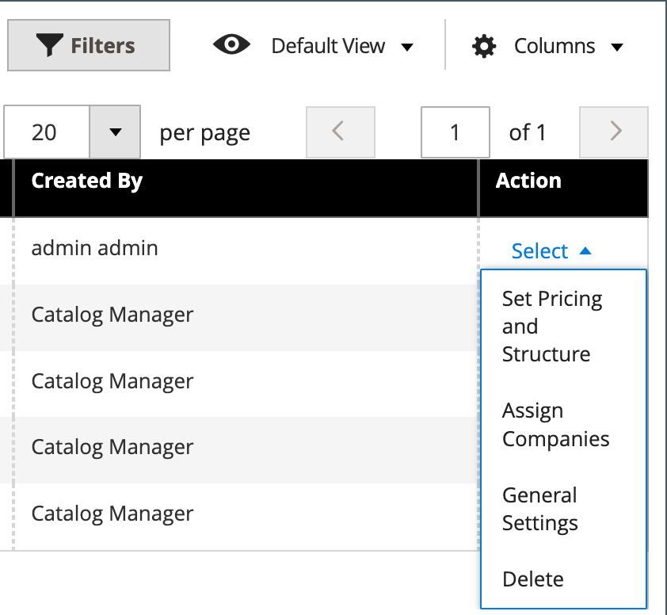

# Shared catalog overview

B2B for Adobe Commerce gives you the ability to maintain gated _shared_ catalogs with custom pricing for different companies. In addition to the standard, _primary_, product catalog, it provides customer access to two types of shared catalogs with different pricing structures.

If the [Shared Catalog feature](enable-basic-features.md) is enabled in the configuration, the original primary catalog remains visible from the Admin, but only the Default (General) public shared catalog is visible from the storefront. In addition, custom catalogs can be created that are visible only to members of specific [company](account-companies.md) accounts.

For the `Default (General)` public shared catalog, you must assign products to display the catalog on the storefront. By default, it is empty and does not contain any products.

>[!NOTE]
>
>**[B2B release 1.3.0](release-notes.md#b2b-v130) and later** -- When you create a shared catalog, each [category permission](../catalog/category-permissions.md) for the catalog is set to _[!UICONTROL Allow for the Display Product Prices]_ and _[!UICONTROL Add to Cart]_ for customer groups that are assigned this access in the catalog permission settings. Previously, these settings were automatically set to `Deny` even when catalog permissions were set to `Allow`.

>[!IMPORTANT]
>
>All existing [group permission settings](../configuration-reference/catalog/catalog.md#category-permissions) are ignored by **_all_** categories in the catalog when the **_[!UICONTROL Shared Catalog]_** feature is enabled. [!UICONTROL Shared Catalog] fully controls all category permissions in the catalog when it is enabled.

The _[!UICONTROL Shared Catalogs]_ page provides access to the tools used for managing your shared catalogs. The page is similar to the standard [Admin workspace](../getting-started/admin-workspace.md), with filters and action controls. The grid lists all shared catalogs, including the default public shared catalog, and any custom catalogs that you have set up.

{width="700" zoomable="yes"}

## Access the [!UICONTROL Shared Catalogs] page

On the _Admin_ sidebar, go to **[!UICONTROL Catalog]** > **[!UICONTROL Shared Catalogs]**.

## Actions controls

The [actions controls](../getting-started/admin-actions-control.md) in the upper-left corner can be used with the mass actions control to delete selected shared catalogs that are no longer needed. In the grid, the _[!UICONTROL Actions]_ column contains the full selection of tools to manage your shared catalogs.

{width="350"}

|Control|Description|
|------|-----------|
|[[!UICONTROL Set Pricing and Structure]](catalog-shared-pricing-structure.md)|Determines the product selection and custom pricing that is available in the shared catalog.|
|[[!UICONTROL Assign Companies]](catalog-shared-assign-companies.md)|Determines which companies can access a shared catalog.|
|[[!UICONTROL General Settings]](catalog-shared-manage.md)|Determines the catalog detail information, including the name, catalog type, customer tax class, and description.|
|[!UICONTROL Delete]|Deletes the selected shared catalogs.|

{style="table-layout:auto"}

## Column descriptions

|Heading|Description|
|--- |--- |
|[!UICONTROL Select]|Selects shared catalog records for applying an action. The control in the header can be used to select all or deselect all shared catalog records in the grid. To select an individual shared catalog, select the checkbox.|
|[!UICONTROL ID]|A unique numeric identifier that is assigned in sequence when the catalog is created.|
|[!UICONTROL Name]|The name of the shared catalog. By default, the default (General) shared catalog is available.|
|[!UICONTROL Type]|Identifies the type of shared catalog as either:  **[!UICONTROL Public]** - The default public shared catalog is created automatically when B2B for Adobe Commerce is installed. It is initially assigned to the `General` and `Not Logged In` customer groups, and is visible to guests and individual logged-in customers who are not associated with a company. The system supports only one public shared catalog at a time.  **[!UICONTROL Custom]** - A custom shared catalog contains pricing that is visible only to logged-in associates of the assigned company accounts. You can create as many custom shared catalogs as you need.|
|[!UICONTROL Customer Tax Class]|The tax class that is assigned to the corresponding customer group. This column does not appear in the default grid, but can be added by changing the column layout.|
|[!UICONTROL Created At]|The date and time the shared catalog was created.|
|[!UICONTROL Created By]|The first and last name of the store administrator who created the shared catalog.|
|[!UICONTROL Action]|Lists actions that be applied to selected catalogs. Options: `Set Pricing and Structure` / `Assign Companies` / `General Settings` / `Delete`|

{style="table-layout:auto"}
