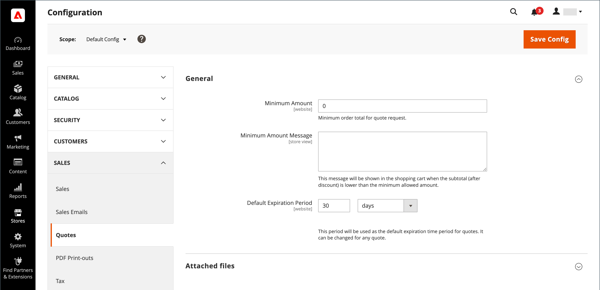
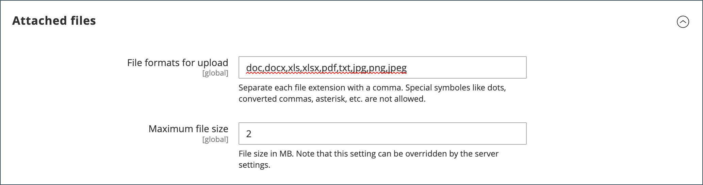

# Configure quotes

If quotes are enabled in the general [B2B features](enable-basic-features.md), you can configure support for quotes in the Admin. The quote configuration determines the minimum required order amount for quote requests, the quote lifetime, and the supported file formats for attached files. 

>[!NOTE]
>
>Quote configuration options and the ability to use quote negotiation functions are controlled using the [role resources](../systems/permissions-user-roles.md#role-resources). These role resources must be selected for the Admin user role that is assigned to the Admin user account. To grant access to quote functions in the Admin, go to **[!UICONTROL System]** > _[!UICONTROL Permissions]_ > **[!UICONTROL User Roles]**, select the role, and navigate to [!UICONTROL Sales] > [!UICONTROL Operations] > [!UICONTROL Quotes] in the _Role Resources_ tree.

1. On the _Admin_ sidebar, go to **[!UICONTROL Stores]** > _[!UICONTROL Settings]_ > **[!UICONTROL Configuration]**.

1. In the left panel, expand **[!UICONTROL Sales]** and choose **[!UICONTROL Quotes]**.

1. Expand  the **[!UICONTROL General]** section and do the following:

   {width="700" zoomable="yes"}

   See [Quotes](../configuration-reference/sales/quotes.md) in the _Configuration Reference_ for a full list of Quotes feature options and their functions.

   - Enter the **[!UICONTROL Minimum Amount]** in the shopping cart that must be met before a request for a quote can be submitted.

   - For **[!UICONTROL Minimum Amount Message]**, enter the message that you want to appear when the shopping cart total does not meet the minimum required amount.

   - For **[!UICONTROL Default Expiration Period]**, enter the number of **[!UICONTROL days]**, **[!UICONTROL weeks]**, or **[!UICONTROL months]** that a quote is to remain valid.

1. Expand  the **[!UICONTROL Attached files]** section and do the following:

   - For **[!UICONTROL File formats for upload]**, enter the suffix of each file type that you support for files that are attached to a quote.

      Enter each file suffix in lowercase, and separated by a comma.

      By default, the following formats are supported: `doc`, `docx`, `xls`, `xlsx`, `pdf`, `txt`, `jpg`, `png`, and `jpeg`

   - For **[!UICONTROL Maximum file size]**, enter the maximum size of an attached file in megabytes.

      The value you enter might be overridden by the server setting.

      {width="600" zoomable="yes"}

1. When complete, click **[!UICONTROL Save Config]**.
