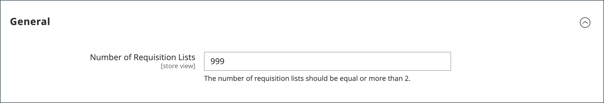

# Configure requisition list maximum

When the requisition list feature is enabled, customers can create multiple lists of frequently purchased items and use those lists for order placement. It is available for both logged-in users and guests. You can enable requisition lists when you [configure the B2B features](enable-basic-features.md).

A customer can have multiple lists that focus on products from different vendors, buyers, teams, campaigns, or anything else that streamlines common workflows. [Requisition list functionality](requisition-lists.md) is similar to wish lists, with the following differences:

- A requisition list is not cleared after sending items to the shopping cart. It can be used multiple times.
- The user interface for requisition lists uses a compact view in order to display many items.

By default, customers can maintain up to 999 requisition lists for their account. But you can modify the configuration and specify a lower number to lessen the load on your store.

1. On the _Admin_ sidebar, go to **[!UICONTROL Stores]** > _[!UICONTROL Settings]_ > **[!UICONTROL Configuration]**.

1. In the left panel, expand **[!UICONTROL Customers]** and choose **[!UICONTROL Requisition Lists]**.

   {width="600" zoomable="yes"}

1. For **[!UICONTROL Number of Requisition Lists]**, enter the maximum number of requisition lists that can be maintained for each customer account.

   The minimum number is `2`, and the maximum is `999`.

1. When complete, click **[!UICONTROL Save Config]**.
