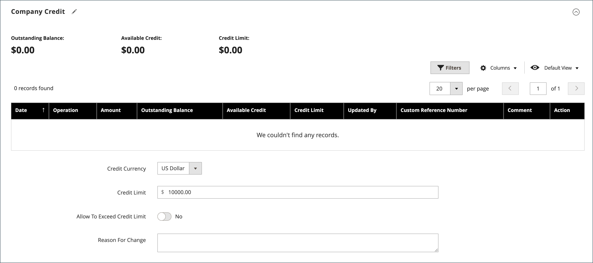
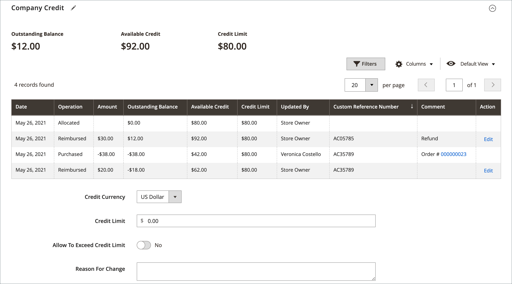
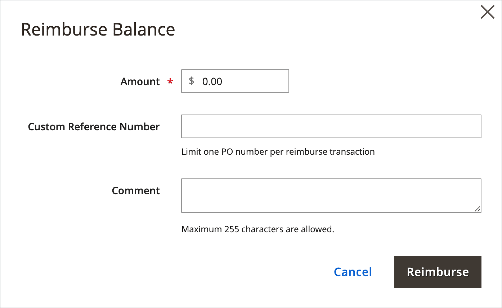
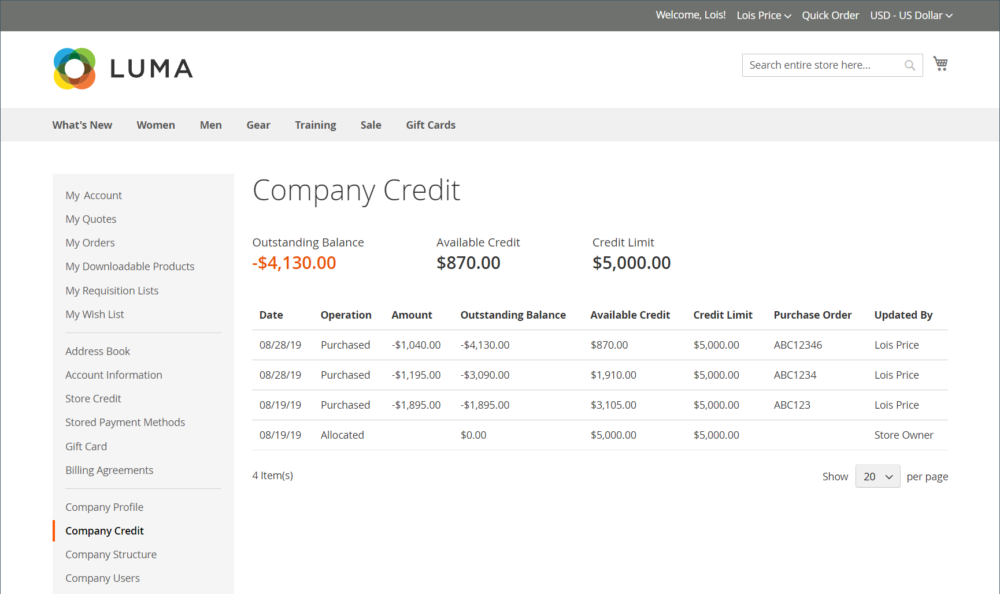

# Manage company credit

Company credit allows B2B businesses to make purchases against a pre-approved credit line rather than requiring immediate payment. When [Payment on Account](../b2b/enable-basic-features.md#configure-payment-on-account) is enabled, companies can purchase up to their credit limit and view their credit status from the account dashboard.

{width="700" zoomable="yes"}

Company credit enables you to:

* **Extend credit terms**—Allow trusted business customers to purchase on account with deferred payment
* **Set credit limits**—Control financial exposure by establishing credit limits for each company
* **Track credit activity**—Monitor all credit transactions, payments, and outstanding balances in real-time
* **Streamline B2B transactions**—Simplify the purchasing process for companies with established credit relationships
* **Support complex workflows**—Integrate with purchase orders, quotes, and approval processes

## Prerequisites

Before setting up company credit, ensure that:

* B2B features are enabled in your Adobe Commerce installation
* [Payment on Account](../b2b/enable-basic-features.md#configure-payment-on-account) is configured and enabled
* Company accounts are properly set up with necessary business information
* You have administrative permissions to manage company credit settings
* Currency settings are configured if operating in multiple currencies

## Use cases

Company credit is ideal for:

* **Established B2B relationships**—Long-term business customers with proven payment history
* **Large enterprise customers**—Companies making significant, regular purchases requiring extended payment terms
* **Seasonal businesses**—Companies with cyclical cash flow that need flexible payment timing
* **Corporate procurement**—Organizations with centralized purchasing but distributed payment processing
* **Supply chain partners**—Distributors, resellers, and channel partners requiring credit facilities

## Understanding Company Credit settings

You can configure the following credit-related parameters for each company profile:

* **Credit Currency**—Currency for all credit transactions and balances
* **Credit Limit**— Maximum amount the company can owe at any time
* **Allow to Exceed Credit Limit**— Whether companies can place orders exceeding available credit
* **Reason for Change**—Documentation field for recording credit setting modifications

For details about these settings and configuring the company profile, see [Create a Company Account](account-company-create.md).

>[!NOTE]
>
>If a company has an outstanding balance, a notice appears to the store administrator at the top of sales orders when viewed from the Admin. This helps ensure awareness of credit status during order processing.

## Company credit activity

The [!UICONTROL Company Credit] section of the company profile displays a complete history of all credit transactions, balance changes, and payment activities in a grid format.

{width="700" zoomable="yes"}

The grid displays the following information for each transaction:

|Column|Description|
|--- |--- |
|[!UICONTROL Date]|The date of the transaction. To display the date and time, hover over the date.|
|[!UICONTROL Operation]|The type of activity associated with the transaction. Values:  **[!UICONTROL Allocated]** - Credit assigned to the company.  **[!UICONTROL Updated]** - A change was applied to one of the following fields: [!UICONTROL Credit limit] / [!UICONTROL Credit currency] / [!UICONTROL Allow to exceed credit limit]  **[!UICONTROL Purchased]** - An order was placed.  **[!UICONTROL Reimbursed]** - The outstanding balance was reimbursed.  **[!UICONTROL Refunded]** - A credit memo amount was refunded.  **[!UICONTROL Reverted]** - The order was canceled and the amount returned to the credit balance.|
|[!UICONTROL Amount]|The amount of the transaction associated with the following transaction types: `Purchased` / `Reimbursed` / `Refunded` / `Reverted`  For purchase amounts, the amount appears in the display currency of the store and in the format of the credit currency setting, followed by the current conversion rate (if applicable). For example:  EUR 20,000.00 ($22,400.00)  USD/EUR 0.8928|
|[!UICONTROL Outstanding Balance]|The amount reimbursed, less the total due from all orders placed using the Payment on Account method. The amount might appear as a positive or negative value.  **[!UICONTROL Positive value]** - An advance payment is represented as a positive value.   **[!UICONTROL Negative value]** - An amount due is represented as a negative value.|
|[!UICONTROL Available Credit]|The sum of the _[!UICONTROL Credit Limit]_ and the _[!UICONTROL Outstanding Balance]_. If the company has exceeded the credit limit, the amount appears as a negative value.|
|[!UICONTROL Credit Limit]|The amount of credit extended to the company.|
|[!UICONTROL Updated By]|The name of the person who initiated the operation.|
|[!UICONTROL Custom Reference Number]|The custom reference number that is associated with the transaction.|
|[!UICONTROL Comment]|A compilation of the values from the `Reason for Change` field, according to operation type.  **[!UICONTROL Purchased]** - Includes comments from the purchase, and the order number and link to the order.  **[!UICONTROL Reimbursed]** - Includes comments from the reimbursed transaction.|
|[!UICONTROL Action]|For `Reimbursed` operations only. **[!UICONTROL Edit]** - Allows the reimbursement amount to be updated.|

{style="table-layout:auto"}

## Update the credit information

When customers make payments, administrators update credit information in the Admin.

1. On the _Admin_ sidebar, go to **Customers > Companies**.

1. Find the company in the grid and open in _Edit_ mode.

1. Expand the **Company Credit** section.

1. For **Credit Limit**, enter the new value.

1. Change the other values as needed.

1. When updates are complete, Click **[!UICONTROL Save]**.

## Receive Payments

A reimbursed balance is an offline payment that is made by a company toward the balance of their account. The store administrator enters the amount manually in the company profile, using the _Reimburse Balance_ button. When the amount is submitted, the system recalculates the outstanding balance and available company credit, and records the action in the company credit history. The reimbursed amount is entered in the credit currency, as specified in the configuration.

### Apply a payment to a company account

1. On the _Admin_ sidebar, go to **[!UICONTROL Customers]** > **[!UICONTROL Companies]**.

1. Find the company record in the list and open in **[!UICONTROL Edit]** mode.

1. At the top of the page, click **Reimburse Balance**.

1. In the dialog, add the payment information:

   {width="500"}

   * Enter the **Amount** of the payment.

      The amount can be entered as a positive or negative value.

   * If applicable, enter the **Custom Reference Number** for reference.

      Only one custom reference number can be entered per reimbursement. To apply the payment to multiple POs, create a separate reimbursement for each.

   * As needed, enter a **Comment** to describe the reimbursement.

1. Click **Reimburse**.

   The system updates balances and credit history automatically to reflect the reimbursement.

### Edit a reimbursement

1. Open the company profile in **[!UICONTROL Edit]** mode.

1. Expand  the **Company Credit** section.

1. Find the reimbursement transaction in the grid and click **[!UICONTROL Edit]**.

1. Make any changes necessary to **Custom Reference Number** and **Comment**.

   The reimbursement amount cannot be changed.

1. Click **[!UICONTROL Save]**.

## Storefront credit information

Company administrators can view their credit information on the account dashboard, including outstanding balance, available credit, credit limit, and outstanding invoices. When orders are canceled, amounts return to the company balance and appear in the Credit Allocation History field.

{width="700" zoomable="yes"}

## Company credit demo

Learn about managing company credit by watching this demo video:

>[!VIDEO](https://video.tv.adobe.com/v/344445?quality=12&learn=on)

## Security considerations

When managing company credit, implement robust security measures to protect sensitive financial data:

* **Access Control**—Restrict credit management permissions to authorized personnel only
* **Audit Trails**—Maintain comprehensive logs of all credit transactions and modifications
* **Data Protection**—Encrypt sensitive financial information both in transit and at rest
* **Approval Workflows**—Implement multi-level approval processes for significant credit adjustments
* **Regular Reviews**—Conduct periodic audits of user access and credit relationships

## Best practices

* * **Credit Policy Management**—When managing company credit, establish clear policies for setting credit limits based on customer payment history and business relationships. Regularly review outstanding balances and payment patterns to assess risk, and always document changes to credit settings with detailed reasons for audit purposes.

Process payments promptly to maintain accurate balances, and ensure credit currency settings align with each company's primary business operations.

* **Compliance and security**—Restrict credit management permissions to authorized personnel only, implement approval workflows for significant credit adjustments, and protect sensitive financial information according to your organization's security policies. Regular reviews of user access and credit relationships help maintain proper oversight and compliance.

>[!MORELIKETHIS]
>
>* [Enable B2B Features](enable-basic-features.md) * Configure Payment on Account and other B2B functionality
>* [Create a Company Account](account-company-create.md) * Set up company accounts with credit capabilities
>* [Manage Companies](manage-companies.md) * Overview of company management features
>* [Company Roles and Permissions](account-company-roles-permissions.md) * Configure user access for credit management
>* [Purchase Order Workflow](purchase-order-flow.md) * Understand how credit integrates with purchase orders
>* [B2B Configuration Reference](../configuration-reference/general/b2b-features.md) - Detailed configuration settings for B2B features
