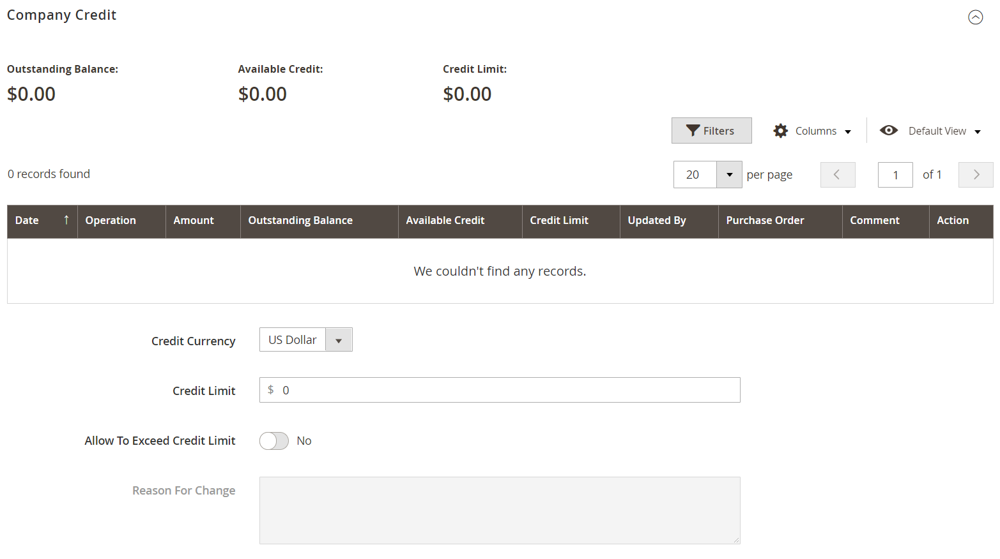

# Manage Company Credit

If [Payment on Account](https://docs.magento.com/user-guide/payment/payment-on-account.html) is enabled in the configuration, companies can make purchases on their account up to the credit limit that is granted to the company. When enabled, customers can check the status of their company credit from their account dashboard.

<!--- zoom --->

You can set the following credit-related parameters for each company profile:

- Credit Currency
- Credit Limit
- Allow to Exceed Credit Limit
- Reason for Change

If the company has an outstanding balance, a notice to the store administrator appears at the top of the sales order when it is viewed from the Admin. To learn more, see [Creating a Company Account](account-company-create.md).

## Company Credit Activity

The Company Credit section of the company profile displays a summary of the customer credit activity, with a grid of the company credit history.

<!--- zoom --->

|Column|Description|
|--- |--- |
|Date|The date of the transaction. To display the date and time, hover over the date.|
|Operation|The type of activity associated with the transaction. Values:  **Allocated** - Credit assigned to the company.  **Updated** - A change was applied to one of the following fields: Credit limit / Credit currency / Allow to exceed credit limit  **Purchased** - An order was placed.  **Reimbursed** - The outstanding balance was reimbursed.  **Refunded** - A credit memo amount was refunded.  **Reverted** - The order was canceled and the amount returned to the credit balance.|
|Amount|The amount of the transaction associated with the following transaction types: Purchased / Reimbursed / Refunded / Reverted  For purchase amounts, the amount appears in the display currency of the store and in the format of the credit currency setting, followed by the current conversion rate (if applicable). For example:  EUR 20,000.00 ($22,400.00)  USD/EUR 0.8928|
|Outstanding Balance|The amount reimbursed, less the total due from all orders placed using the Payment on Account method. The amount might appear as a positive or negative value.  **Positive value** - An advance payment is represented as a positive value.   **Negative value** - An amount due is represented as a negative value.|
|Available Credit|The sum of the _Credit Limit_ and the _Outstanding Balance_. If the company has exceeded the credit limit, the amount appears as a negative value.|
|Credit Limit|The amount of credit extended to the company.|
|Updated By|The name of the person who initiated the operation.|
|Custom Reference Number|The custom reference number that is associated with the transaction.|
|Comment|A compilation of the values from the `Reason for Change` field, according to operation type.  **Purchased** - Includes comments from the purchase, and the order number and link to the order.  **Reimbursed** - Includes comments from the reimbursed transaction.|
|Action|For `Reimbursed` operations only. **Edit** - Allows the reimbursement amount to be updated.|

{style="table-layout:auto"}

## Update the credit information

When the customer makes the payment for their outstanding credit to the merchant, a store administrator must then update the customer credit information in the Admin.

1. On the _Admin_ sidebar, go to **Customers > Companies**.

1. Find the company in the grid and open in _Edit_ mode.

1. Expand the **Company Credit** section.

1. For **Credit Limit**, enter the new value.

1. Change the other values as needed.

1. When updates are complete, click **Save**.

## Receive Payments

A reimbursed balance is an offline payment that is made by a company toward the balance of their account. The store administrator enters the amount manually in the company profile, using the _Reimburse Balance_ button. When the amount is submitted, the system recalculates the outstanding balance and available company credit, and records the action in the company credit history. The reimbursed amount is entered in the credit currency, as specified in the configuration.

<!--- zoom --->

### Apply a payment to a company account

1. On the _Admin_ sidebar, go to **Customers** > **Companies**.

1. Find the company record in the list and open in **Edit** mode.

1. At the top of the page, click **Reimburse Balance**.

1. Add the payment information:

   - Enter the **Amount** of the payment.

      The amount can be entered as a positive or negative value.

   - If applicable, enter the **Custom Reference Number** for reference.

      Only one custom reference number can be entered per reimbursement. To apply the payment to multiple POs, create a separate reimbursement for each.

   - As needed, enter a **Comment** to describe the reimbursement.

1. Click **Reimburse**.

   The company’s outstanding balance and available credit is recalculated, and the Company Credit history is updated to reflect the reimbursement.

   <!--- zoom --->

### Edit a reimbursement

1. Open the company profile in **Edit** mode.

1. Expand  the **Company Credit** section.

1. Find the reimbursement transaction in the grid and click **Edit**.

1. Make any changes necessary to **Custom Reference Number** and **Comment**.

   The reimbursement amount cannot be changed.

1. Click **Save**.

## Storefront credit information

For the company administrator, the account dashboard displays the _Company Credit_ section. It provides the current outstanding balance, available credit, and the credit limit that is allocated to their company account followed by a list of outstanding invoices.

If the merchant cancels an order that was charged to company credit, the amount of the order is returned to the company balance and the _Credit Allocation History_ includes a record of the action.

<!--- zoom --->
