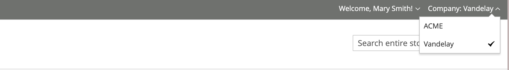
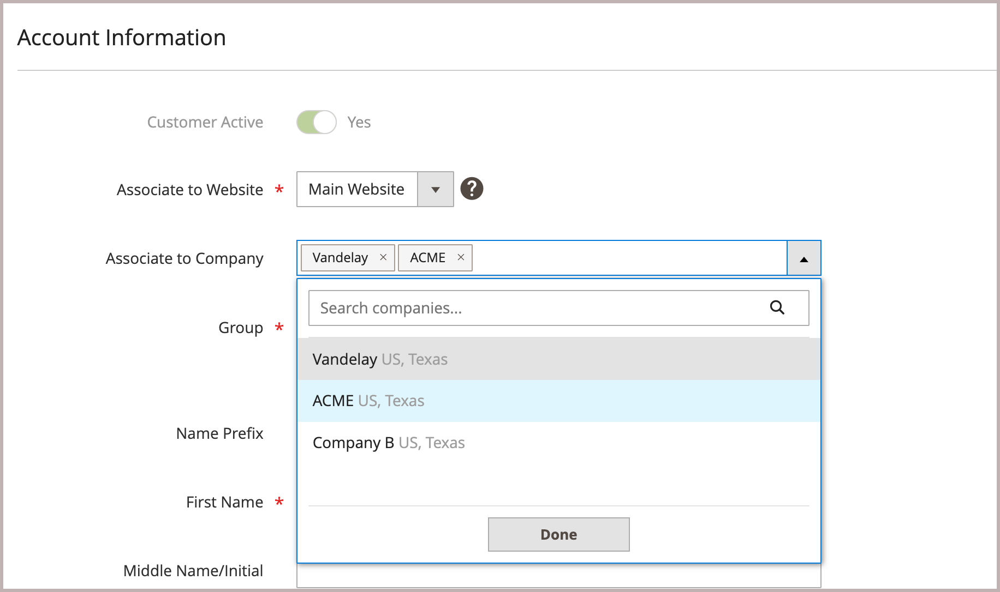
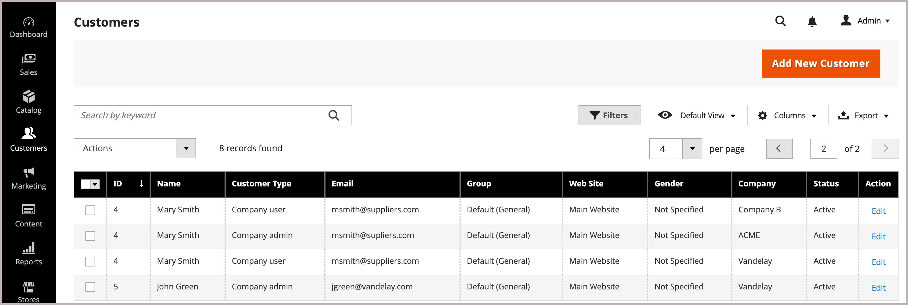

# Add users to a company account

When enabled in the configuration, the company administrator adds and manages company users from the storefront. However, company users accounts can also be added and managed from the Admin.

If needed, you can assign a user to more than one company. For example, if B2B buyers support multiple companies, you can add their user accounts to all companies they do business with. On the storefront, buyers that are assigned to multiple companies can switch between company accounts by selecting from the available companies in the *[!UICONTROL Company]* menu.

{width="700"}

When the buyer switches the company, the interface updates to display information based on the context of the selected company. For example, the user sees the user role, orders, purchase orders, quotes, and other information based on the new company. If the user has an active shopping cart, the shopping cart updates to show products and prices based on the catalog assigned to the selected company.

>[!NOTE]
>
>If an individual already has a personal account with your store, and later goes to work for a company, do not assign the person's individual account to the company. Instead, create a company user account for the person with a company email address.

## Add a company user

When you add a company user, the first company you associate with the user account is the default company.

1. On the Admin sidebar, go to **[!UICONTROL Customers > All Customers]**.

1. Click **[!UICONTROL Add new customer]**.

1. Configure the new account.

   1. Specify initial account status by setting the **[!UICONTROL Customer Active]** toggle.

      Turn it on to immediately activate the account, or disable it to create an inactive account.

   1. Select the website scope from the **[!UICONTROL Associate to Website]** list.

   1. Click **[!UICONTROL Associate to Company]** to view available companies.

      {width="675"}

      If needed, filter the list by typing the first few letters of the company name in the input box.

   1. In the list, select one or more companies where you want to assign the customer and click **[!UICONTROL Done]**.

      Company users are added automatically to the customer group (or [shared catalog](catalog-shared.md)) for each company associated with their account.

   1. Enter required user account information: **[!UICONTROL First Name]**, **[!UICONTROL Last Name]**, and **[!UICONTROL Email]**.

   1. Allow sales representatives to log in to the storefront on behalf of the customer by enabling **[!UICONTROL Allow remote shopping assistance]**.

   1. Apply the changes by clicking **[!UICONTROL Save Customer]**.

      {width="675"}

The [!UICONTROL Customers grid] shows a separate row for each company that the user is assigned to. The following columns are updated.

- The _[!UICONTROL Customer Type]_ column updates to show the role assigned to the user.

  If this is the first time the customer has been assigned to a company, the _[!UICONTROL Customer Type]_ column updates from _[!UICONTROL Individual user]_ to _[!UICONTROL Company User]_.

- The _[!UICONTROL Group]_ column changes to the name of the customer group (or shared catalog) that is assigned to the company.

- The _[!UICONTROL Company]_ column displays the name of the company to which the customer profile is now associated.

## Assign a user to one or more company accounts

When you assign a new user, the first company you associate with the user account is the default company.

1. On the _Admin_ sidebar, go to **[!UICONTROL Customers]** > **[!UICONTROL All Customers]**.

1. Find the customer in the grid and click **[!UICONTROL Edit]** in the _[!UICONTROL Action]_ column.

1. In the left panel, choose **[!UICONTROL Account Information]**.

1. From the **[!UICONTROL Associate to Company]** list, select one or more companies to assign to the company user and click **[!UICONTROL Done]**.

1. Apply the changes by clicking **[!UICONTROL Save Customer]**.

## Remove company assignment from a user account

Removing a company from a user profile revokes user access to that company. User data remains accessible in the Admin. If you remove all company assignments, the _[!UICONTROL Customer Type]_ changes to *[!UICONTROL Individual user]* disabling B2B capabilities for the account.

1. From the Customer grid in the Admin, edit the customer profile to update.

1. In the *[!UICONTROL Account Information] section, remove an assigned company from the **[!UICONTROL Associate to Company]** field by clicking the **[!UICONTROL X]** in the company name label.

1. Apply the changes by clicking **[!UICONTROL Save Customer]**.

>[!NOTE]
>
>If a company user is assigned as the company administrator, you cannot  the company association from this user until you update the Company account to assign a new company administrator.
