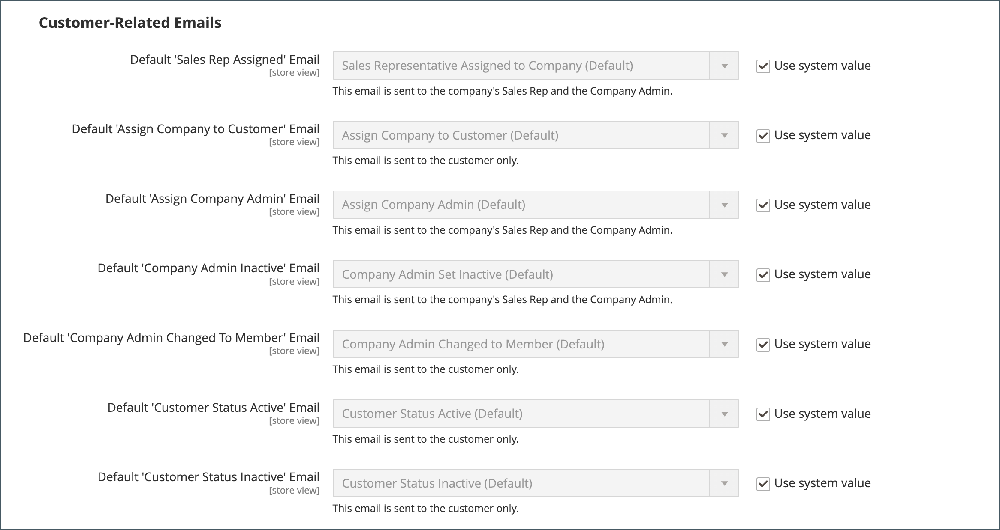
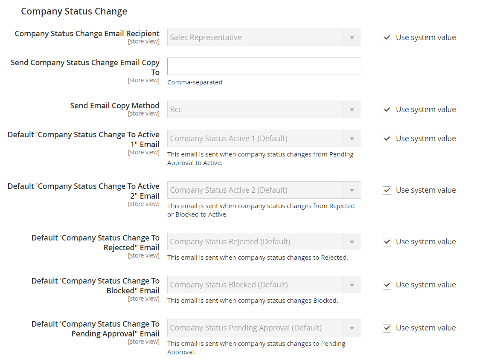

# Configure company email options

The [sales representative](account-company-manage.md) that is assigned as the primary contact for a company is configured by default as the sender of many automated email messages sent to the company.

1. On the _Admin_ sidebar, go to **[!UICONTROL Stores]** > _[!UICONTROL Settings]_ > **[!UICONTROL Configuration]**.

1. In the left panel, expand **[!UICONTROL Customers]** and choose **[!UICONTROL Company Configuration]**.

1. If necessary, set **[!UICONTROL Store View]** to the store view to define the [scope](../getting-started/websites-stores-views.md#scope-settings) of the configuration.

1. Complete the **[!UICONTROL Company Registration]** section:

   >[!NOTE]
   >
   >Clear the **[!UICONTROL Use system value]** checkbox to make the field editable.

   - Set **[!UICONTROL Company Registration Email Recipient]** to the [store contact](../getting-started/store-details.md#store-email-addresses) who is to be notified when a new company registration request is received.

   - In the **[!UICONTROL Send Company Registration Email Copy To]** field, enter the email address of each person who is to receive a copy of the registration notification. Separate multiple email addresses with a comma.

   - To determine how the copy of the notification is sent, set **[!UICONTROL Send Email Copy Method]** to one of the following:

      - `Bcc` - Sends a _blind courtesy copy_ by including the recipient in the header of the same email that is sent to the customer. The BCC recipient is not visible to the customer.
      - `Separate Email` - Sends the copy as a separate email.

   - If you have prepared an email template that is to be used instead of the default, set **[!UICONTROL Default Company Registration Email]** to the name of the template. By default, the `Company Registration Request` template is used.

      {width="600" zoomable="yes"}

1. Complete the **[!UICONTROL Customer-Related Emails]** section:

   If you have prepared alternate email templates to be used instead of the defaults, choose the template that you want to use for each of the following:

   - **[!UICONTROL Default 'Sales Rep Assigned' Email]**
   - **[!UICONTROL Default 'Assign Company to Customer' Email]**
   - **[!UICONTROL Default 'Assign Company Admin' Email]**
   - **[!UICONTROL Default 'Company Admin Inactive' Email]**
   - **[!UICONTROL Default 'Company Admin Changed to Member' Email]**
   - **[!UICONTROL Default 'Customer Status Active' Email]**
   - **[!UICONTROL Default 'Customer Status Inactive' Email]**

   {width="600" zoomable="yes"}

1. Complete the **[!UICONTROL Company Status Change]** section:

   - Set **[!UICONTROL Company Status Change for Email Recipient]** to the [store contact](../getting-started/store-details.md#store-email-addresses) who is to be notified when the status of a company changes.

   - In the **[!UICONTROL Send Company Status Change Email Copy To]** field, enter the email address of each person who is to receive a copy of the status change notification. Separate multiple email addresses with a comma.

   - To determine how the copy of the notification is sent, set **[!UICONTROL Send Email Copy Method]** to one of the following:

      - `Bcc` - Sends a _blind courtesy copy_ by including the recipient in the header of the same email that is sent to the customer. The BCC recipient is not visible to the customer.
      - `Separate Email` - Sends the copy as a separate email.

   - If you have a prepared email template that is to be used instead of the default when company status changes from `Pending Approval` to `Active`, set **[!UICONTROL Default 'Company Status Change to Active 1' Email]** to that template. By default, the `Company Status Active 1` template is used.

   - If you have a prepared email template that is to be used instead of the default when company status changes from `Rejected` or `Blocked` to `Active`, set **[!UICONTROL Default 'Company Status Change to Active 2' Email]** to that template. By default, the `Company Status Active 2` template is used.

   - If you have a prepared email template that is to be used instead of the default when company status changes to `Rejected`, set **[!UICONTROL Default 'Company Status Change to Rejected' Email]** to that template. By default, the `Company Status Rejected` template is used.

   - If you have a prepared email template that is to be used instead of the default when company status changes to `Blocked`, set **[!UICONTROL Default 'Company Status Change to Blocked' Email]** to that template. By default, the `Company Status Blocked` template is used.

   - If you have a prepared email template that is to be used instead of the default when company status changes to `Pending Approval`, set **[!UICONTROL Default 'Company Status Change to Pending Approval' Email]** to that template. By default, the `Company Status Pending Approval` template is used.

      {width="600" zoomable="yes"}

1. Complete the **[!UICONTROL Company Credit Emails]** section:

   - Set **[!UICONTROL Company Credit Change Email Sender]** to the [store contact](../getting-started/store-details.md#store-email-addresses) who is to be notified when a change is made to the credit limit that is assigned to a company. By default, the notification is sent to _Sales Representative_.

   - In the **[!UICONTROL Send Company Credit Change Email Copy To]** field, enter the email address of each person who is to receive a copy of the credit change notification. Separate multiple email addresses with a comma.

   - To determine how the copy of the notification is sent, set **[!UICONTROL Send Email Copy Method]** to one of the following:

      - `Bcc` - Sends a _blind courtesy copy_ by including the recipient in the header of the same email that is sent to the customer. The BCC recipient is not visible to the customer.
      - `Separate Email` - Sends the copy as a separate email.

   - If you have prepared email templates to be used instead of the defaults, choose the template for each of the following notifications that are sent to the company administrator.

      - **[!UICONTROL Allocated Email Template]**
      - **[!UICONTROL Updated Email Template]**
      - **[!UICONTROL Reimbursed Email Template]**
      - **[!UICONTROL Refunded Email Template]**
      - **[!UICONTROL Reverted Email Template]**

    {width="600" zoomable="yes"}

1. When complete, click **[!UICONTROL Save Config]**.
