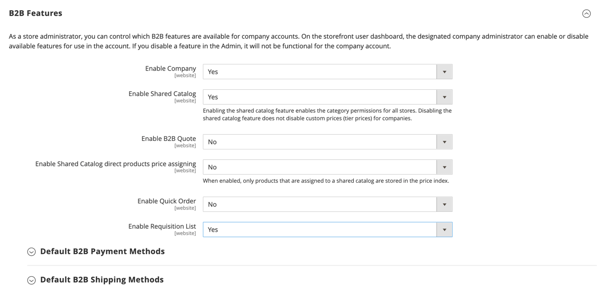

# Enable Basic B2B Features

By default, all B2B features are initially disabled. However, they are always available from the Admin, regardless of whether they are enabled or disabled for the storefront. For a complete list of B2B configuration settings, see [B2B Configuration Reference](https://docs.magento.com/user-guide/configuration/general/b2b-features.html).

>[!IMPORTANT]
>
>When support for customer companies is enabled, shared catalogs, negotiable quotes, and default B2B payment methods become available. The Quick Order and Requisition Lists features can be enabled/disabled independently.

## Configure B2B features

1. On the _Admin_ sidebar, go to **[!UICONTROL Stores]** > _[!UICONTROL Settings]_ > **[!UICONTROL Configuration]**.

   If you have a multi-site installation, set the **[!UICONTROL Store View]** control in the upper-left corner to the website where the configuration applies.

1. In the left panel under _[!UICONTROL General]_, choose **[!UICONTROL B2B Features]** and enable the basic features:

   <!-- zoom -->

   See [B2B Features](https://docs.magento.com/user-guide/configuration/general/b2b-features.html) in the _Configuration Reference_ for a full list of general B2B feature options and their functions.

   - To allow customers to manage their own company accounts, set **[!UICONTROL Enable Company]** to `Yes`.

      This setting displays additional fields to enable Shared Catalogs and B2B Quotes, and a new section for configuring Default B2B Payment Methods.

   - To allow customers and guests to quickly place orders based on SKU or product name, set **[!UICONTROL Enable Quick Order]** to `Yes`.

   - To allow customers to create and manage requisition lists from their account dashboard, set **[!UICONTROL Enable Requisition List]** to `Yes`.

      You can also [configure the maximum number of lists](configure-requisition-lists.md) a customer can have for their account.

1. To make custom pricing available for different companies, set **[!UICONTROL Enable Shared Catalog]** to `Yes`.

   Enabling shared catalogs also enables category permissions for all stores.

   <!-- zoom -->

   When the Shared Catalog feature is enabled, the **Enable Shared Catalog direct products price assigning** option is available. When this option is set to `Yes`, only products that are assigned to a shared catalog are stored in the price index. This is recommended if you have a large number of shared catalogs to manage custom pricing for different companies.

1. To give company buyers the ability to negotiate prices, set **[!UICONTROL Enable B2B Quote]** to `Yes`.

1. When complete, click **[!UICONTROL Save Config]**.

## Configure default B2B payment and shipping methods

1. Expand  the **[!UICONTROL Default B2B Payment Methods]** section.

1. To establish the default payment methods for B2B orders, set **[!UICONTROL Applicable Payment Methods]** to one of the following:

   - `All Payment Methods`

   - `Selected Payment Methods`

      For the specific option, select the **[!UICONTROL Payment Methods]** that you want to make available to your customers by holding down the Ctrl key (PC) or the Command key (Mac) as you click each option.

   The list of [payment methods](https://docs.magento.com/user-guide/configuration/sales/payment-methods.html) shows which are currently enabled or disabled in your store. In addition to the standard payment methods, the list also includes the following:

   - No Payment Information is Required
   - [Payment on Account](#configure-payment-on-account)
   - Stored Accounts
   - Stored Cards

   <!-- zoom -->

1. Expand  the **[!UICONTROL Default B2B Shipping Methods]** section.

1. To specify the default shipping methods for B2B orders, set **[!UICONTROL Applicable Shipping Methods]** to one of the following:

   - `All Shipping Methods`
   - `Selected Shipping Methods`

     For the specific option, select the **[!UICONTROL Shipping Methods]** that you want to make available to your customers by holding down the Ctrl key (PC) or the Command key (Mac) as you click each option.

     The list of shipping methods shows which are currently [enabled or disabled](https://docs.magento.com/user-guide/configuration/sales/delivery-methods.html).

   <!-- zoom -->

1. When complete, click **[!UICONTROL Save Config]**.

## Configure Company Email Options

The [sales representative](account-company-manage.md#assign-a-sales-representative) that is assigned as the primary contact for a company is configured by default as the sender of many automated email messages sent to the company.

1. On the _Admin_ sidebar, go to **[!UICONTROL Stores]** > _[!UICONTROL Settings]_ > **[!UICONTROL Configuration]**.

1. In the left panel, expand **[!UICONTROL Customers]** and choose **[!UICONTROL Company Configuration]**.

1. If necessary, set **[!UICONTROL Store View]** to the store view to define the [scope](../getting-started/websites-stores-views.md#scope-settings) of the configuration.

1. Complete the **[!UICONTROL Company Registration]** section:

   >[!NOTE]
   >
   >Clear the **[!UICONTROL Use system value]** checkbox to make the field editable.

   - Set **[!UICONTROL Company Registration Email Recipient]** to the [store contact](https://docs.magento.com/user-guide/stores/store-email-addresses.html) who is to be notified when a new company registration request is received.

   - For **[!UICONTROL Send Company Registration Email Copy To]**, enter the email address of each person who is to receive a copy of the registration notification. Separate multiple email addresses with a comma.

   - To determine how the copy of the notification is sent, set **Send Email Copy Method** to one of the following:

      - `Bcc` - Sends a _blind courtesy copy_ by including the recipient in the header of the same email that is sent to the customer. The BCC recipient is not visible to the customer.
      - `Separate Email` - Sends the copy as a separate email.

   - If you have prepared an email template that is to be used instead of the default, set **[!UICONTROL Default Company Registration Email]** to the name of the template. By default, the `Company Registration Request` template is used.

      <!-- zoom -->

1. Complete the **[!UICONTROL Customer-Related Emails]** section:

   If you have prepared alternate email templates to be used instead of the defaults, choose the template that you want to use for each of the following:

   - **[!UICONTROL Default ‘Sales Rep Assigned’ Email]**
   - **[!UICONTROL Default ‘Assign Company to Customer’ Email]**
   - **[!UICONTROL Default ‘Assign Company Admin’ Email]**
   - **[!UICONTROL Default ‘Company Admin Inactive’ Email]**
   - **[!UICONTROL Default ‘Company Admin Changed to Member’ Email]**
   - **[!UICONTROL Default ‘Customer Status Active’ Email]**
   - **[!UICONTROL Default ‘Customer Status Inactive’ Email]**

   <!-- zoom -->

1. Complete the **[!UICONTROL Company Status Change]** section:

   - Set **[!UICONTROL Company Status Change for Email Recipient]** to the [store contact](https://docs.magento.com/user-guide/stores/store-email-addresses.html) who is to be notified when the status of a company changes.

   - For **[!UICONTROL Send Company Status Change Email Copy To]**, enter the email address of each person who is to receive a copy of the status change notification. Separate multiple email addresses with a comma.

   - To determine how the copy of the notification is sent, set **Send Email Copy Method** to one of the following:

      - `Bcc` - Sends a _blind courtesy copy_ by including the recipient in the header of the same email that is sent to the customer. The BCC recipient is not visible to the customer.
      - `Separate Email` - Sends the copy as a separate email.

   - If you have prepared an email template that is to be used instead of the default when company status changes from `Pending Approval` to `Active`, set **[!UICONTROL Default ‘Company Status Change to Active 1’ Email]** to the name of the template. By default, the `Company Status Active 1` template is used.

   - If you have prepared an email template that is to be used instead of the default when company status changes from `Rejected` or `Blocked` to `Active`, set **[!UICONTROL Default ‘Company Status Change to Active 2’ Email]** to the name of the template. By default, the `Company Status Active 2` template is used.

   - If you have prepared an email template that is to be used instead of the default when company status changes to `Rejected`, set **[!UICONTROL Default ‘Company Status Change to Rejected’ Email]** to the name of the template. By default, the `Company Status Rejected` template is used.

   - If you have prepared an email template that is to be used instead of the default when company status changes to `Blocked`, set **[!UICONTROL Default ‘Company Status Change to Blocked’ Email]** to the name of the template. By default, the `Company Status Blocked` template is used.

   - If you have prepared an email template that is to be used instead of the default when company status changes to `Pending Approval`, set **[!UICONTROL Default ‘Company Status Change to Pending Approval’ Email]** to the name of the template. By default, the `Company Status Pending Approval` template is used.

   <!-- zoom -->

1. Complete the **[!UICONTROL Company Credit Emails]** section:

   - Set **[!UICONTROL Company Credit Change Email Sender]** to the [store contact](https://docs.magento.com/user-guide/stores/store-email-addresses.html) who is to be notified when a change is made to the credit limit that is assigned to a company. By default, the notification is sent to _Sales Representative_.

   - For **[!UICONTROL Send Company Credit Change Email Copy To]**, enter the email address of each person who is to receive a copy of the credit change notification. Separate multiple email addresses with a comma.

   - To determine how the copy of the notification is sent, set **Send Email Copy Method** to one of the following:

      - `Bcc` - Sends a _blind courtesy copy_ by including the recipient in the header of the same email that is sent to the customer. The BCC recipient is not visible to the customer.
      - `Separate Email` - Sends the copy as a separate email.

   - If you have prepared email templates to be used instead of the defaults, choose the template for each of the following notifications that are sent to the company administrator.

      - **[!UICONTROL Allocated Email Template]**
      - **[!UICONTROL Updated Email Template]**
      - **[!UICONTROL Reimbursed Email Template]**
      - **[!UICONTROL Refunded Email Template]**
      - **[!UICONTROL Reverted Email Template]**

    <!-- zoom -->

1. When complete, click **[!UICONTROL Save Config]**.

## Configure order approval

The ability to track order processing and purchase orders gives company administrators control over the actions of the company's buyers. The order approval functionality is available when the purchase orders feature is enabled by a store administrator.

1. On the _Admin_ sidebar, go to **[!UICONTROL Stores]** > _[!UICONTROL Settings]_ > **[!UICONTROL Configuration]**.

1. In the left panel, expand **[!UICONTROL General]** and choose **[!UICONTROL B2B Features]**.

1. Expand  the **[!UICONTROL Order Approval Configuration]** section.

   <!-- zoom -->

1. To allow companies to create purchase orders, set **[!UICONTROL Enable Purchase Orders]** to `Yes`.

1. When complete, click **[!UICONTROL Save Config]**.

   The purchase orders feature is enabled at the website level. To enable this type of order for a company, do the same with the appropriate settings in each [company profile](account-company-manage.md).   

## Configure purchase orders

1. On the _Admin_ sidebar, go to **[!UICONTROL Customers]** > **[!UICONTROL Companies]**.

1. Find the company in the list and click **[!UICONTROL Edit]**.

1. Expand  the **[!UICONTROL Advanced Settings]** section.

1. Set **[!UICONTROL Enable Purchase Orders]** to `Yes`.

1. When complete, Click **[!UICONTROL Save]**.

After activation, the **[!UICONTROL Approval Rules]** section is displayed on the storefront [Account Dashboard](https://docs.magento.com/user-guide/customers/account-dashboard.html) for a company administrator.s

>[!NOTE]
>
>Purchase order access on the storefront must be granted by the company administrator based on [company user role permissions](account-company-roles-permissions.md). 

## Configure payment on account

Payment on Account is an offline payment method that allows companies to make purchases up to the credit limit that is specified in their profile. Payment on Account can be enabled globally, or per company, and appears during checkout only if enabled. When _Payment on Account_ is used as a payment method, a message appears at the top of the order that indicates the status of the account. To configure this payment method for a specific company, see [Manage Company Accounts](account-company-manage.md).

>[!NOTE]
>
>Payment on Account is not supported for orders with [multiple shipping addresses](https://docs.magento.com/user-guide/shipping/shipping-multiaddress.html) and does not appear among the payment options for these orders.

To enable Payment on Account for your store:

1. On the _Admin_ sidebar, go to **[!UICONTROL Stores]** > _[!UICONTROL Settings]_ > **[!UICONTROL Configuration]**.

1. In the left panel, choose **[!UICONTROL Payment Methods]**.

1. Expand  the **[!UICONTROL Payment on Account]** section.

   <!-- zoom -->

   >[!NOTE]
   >
   >If necessary, first deselect the **[!UICONTROL Use system value]** checkbox to change these settings.

1. To allow payment on account, set **[!UICONTROL Enabled]** to `Yes`.

1. Enter a **[!UICONTROL Title]** that identifies the payment method during checkout, or you can accept the `Payment on Account` default title.

1. If orders typically wait for approval, accept the default **[!UICONTROL New Order Status]** as `Pending` until it is approved.

   If you prefer, you can use the `Processing` or `Suspected Fraud` status for new orders with this payment method.

1. Set **[!UICONTROL Payment from Applicable Countries]** to one of the following:

   - `All Allowed Countries` - Customers from all [countries](https://docs.magento.com/user-guide/stores/country-options.html) specified in your store configuration can use this payment method.
   - `Specific Countries` - After you choose this option, the _[!UICONTROL Payment from Specific Countries]_ list appears. To select multiple countries, hold down the Ctrl key (PC) or the Command key (Mac) and click each option.

1. Set **[!UICONTROL Minimum Order Total]** and **[!UICONTROL Maximum Order Total]** to the order amounts required to qualify for this payment method.

   >[!NOTE]
   >
   >An order qualifies if the total falls between, or exactly matches, the minimum or maximum total values.

1. Enter a **[!UICONTROL Sort Order]** number that sets the position of this item in the list of payment methods that is displayed during checkout.

   The value is relative to the other payment methods. (`0` = first, `1` = second, `2` = third, and so on.)

1. When complete, click **[!UICONTROL Save Config]**.
