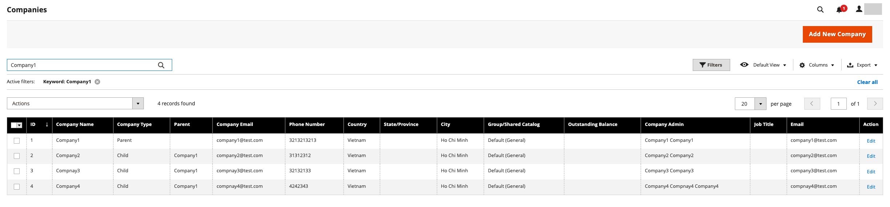
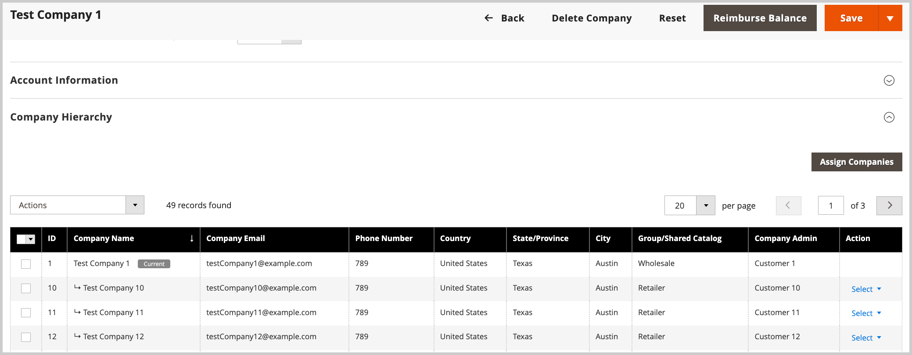
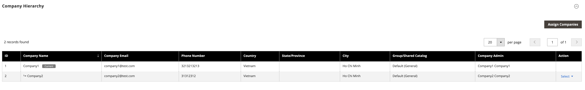

# Company management

[!BADGE 1.5.0-beta]{type=Informative url="/help/b2b/release-notes.md" tooltip="Available only for Beta program participants"}

Company management streamlines business operations for companies with complex organizational structures. Admin users can build a company hierarchy to mirror a B2B organization by assigning companies to the designated parent company. This assignment allows the parent company administrator to view and manage companies within the organization.

Initiate company management tasks from the *[!UICONTROL Companies]* view. From the Admin, go to  **[!UICONTROL Customers]** > **[!UICONTROL Companies]**.

  {width="700" zoomable="yes"}

In the *[!UICONTROL Companies grid]*, the *[!UICONTROL Company Type]* column indicates whether a company is managed as part of an organization, or as a separate company.

  {width="675" zoomable="yes"}

The *[!UICONTROL Company Type]* column indicates whether a company is managed as part of an organization, or as a separate company.

- `Parent` is a business organization with one or more assigned companies. A parent company cannot be assigned as a child of another company.

- `Child` is a company that has been assigned to an organization. A company can be assigned to only one parent company.

- `Company` represents a single company. A single company can be added to an organization by assigning it to a parent company.

When you edit a parent or child company from the grid, the company details list all associated companies in the *[!UICONTROL Company Hierarchy]*.  A `Current` flag indicates the company you are editing.

   {width="700" zoomable="yes"}

## View and configure the [!UICONTROL Company Hierarchy]

On initial company creation, the [!UICONTROL Company Hierarchy] grid is empty. It is also empty if the company is a single company.

{width="700" zoomable="yes"}

If the company is a parent company for an organization, and the company accounts for other companies in the organization have already been configured in Adobe Commerce, Admin users with appropriate permissions can assign companies and use the *[!UICONTROL Company Hierarchy]* grid to complete other company management tasks:

- View all companies associated with parent company.
- From a parent company detail page, assign more companies to the organization.
- Remove a company from an organization by using the *[!UICONTROL Unassign from parent]* action.
- Update the [!UICONTROL Advanced Settings] configuration to apply the same settings to multiple companies.

For detailed instructions, see [Manage the company hierarchy](manage-company-hierarchy.md).
