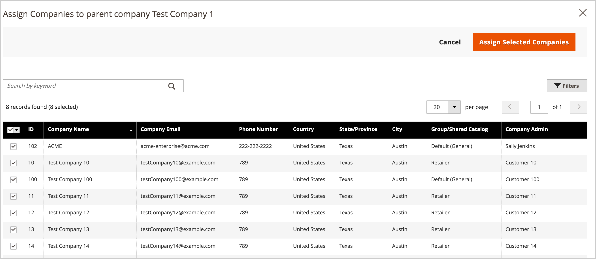
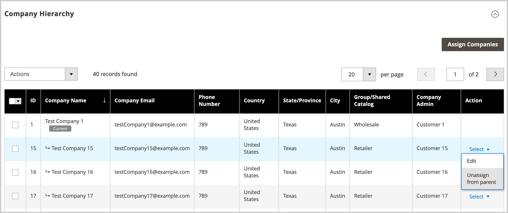
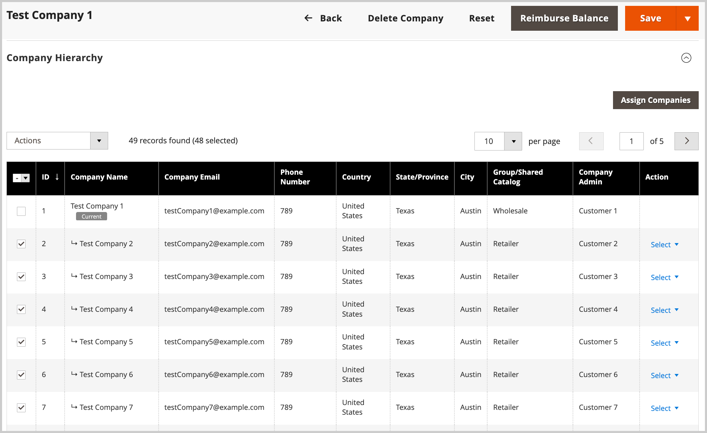
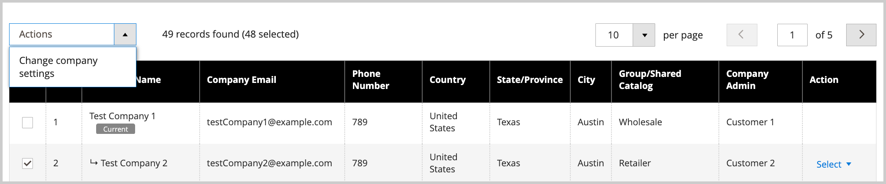
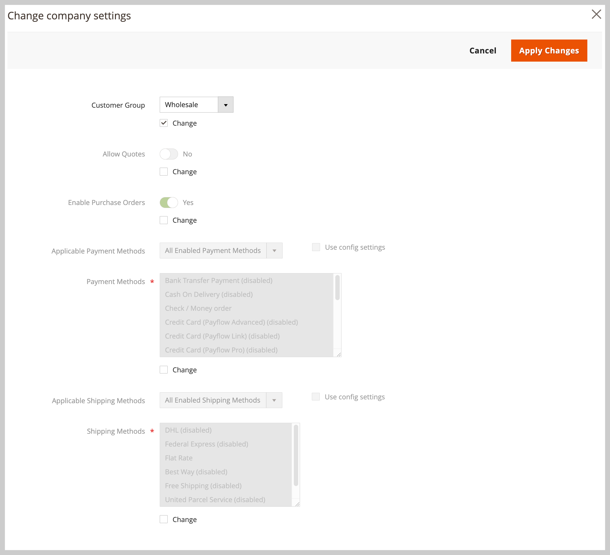

# Manage Company Hierarchies

The [!UICONTROL Company Hierarchy] feature allows you to organize multiple related companies under a single parent company structure. This is ideal for businesses with subsidiaries, franchises, multiple locations, or complex organizational structures that need centralized management while maintaining individual company identities.

## Use cases

* **Centralize Management**—Apply settings and configurations across multiple companies from a single parent company
* **Maintain Structure**—Organize companies in a logical hierarchy that reflects your business organization
* **Streamline Operations**— Manage quotes, purchase orders, payment methods, and shipping settings for the entire organization
* **Preserve Autonomy**—Individual companies retain their identity while benefiting from shared configurations

## Prerequisites

Before creating a company hierarchy, ensure that:

* B2B features are enabled in your Commerce installation
* You have administrator access to manage companies
* Parent and child companies are already created as individual companies
* You understand that applying parent settings will override existing child company configurations

## How It Works

Administrators can build a company hierarchy by assigning related companies to a designated parent company, which is the company at the top of the organizational hierarchy.

From the Admin, create a parent company by editing an individual company (`[!UICONTROL Company Type] = Company`) and assigning related companies in the [!UICONTROL Company Hierarchy] configuration.

{width="700"}

>[!NOTE]
>
>For details about the [!UICONTROL Company Hierarchy] grid, see [Company Hierarchy](account-company-create.md#company-hierarchy) field descriptions.

Manage company assignments by editing a parent company and using the *[!UICONTROL Company Hierarchy]* grid to add or remove companies. Use the *[!UICONTROL Actions]* control to manage the [advanced settings configuration](#change-company-settings) for companies in the organization.

## Assign companies to a parent company

1. On the _Admin_ sidebar, navigate to **[!UICONTROL Customers]** > **[!UICONTROL Companies]**.

     {width="700" zoomable="yes"}

1. From the [!UICONTROL Companies] grid, open the company detail page to create the assignments.

   * To assign additional companies to an existing parent company, select the **[!UICONTROL Edit]** action for the parent company.
   * To create a parent company, select the **[!UICONTROL Edit]** action for the company designated as the parent.

     You cannot create a new parent company from an existing parent or child company.

1. On the Company detail page, expand **[!UICONTROL Company Hierarchy]**, and then select **[!UICONTROL Assign Companies]**.

    {width="675" zoomable="yes"}

1. From the list of available companies, choose the companies to assign, then select **[!UICONTROL Assign Selected Companies]**.

    {width="675" zoomable="yes"}

1. When prompted, complete the company assignment by selecting **[!UICONTROL Assign]**.

## Unassign companies from a parent company

1. On the Companies page, open the company detail page for the parent company by selecting the **[!UICONTROL Edit]** action.

    {width="700" zoomable="yes"}

1. View the list of assigned companies by expanding **[!UICONTROL Company Hierarchy]**.

1. Remove the company from the organization.

   * In the [!UICONTROL Action] column for the company to remove, **[!UICONTROL Select]** > **[!UICONTROL Unassign from parent]**.

     {width="640" zoomable="yes"}

   * When prompted, remove the assigned company from the hierarchy by selecting **[!UICONTROL Unassign]**.

## Manage company settings for an organization

Update the [Advanced Settings](account-company-create.md#advanced-settings) configuration for an organization. You can:

* Apply the parent configuration settings to all child companies
* Apply the same settings to selected companies in the organization

You can select settings to apply from the list of available settings—

* **Quote Management**—Enable or disable the ability for companies to request and manage quotes
* **Purchase Orders**—Control whether companies can create and manage purchase orders
* **Payment Method Configuration**—Define which payment methods are available to companies
* **Payment Method Settings**—Configure specific payment method parameters and limits
* **Shipping Method Availability**—Set which shipping methods companies can use
* **Shipping Method Configuration**—Define shipping method settings and restrictions

During the update process the initial configuration values default to the current values configured for the parent company. You must select the change checkbox for at least one setting to apply settings to the selected companies. You can also update the default value for each setting before applying the changes.

>[!WARNING]
>
>Applying parent company settings replaces existing child company configurations, including credit limits, payment methods, shipping settings, and custom restrictions. After applying the settings, you can still manage and customize the advanced settings for individual parent and child companies by editing the company line item.

### Best practices

When applying parent company settings to child companies, consider the following best practices:

* Review existing child company settings before applying parent configurations
* Test settings changes on a single child company first
* Communicate changes to company administrators who may be affected

### Apply parent configuration settings to child companies

1. On the _Admin_ sidebar, navigate to **[!UICONTROL Customers]** > **[!UICONTROL Companies]**.

1. From the [!UICONTROL Companies] grid, edit the parent company by selecting **[!UICONTROL Edit]** from the **[!UICONTROL Action]** column.

1. On the parent company detail page, expand **[!UICONTROL Company Hierarchy]** section to view companies included in the organization.

1. Select the companies to configure.

   {width="675" zoomable="yes"}

1. From the **[!UICONTROL Actions]** control above the grid, select **[!UICONTROL Change company settings]**.

   {width="675" zoomable="yes"}

1. Change the settings configuration.

   * On the [!UICONTROL Change company settings] page, find the configuration setting to modify.

   * Select the **[!UICONTROL Change]** checkbox to enable the setting.

   * Update the value if needed.

     {width="575" zoomable="yes"}

1. After updating the configuration, select **[!UICONTROL Apply Changes]**.

1. When prompted, select **[!UICONTROL Change settings]** to update the configuration for the selected companies.

>[!MORELIKETHIS]
>
>* [Create a Company Account](account-company-create.md) - Learn how to create individual companies before building hierarchies
>* [Company Roles and Permissions](account-company-roles-permissions.md) - Understand user access within company structures
>* [Company Credit Management](credit-company.md) - Configure credit limits and payment terms for companies
>* [Manage Companies](manage-companies.md) - Overview of company management features
>* [B2B Features Configuration](enable-basic-features.md) - Enable and configure B2B functionality
