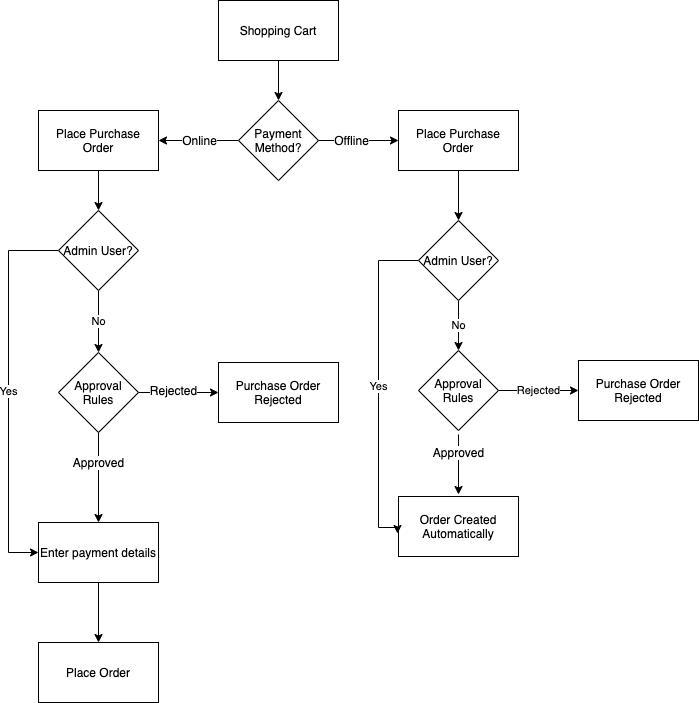

# Purchase orders for companies

Purchase orders (POs) are a common way for companies to track and control spending. [Purchase order](../stores-purchase/purchase-order.md) is one of the standard offline payment methods supported in Adobe Commerce and Magento Open Source. When B2B of Adobe Commerce is installed and [_Enable Purchase Orders_](account-company-manage.md#advanced-settings) is activated for a company account, all orders are automatically created as Purchase Orders (PO). Company users with the required [permissions](account-company-roles-permissions.md) can create, edit, and delete POs that they create and POs created by subordinate users.

## Purchase order flow

Depending on their role, and the order, company users could be subjected to several approval rules. And depending on whether using online or offline payment methods, the flow is slightly different. Company administrators can create orders automatically, bypassing the approval rules. Because storing online payment details during the approval process is a security risk, these details are added after approval and then the purchase order is converted to a real order.

{width="600" zoomable="yes"}

The purchase order workflow for a company can vary in a few ways:

- If no approval rules are set, purchase orders can be placed and the order completed directly.

   >[!NOTE]
   >
   >By default, a `Purchase order has been submitted for approval` message is always displayed to company users, even when no approval rules are set. When no approval process is required, company users automatically receive an email informing them that the order was created and approved.
   
- If approval rules are defined by the company administrator, users go through the approval process.
- Offline payment details are entered when creating the purchase order.
- Online payment details are entered after the purchase order is approved.

>[!NOTE]
>
>Purchase Orders create a _snapshot_ of item prices, discounts, and shipping prices at the time the order was created. If the price of an item changes after the PO is created, the original price is used.

### Basic workflow example

Companies use purchase orders to control what employees can purchase on behalf of the company and often set up approval rules to enforce company guidelines. Depending on the approval rules, multiple people might have to approve the order.

1. User creates a purchase order for $25,000 worth of goods.
1. Their manager must approve.
1. Because the order is more than $10,000, the V.P. must also approve.
1. Depending on the payment method, after the approvals, the purchase order is converted to an order automatically, or the user returns to enter payment details.

### Approval rules

Approval rules are used to control spending based on company guidelines. Examples of approval rules are:

- Any order over $100 needs the approval of your manager.
- Any order over $1000 needs the approval of your manager and the company administrator.
- Any order with more than 30 unique SKUs needs the approval of the company administrator.

With these rules in place for a company, a company user can complete the order immediately when the order is less than $100. To learn approval rule definition, see [Approval Rules](account-dashboard-approval-rules.md)

### Types of store users

The purchase order workflow can also be different depending on who is doing the purchasing.

- A regular employee may be subject to all approval rules
- A manager could have more buying power and would have different approval rules
- Company administrators can bypass all approval rules and have their purchase orders completed automatically.

All these factors can have an influence on the exact checkout process.

## [!UICONTROL My Purchase Orders]

When purchase orders are enabled for a company, the **[!UICONTROL My Purchase Orders]** item is displayed in left panel for customers logged in to a company user account. There are three tabs that provide different purchase order lists and functions:

- **[!UICONTROL My Purchase Orders]**: POs created by the customer.
- **[!UICONTROL Company Purchase Orders]**: POs made by subordinate users within the company (depends on company structure and roles).
- **[!UICONTROL Requires My Approval]**: (Visible for designated approvers) POs that are waiting for the customer's approval. The counter shows how many orders are awaiting approval.

{width="700" zoomable="yes"}

For more information about the supported purchase order functions available for company users on the storefront, see [My Purchase Orders](account-dashboard-my-purchase-orders.md).

## Offline vs online payment methods

Workflows can vary depending on the payment method. To learn more about Adobe Commerce payment methods, see [Payment Methods](../stores-purchase/payments.md) in the _Sales and Purchase Experience Guide_.

>[!IMPORTANT]
>
>Purchase orders should use an _In-Context_ checkout experience. _Out-of-Context_ checkouts are not supported because they bypass the normal checkout flow. Generally, _In-Context_ means the customer stays on your commerce site to complete the process. _Out-of-Context_ is when the customer is taken to another site to complete the purchase.

### Online payments

For security reasons, online stores do not typically want to collect store credit card details while waiting for the approval process to complete. Therefore, if an online payment option is selected, the purchase order creator returns to the store after approval, enters the payment details, and completes the order. Examples of online payments are:

- Credit/Debit Cards
- PayPal
- Braintree

>[!IMPORTANT]
>
>Using gift cards, store credit, or reward points with online payment methods for purchase orders is not supported. Enabling these features with online payments may cause some unexpected behavior. It is recommended that you disable gift cards, store credit, and reward points when online payments are enabled for purchase orders.

## Offline payments

As offline payment methods, such as a money order, are handled outside the website, they are safer. Purchase orders with offline payments can be processed automatically, after any approval process.

Examples of offline payments are:

- Check/Money Order
- Payment on Account
- Cash on Delivery
- Bank Transfers
- Store Credit
