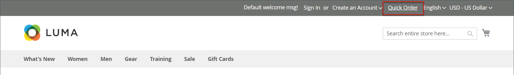
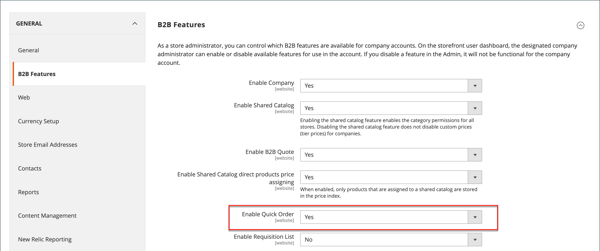
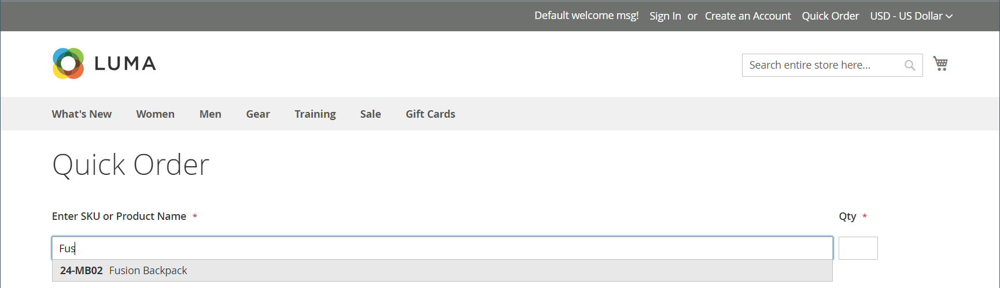
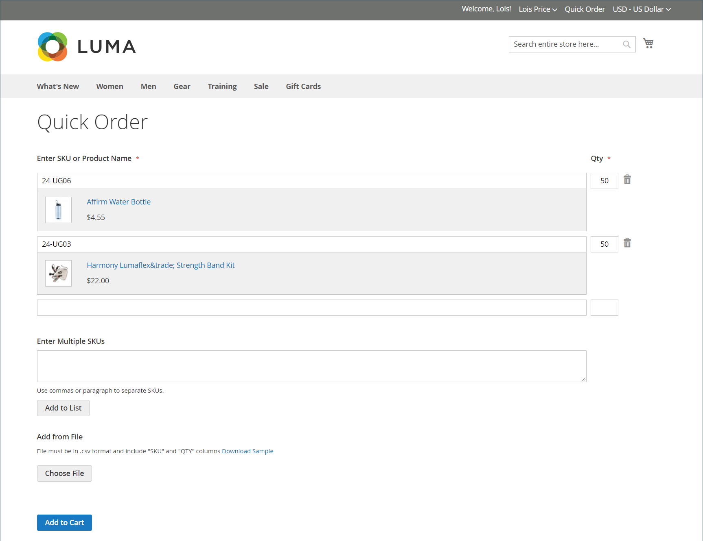

# Quick orders

The _Quick Order_ feature reduces the order process to several clicks for customers who know the product name or SKU of the products they want to order. Orders with multiple SKUs can be entered manually, or imported into the Quick Order form. Quick order can be used by customers who are logged in to their accounts, and by guests. When enabled, the _Quick Order_ link appears at the top of the page, next to the customer name.

{width="700" zoomable="yes"}

## Enable quick orders for your store

1. On the _Admin_ sidebar, go to **[!UICONTROL Stores]** > _[!UICONTROL Settings]_ > **[!UICONTROL Configuration]**.

1. In the _[!UICONTROL General]_ section on the left panel, choose **[!UICONTROL B2B Features]**.

1. Set **[!UICONTROL Enable Quick Order]** to `Yes`.

    {width="600" zoomable="yes"}

1. Click **[!UICONTROL Save Config]**.

1. When prompted, click [Cache Management](../systems/cache-management.md) and refresh any invalid caches.

## Quick order workflows

Customers can specify products for quick orders using either of the following methods.

### Method 1: Enter individual products

1. The customer clicks the **[!UICONTROL Quick Order]** link.

1. Selects the product by SKU or product name:

   - To place a quick order by SKU, does the following:

      - Enters the **[!UICONTROL SKU]**.

      - Clicks **[!UICONTROL Add to List]**.

         The SKU appears in the input line, with the product detail below.

         {width="600" zoomable="yes"}

   - To place a quick order by the product name, does the following:

      - Enters the first few characters of the **[!UICONTROL Product Name]**.

         >[!NOTE]
         >
         >Do not use the _Enter_ key to choose the name of the product.

      - When the list of possible matches appears, the customer clicks the product that they want to order.

          {width="700" zoomable="yes"}

1. Enters the **[!UICONTROL Qty]**.

1. Using the next input line, repeats this process as many times as necessary.

1. Clicks **[!UICONTROL Add to Cart]**.

### Method 2: Enter multiple products

1. In the **[!UICONTROL Enter Multiple SKUs]** box, the customer does one of the following:

   - Enters one SKU per line

   - Enters all SKUs on the same line, separated by commas, and without spaces.

      {width="600" zoomable="yes"}

1. To add the products to the list, clicks **[!UICONTROL Add to List]**.

1. Enters the **[!UICONTROL Qty]** to be ordered for each item in the list.

   {width="600" zoomable="yes"}

   >[!NOTE]
   >
   >If the product has required options, the customer is prompted to choose the options. They can wait until they reach the shopping cart to add product options.

   {width="600" zoomable="yes"}

### Method 3: Upload a list of products

1. In the _[!UICONTROL Add from File]_ section, click **[!UICONTROL Download Sample]** to download an order template.

    {width="600" zoomable="yes"}

1. Opens the downloaded file.

1. Uses the template to add the product SKUs to upload for the Quick Order list.

1. When complete, clicks **[!UICONTROL Save]**.

    {width="400" zoomable="yes"}

1. To upload the file, clicks **[!UICONTROL Choose]** and selects the file from their system.

   The items are added to the Quick Order list.

1. When ready, clicks **[!UICONTROL Add to Cart]**.

After the customer creates the quick order, they can proceed through checkout as usual.

{width="700" zoomable="yes"}
