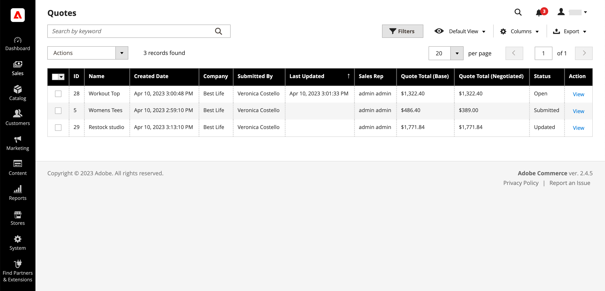
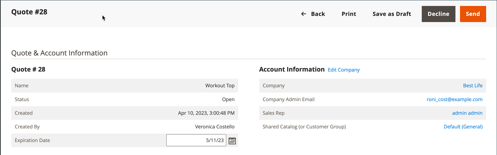
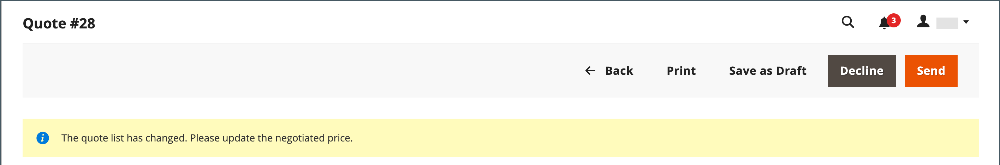
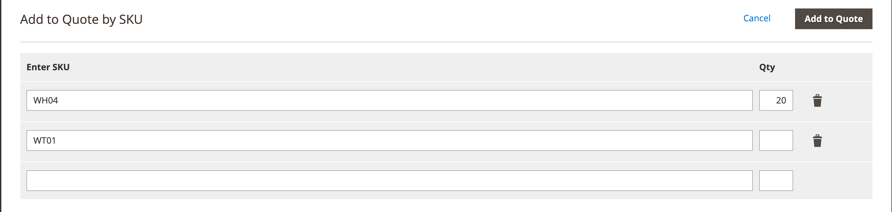
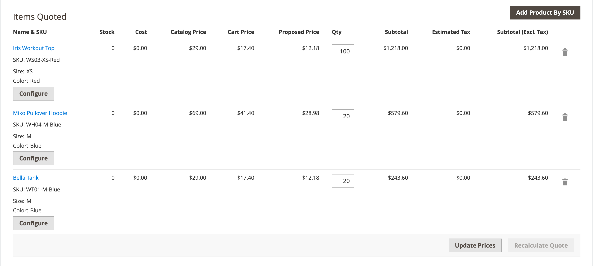
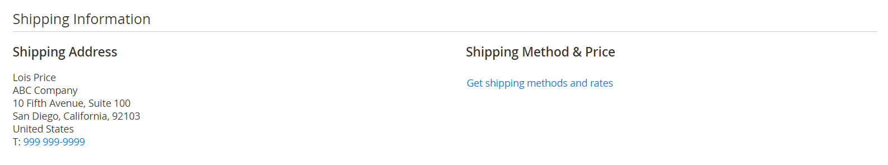
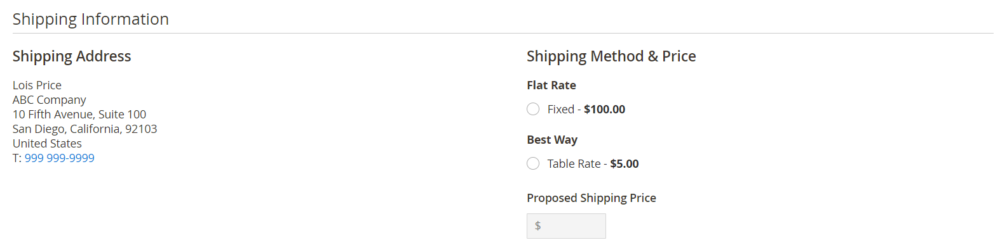
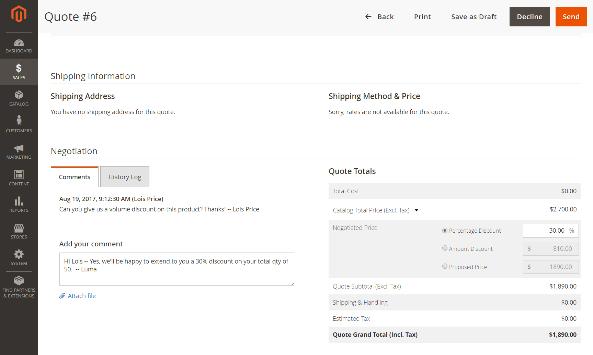

# Negotiate a Quote

If [B2B Quotes are enabled](configure-quotes.md) in the configuration, an authorized buyer from a company initiates the price negotiation process by [requesting a quote](quote-request.md) from the shopping cart. Requests for quotes received are listed in the [Quotes](quotes.md) grid. All negotiation between the buyer and seller takes place by email, and is initiated and tracked from the detail view of the quote.

During the negotiation process, the seller can do the following:

- Add or remove products
- Change the quantity
- Apply a discount to the total price
- Add or change the shipping method
- Add comments
- Send the updated quote to the buyer, or save as a draft

While the quote is open for review, its status in the buyer’s account is set to `Pending`. The buyer can change and resubmit the quote even if it was declined or is expired.

## Step 1: View the request

1. On the Admin sidebar, go to **[!UICONTROL Sales]** > **[!UICONTROL Quotes]**.

   The new request appears in the _[!UICONTROL Quotes]_ grid.

1. In the _Actions_ column, click **[!UICONTROL View]**.

   <!-- zoom -->

## Step 2: Modify the quote

1. Under _[!UICONTROL Quote & Account Information]_, click the _Calendar_ () icon.

   <!-- zoom -->

1. Choose an **[!UICONTROL Expiration Date]** for the quote.

   If the buyer changes the quantity of any items in the quote, a notice appears at the top of the quote, indicating that list of items has changed, and the negotiated price must be updated.

   <!-- zoom -->

1. Scroll down to the _[!UICONTROL Quote Totals]_ section and update the **[!UICONTROL Negotiated Price]** as needed.

   <!-- zoom -->

### Add new products to the quote

1. Click **[!UICONTROL Add Products by SKU]**.

1. Enter the **[!UICONTROL SKU]** and **[!UICONTROL Qty]** to be added.

   <!-- zoom -->

### Apply a line item discount

In the _[!UICONTROL Items Quoted]_ section, make the following changes, if needed:

- Change the **[!UICONTROL Quantity]** that must be purchased at the Proposed Price.

- Click **[!UICONTROL Configure]** and change the product options.

### Apply changes and update

- To apply changes, click **[!UICONTROL Add to Quote]**.

- To update the quote, click **[!UICONTROL Recalculate the Quote]**.

- To apply the changes and update the quote to the shared catalog and price rules, click **[!UICONTROL Update Prices]** and then click **[!UICONTROL Proceed]** to confirm the update.

   <!-- zoom -->

### Update shipping information

1. If the buyer includes a _Ship To_ address in the quote, click **[!UICONTROL Get shipping methods and rates]**.

   <!-- zoom -->

1. Choose a shipping method from the available options.

1. Enter a **[!UICONTROL Proposed Shipping Price]**.

   The _[!UICONTROL Quote Totals]_ are updated to reflect the proposed shipping price.

   <!-- zoom -->

### Attach a supporting document

1. Under the _Add your comment_ box, click **[!UICONTROL Attach file]**.

   By default, [attached files](https://docs.magento.com/user-guide/configuration/sales/quotes.html) can be up to 2 MB in any of the following file formats: DOC, DOCX, XLS, XLSX, PDF, TXT, JPG or JPEG, PNG.

1. Choose the file from your directory.

## Step 3: Send your reply

1. In the _[!UICONTROL Negotiation]_ section on the _[!UICONTROL Comments]_ tab, enter your reply in the **[!UICONTROL Add your comment]** section.

1. To include a supporting document, click **[!UICONTROL Attach file]** and select the file from your directory.

    The maximum file size allowed for attachments is 2 MB.

1. To apply a discount to the quote as a whole:

   - Under _[!UICONTROL Quote Totals]_ in the _[!UICONTROL Negotiated Price]_ section, choose one of the following discount types:

      - `Percentage Discount`
      - `Amount Discount`
      - `Proposed Price`

   - Enter the amount as a percentage or flat price.

      <!-- zoom -->

1. Send or save the quote:

   - If the quote is ready to send back to the buyer, click **[!UICONTROL Send]**.

   - To continue working on the quote later, click **[!UICONTROL Save as Draft]**.

## Step 4: Follow up on a quote

When you send a quote, the system notifies both the buyer and the sales rep who manages the company account. The email includes a link to the quote in the buyer’s account and the expiration date of the quote. At any point in the negotiation, the buyer can do any of the following:

- Accept the negotiated quote and complete the purchase.
- Send a reply with a counter offer and continue the negotiation.
- Ends the negotiation.

To monitor its position in the workflow, check your email and the status of the quote in the grid. You can continue the negotiation process as long as needed.

<!-- zoom -->

## Button bar

|Button|Description|
|--- |--- |
|[!UICONTROL Back]|Returns to the _[!UICONTROL Quotes]_ page without saving changes.|
|[!UICONTROL Print]|Sends the quote to a printer or saves it as a PDF file.|
|[!UICONTROL Save as Draft]|Save any changes made to the quote, but do not send it back to the buyer.|
|[!UICONTROL Decline]|Declines the request to negotiate prices, either on the initial inquiry, or during ongoing negotiations. When a quote is declined, the seller should add a comment to explain the decision. When a quote is declined, all negotiated prices are reset to the original values. This button is disabled while the seller is waiting for a reply from the buyer.|
|[!UICONTROL Send]|Sends the updated quote as a reply to the buyer’s inquiry. This button is disabled if the seller is waiting for a reply from the buyer.|

{style="table-layout:auto"}

## Field descriptions

Quote information and functions in the Admin are organized into the following sections.

### [!UICONTROL Quote & Account Information]

| Field        | Description |
|--------------|---------------|
|[!UICONTROL Name]|The name assigned to a quote request by the [buyer](account-company-roles-permissions.md).|
|[!UICONTROL Status]|Indicates the current state of the quote. The status of a quote can be changed only by action on the part of either the buyer or seller. See also the [Status settings](quotes.md) from the Admin and the [buyer’s account](account-dashboard-my-quotes.md).|
|[!UICONTROL Created]|The date and time the buyer first submitted the request for a quote.|
|[!UICONTROL Created By]|The first and last name of the company buyer who submitted the request for a quote.|
|[!UICONTROL Expiration Date]|Indicates the last day that the current quote is valid. The default expiration date is set in the configuration as 30 days after a buyer submits a request for a quote.   The seller can override the default expiration date by entering a different date (MMM DD YYYY ) or choosing the date from the calendar. The quote never expires if the field is left blank.   For open quotes, the seller receives an [email notification](https://docs.magento.com/user-guide/marketing/email-template-list.html) 48 hours before the quote is scheduled to expire. Buyers are notified 24 hours before the expiration date.   The status of the quote changes to _Expired_ and the buyer cannot make further changes to the quote. The proposed prices in the quote revert to the original values from the catalog.   If a quote is open for review by the seller when the quote is set to expire, the expiration date is reset according to the range that is set in the configuration.   The Expiration Date is the only field in the _Quote & Account_ section that can be edited during the review process.|
|[!UICONTROL Company]|The legal name of the [company](account-companies.md) that the buyer represents.|
|[!UICONTROL Company Admin Email]|The email address of the [company administrator](account-company-admin.md).|
|[!UICONTROL Sales Rep]|The [sales representative](account-company-manage.md) who works for the seller, and is the primary contact assigned to the company account.|
|[!UICONTROL Shared Catalog (or Customer Group)]|The [shared catalog](catalog-shared.md) or [customer group](account-company-customer-group.md) to which the company is assigned. The quote might include custom prices from the shared catalog that is assigned to the company.|

{style="table-layout:auto"}

### [!UICONTROL Add to Quote by SKU]

| Field        | Description |
|--------------|---------------|
|[!UICONTROL Enter SKU]|The SKU of the product that is to be added to the quote.|
|[!UICONTROL Qty]|The number of items of this SKU to be added to the quote.|
|[!UICONTROL Add to Quote]|Adds the quantity of the product specified to the quote.|

{style="table-layout:auto"}

### [!UICONTROL Items Quoted]

| Field        | Description |
|--------------|---------------|
|[!UICONTROL Name & SKU]|The linked product name and stock-keeping unit (SKU).|
|[!UICONTROL Stock]|The number of products under this SKU that are currently available for sale.|
|[!UICONTROL Cost]|The amount the seller paid to purchase the product.|
|[!UICONTROL Catalog Price]|The price of the product in the buyer’s catalog, based on the customer group or shared catalog that is assigned to the buyer’s company.|
|[!UICONTROL Cart Price]|The original price of the item in the cart, less any discounts applied from the cart. The cart price might differ from the catalog price if there are discounts or cart rules that apply to the buyer’s customer group.|
|[!UICONTROL Proposed Price]|The price proposed by the buyer during the negotiation of a quote. The Cart Price and Proposed Price are the same until price negotiation begins.|
|[!UICONTROL Qty]|The number of units in this SKU that is the basis for  the quoted price. Only a positive number greater than zero can be entered. If you want to change the quantity to zero, delete the line item from the quote.|
|[!UICONTROL Subtotal]|The proposed price multiplied by the quantity of items ordered.|
|[!UICONTROL Estimated Tax]|The amount of tax that is estimated for this line item, according to the configuration. Depending on the Tax Calculation Settings, the estimated tax can be based on any of the following: Unit Price / Row Total / Total|
|[!UICONTROL Subtotal (Incl./Excl. Tax)]|Depending on the configuration, this column can display the subtotal with or without estimated taxes.|
|[!UICONTROL Configure]|Allows you to change the product options for a configurable product.|
|[!UICONTROL Update Prices]|Updates the quote with the latest changes from the shared catalog and price rules.|
|[!UICONTROL Recalculate Quote]|Recalculates all quote prices, cart price rules, and tax to reflect changes to the quote.|

{style="table-layout:auto"}

### [!UICONTROL Shipping Information]

| Field        | Description |
|--------------|---------------|
|[!UICONTROL Shipping Address]|Displays the shipping address that is specified in the buyer’s account. The shipping address is blank if the buyer did not specify an address before submitting the request.|
|[!UICONTROL Shipping Method & Price]|The Get Shipping Methods and Rates link appears if the buyer includes a _Ship To_ address in the quote.|

{style="table-layout:auto"}

### [!UICONTROL Negotiation]

| Field        | Description |
|--------------|---------------|
|[!UICONTROL Comments]|The Comments tab of the Negotiation section is used to enter a message to the buyer about the quote.  **[!UICONTROL Add your comment]** - The comments are used to communicate with the buyer during the negotiation process. Use the comments to explain any discounts offered in the quote, or the reason a quote request is declined.  **[!UICONTROL Attach file]** - The maximum file size and supported file types for [attached files](configure-quotes.md) are determined by the configuration. By default, an attached file can be up to 2 MB, and of any of the following file types: DOC, DOCX, XLS, XLSX, PDF, TXT, JPG or JPEG, PNG.|
|[!UICONTROL History Log]|This tab displays a complete history of the quote with dates, quote status, and comments.|

{style="table-layout:auto"}

### [!UICONTROL Quote Totals]

| Field        | Description |
|--------------|---------------|
|[!UICONTROL Total Cost]|The total cost to the seller of the items included in the quote.|
|[!UICONTROL Catalog Total Price  (Incl./Excl. Tax)]|The total price of the items in the quote without tax, according to the prices in the shared catalog or primary catalog that is used as the basis of the quote. Expand the section to display the values that are used in the calculation, depending on the [Display Subtotal](https://docs.magento.com/user-guide/configuration/sales/tax.html) setting in the configuration. Options:  **[!UICONTROL Subtotal (Excl. Tax)]** - The Catalog Total Price without estimated tax.  **[!UICONTROL Subtotal (Incl. Tax)]** - The Catalog Total Price without estimated tax.  **[!UICONTROL Estimated Tax]** - The amount of tax that is estimated to apply to the Catalog Total Price.|
|Negotiated Price|The discount that is offered to the buyer can be based on any of the following:  **[!UICONTROL Percentage Discount]** - The discount as a percentage.  **[!UICONTROL Amount Discount]** - The discount as a fixed amount.  **[!UICONTROL Proposed Price]** - The price proposed by the seller.|
|[!UICONTROL Quote Subtotal (Incl./Excl. Tax)]|The total proposed price of each line item in the quote, either with or without tax, depending on the [tax calculation](https://docs.magento.com/user-guide/configuration/sales/tax.html) settings in the configuration.|
|[!UICONTROL Shipping & Handling]|The  amount entered by the seller in the Proposed Shipping Price field in the Shipping Information section of the quote. If that field is empty, the amount is based on the selected shipping method.|
|[!UICONTROL Estimated Tax]|The amount of tax that is estimated to be due, as specified in the configuration [display settings](https://docs.magento.com/user-guide/configuration/sales/tax.html).|
|[!UICONTROL Quote Grand Total (Incl. Tax)]|The final total at the bottom of the quote that includes the negotiated price, estimated tax, and proposed shipping and handling.|

{style="table-layout:auto"}
