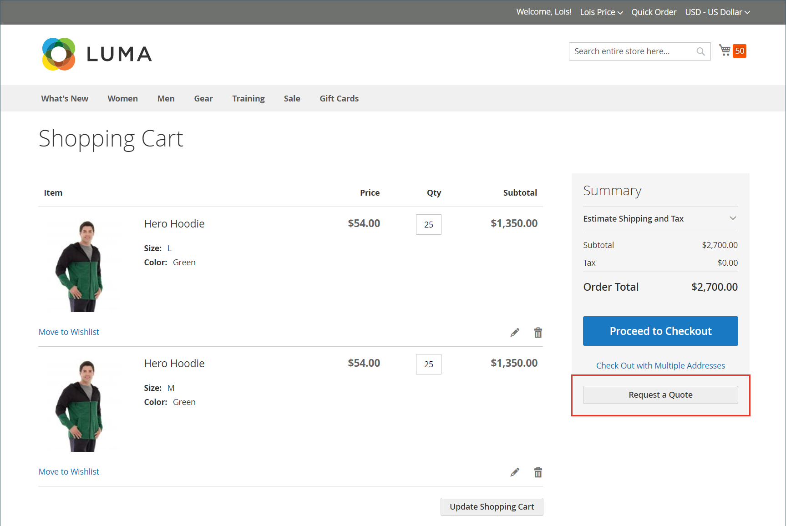
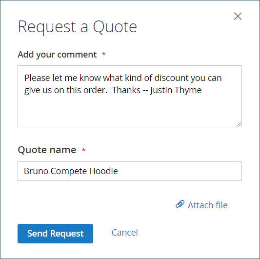

# Request for Quote

If quotes are enabled in the [Sales features configuration](configure-quotes.md), an authorized buyer from a company can initiate the price negotiation process by requesting a quote from their shopping cart.

>[!NOTE]
>
>A request for a quote cannot include discount codes or gift cards.

## Customer quote request experience

1. The customer logs in to their user account as a buyer with [permission](account-company-roles-permissions.md) to request a quote.

1. Adds the products that they want to be included in the quote to the shopping cart.

1. Clicks **Request a Quote**.

   <!--- zoom --->

1. In the **Add your comment** box, enters a brief note that describes the request.

1. Enters a **Quote Name**.

   <!--- zoom --->

1. If needed, attaches a supporting document or image to the quote:

   - Clicks **Attach file**.
   - Chooses the file from their system.

   By default, an [attached file](configure-quotes.md) can be up to 2 MB, in any of the following file formats: DOC, DOCX, XLS, XLSX, PDF, TXT, JPG or JPEG, PNG.

1. Clicks **Send Request**.
