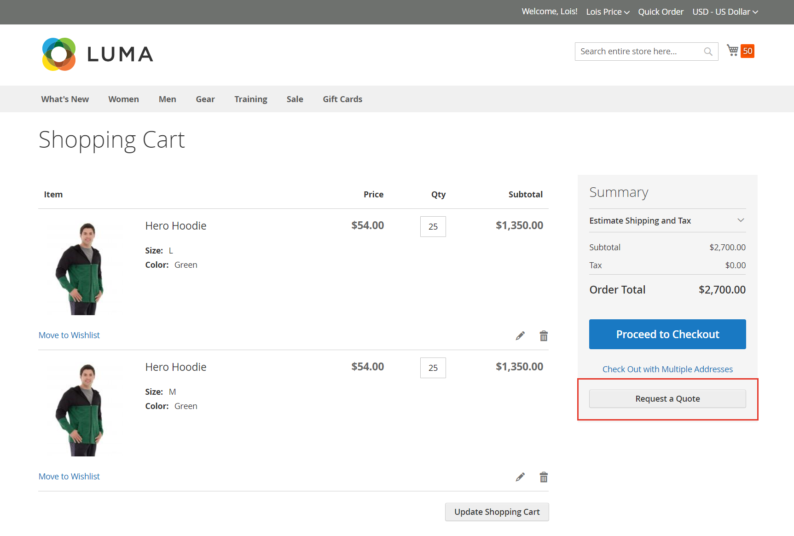
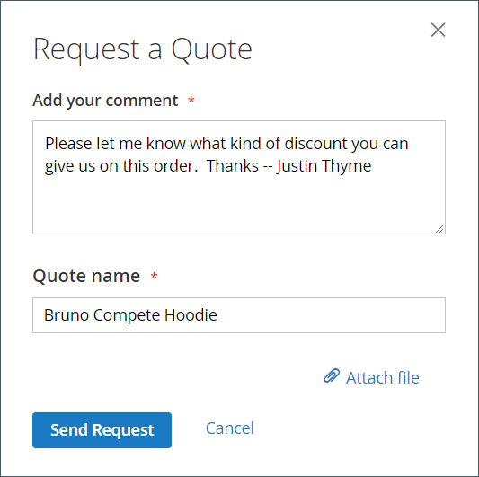

# Request for quote

If quotes are enabled in the [Sales features configuration](configure-quotes.md), an authorized buyer from a company can initiate the price negotiation process by requesting a quote from their shopping cart. If a buyer is not ready to submit a quote for negotiation, they can save it as a draft.

>[!NOTE]
>
>A request for a quote cannot include discount codes or gift cards.

## Customer quote request experience

1. The customer logs in to their user account as a buyer with [permission](account-company-roles-permissions.md) to request a quote.

1. Adds the products to include in the quote to the shopping cart.
 
   >[!TIP]
   > 
   >Customers can add a list of product SKUs to the cart more quickly by using [Quick Order](quick-order.md).

1. Selects **[!UICONTROL Request a Quote]**.

   {width="700" zoomable="yes"}

1. In the **[!UICONTROL Add your comment]** box, the customer enters a brief note to describe the request.

1. Enters a **[!UICONTROL Quote Name]**.

   {width="400" zoomable="yes"}

1. If needed, attaches a supporting document or image to the quote:

   - Selects **[!UICONTROL Attach file]**.
   - Chooses the file from their system.

   By default, an [attached file](configure-quotes.md) can be up to 2 MB, in any of the following file formats: DOC, DOCX, XLS, XLSX, PDF, TXT, JPG or JPEG, PNG.

1. Creates and processes the quote:

   - Sends the quote to the Seller by selecting **[!UICONTROL Request a Quote]**.
   - Saves the quote as a draft by selecting **[!UICONTROL Save as Draft]**.

     If the buyer saves the quote as a draft, the quote is available in [!UICONTROL My Quotes] in `Draft` state. Draft quotes are not visible to the Seller until the Buyer sends them for review.
