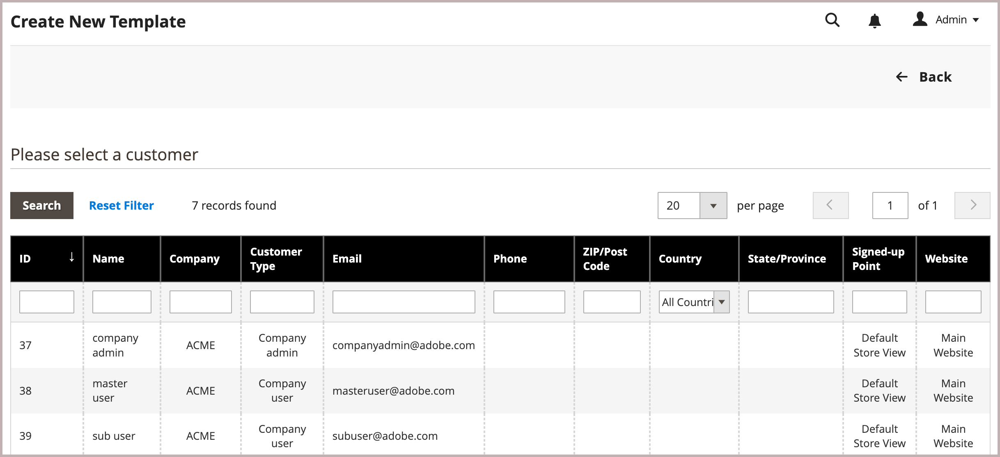

# Quote templates use case and workflows

The Quote Template capability allows buyers and sellers to streamline the quote process by creating reusable and customizable quote templates.

- **Customizable Quotes**—Buyers can generate linked quotes from a pre-approved template, allowing for customization within specified parameters such as line-item quantities and selections.
- **Order Thresholds**—Sellers can set minimum and maximum order commitments, ensuring that buyers adhere to agreed-upon purchasing volumes.
- **Expiration Dates**—Templates can have validity periods, ensuring that the terms are applicable only within a specified time frame.
- **Discounts and Pricing**- Sellers can use the same line-item, quote-level, and shipping price discount capabilities available with quotes to set discounts for recurring orders, simplifying the negotiation process.
- **Tracking and Reporting**—The system tracks the number of linked quotes generated from the template and successfully completed orders to provide insights into the fulfillment of agreed upon order quotas.

## Use Case

A company buyer can use a quote template to order a specific set of products over a period of time. The buyer configures the following quote template options to make the quoting process more efficient, consistent, and aligned with strategic purchasing agreements.

- Order threshold to specify the minimum and maximum number of orders eligible for negotiated pricing. This can be used to apply and track order quotas specified in contract agreements.

- Quantity thresholds (minimum/maximum quantities) The template specifies a quantity threshold to set the minimum and maximum quantity that can be purchased for each order, ensuring that the seller can manage stock levels effectively while providing the buyer with the flexibility to adjust quantities as needed.

## Quote template workflow

Quote templates can be initiated by the buyer or the seller.

**Step 1: Quote template creation (New)**

- **Buyer creates the quote template**

   When reviewing an existing quote template, the buyer decides that the company needs to submit multiple orders over the next year and wants to request additional discounts based on repeat business. They create a quote template by using the *[!UICONTROL Create quote template]* action on the quote. Then, they initiate the negotiation by sending the new template to the seller for review.

   Buyers can also create a quote template directly from the *[!UICONTROL My Quote Templates]** page on the storefront.

- **Sales representative** — A Sales Representative can create a quote template from the Admin on behalf of a specific company buyer. The Sales Representative can create the quote template in the Admin from an existing quote or from the [!UICONTROL Quote Templates] grid and save it as a `draft` or send it to the buyer to start the negotiation. In draft state, the quote is visible only to the seller. Once the quote is sent, the status is `Submitted`. It cannot be modified by the seller until the buyer sends it back.

  {width="700" zoomable="yes"}

**Step 2: Quote review and negotiation (Review)**

Reviewing or negotiating a quote template can include changing quantities, removing items, adding line item comments, applying line item or quote discounts (seller), and adding a shipping address (buyer).

- **Seller views request and sends response** - In the Admin, the seller views the quote template from the *[!UICONTROL Quote Templates]** grid or opens it from the link in the email notification. On the storefront, the status of the quote changes to `Pending`, and the buyer cannot make any changes. Following the same process for [quote negotiation](quote-price-negotiation.md), the seller responds by offering price discounts and adjusting quantities and items as needed, enters a comment, and sends the quote back to the buyer. The buyer and sales representative are notified by email that the seller has responded.

- **Buyer views quote template from seller and sends response** - The buyer clicks the link in the email notification to open the quote template, or opens the quote from the _My Quote Templates_ page of the account dashboard. The buyer can leave notes to the seller at the line item or quote level, change quantities, and remove items.

The buyer and seller continue the negotiation process until an agreement is reached, or the seller declines the quote template. If the buyer makes changes to the quote—adding or removing products or changing product quantities—the quote must be returned to the seller for review.

- **Buyer adds a shipping address** - The buyer must add a shipping address to the quote template if it doesn't have one. After the buyer adds the address, the seller can provide shipping and delivery options. The shipping methods shown depend on the Storefront configuration.

If the buyer adds a shipping address, the negotiation agreement has to be reviewed, and the seller can continue the negotiation process until an agreement is reached, or the seller declines the quote template.

**Step 3: Buyer accepts quote template**

The buyer accepts the negotiated terms in the template. After the quote template is accepted, the buyer can use it to generate pre-approved, linked quotes that can be used to submit orders without requiring further negotiation.

Shipping options are locked on checkout.

### View a quote template

1. In the **[!UICONTROL Actions]** column for a record, click **[!UICONTROL View]**.

1. To respond to the customer request, follow the instructions and begin the same [price negotiation](quote-price-negotiation.md) process used to negotiation quotes.

### View quote template activity

View the negotiation timeline, communication, and other quote activity from the [!UICONTROL Comments] and [!UICONTROL History Log]--information includes status changes, updates to customer and shipping info, item and price updates, and other important information.

1. Open a quote template.

1. View quote negotiation comments and history by scrolling to **[!UICONTROL Negotiation]**, and selecting **[!UICONTROL Comments]** and **[!UICONTROL History Log]**.

   {width="400"}

1. History is also tracked at the line item level.

   {width="400"}

### Decline a quote template

Only quote templates with an `In Review` status can be declined.

1. From the *[!UICONTROL Quote Templates]* grid, open the quote template that you want to decline.

1. On the quote template, click **[!UICONTROL Decline]**.

1. When prompted, enter the reason the quote was declined and click **[!UICONTROL Confirm]**.
