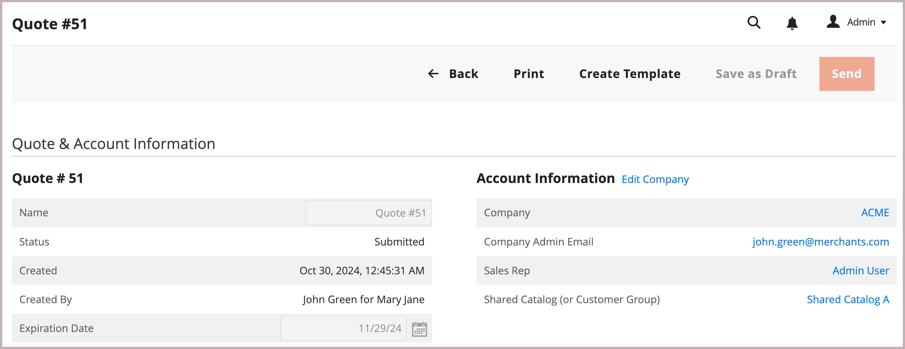

# Create a quote template

Negotiate volume discounts for recurring orders by creating a quote template from an existing quote.

{width="700" zoomable="yes"}

After creating the template, the seller can configure template options to set order and quantity thresholds, adjust line item and quote level discounts before sending it to the buyer to begin the negotiation process.

Once the buyer and seller reach agreement, the buyer accepts the quote template. Then, the buyer can [generate pre-approved, linked quotes](account-dashboard-my-quote-templates.md) based on the quote template terms when they are ready to order. For example, if a company has MRO (maintenance, repairs, and operations) orders to sustain their business operations, either the buyer or seller can use a quote template to add the required items, negotiate the pricing, and set the terms for monthly recurring orders. Then, the buyer can submit orders without requiring additional negotiation.

For additional details, see [Quote templates overview](quote-templates-overview.md).
