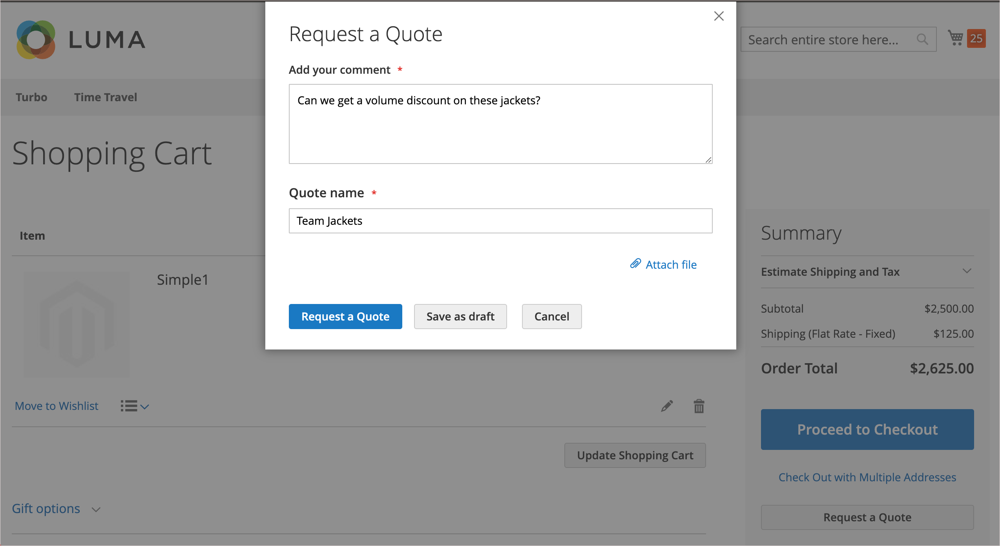
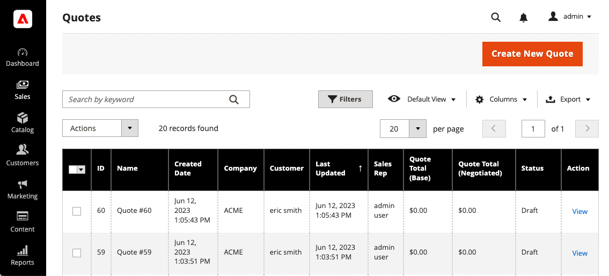
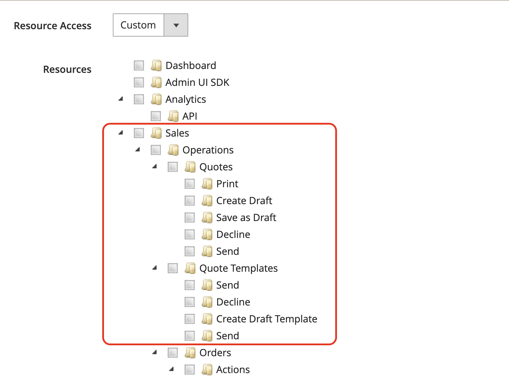
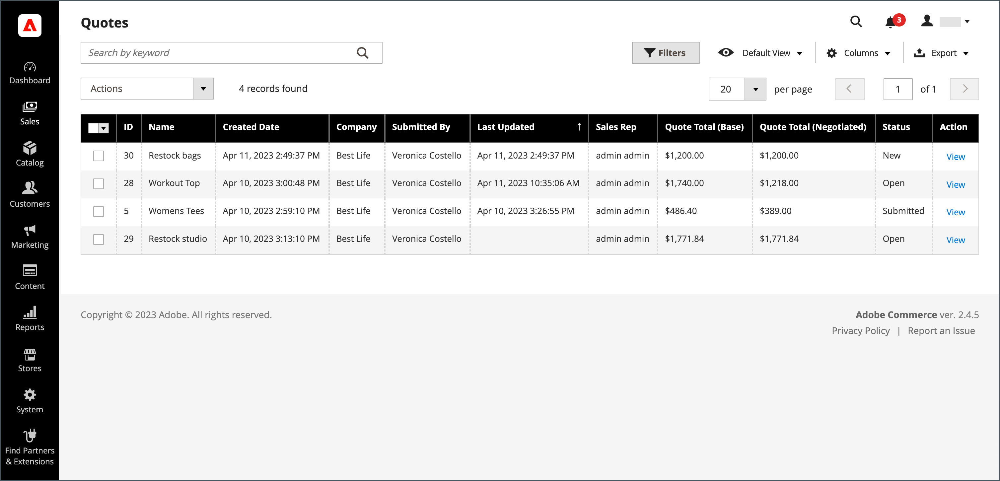
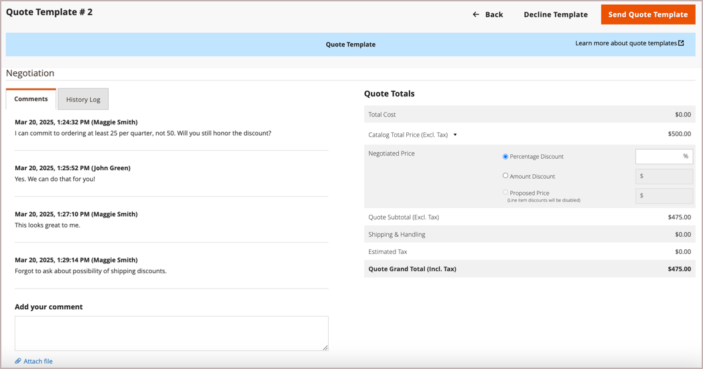
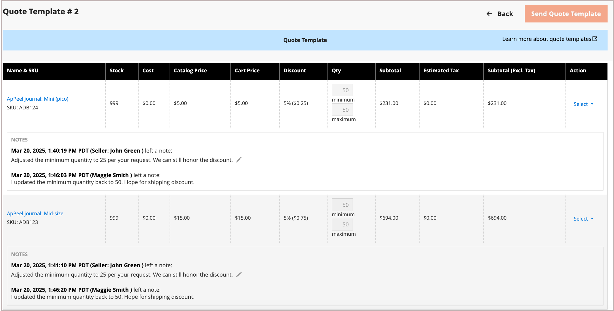
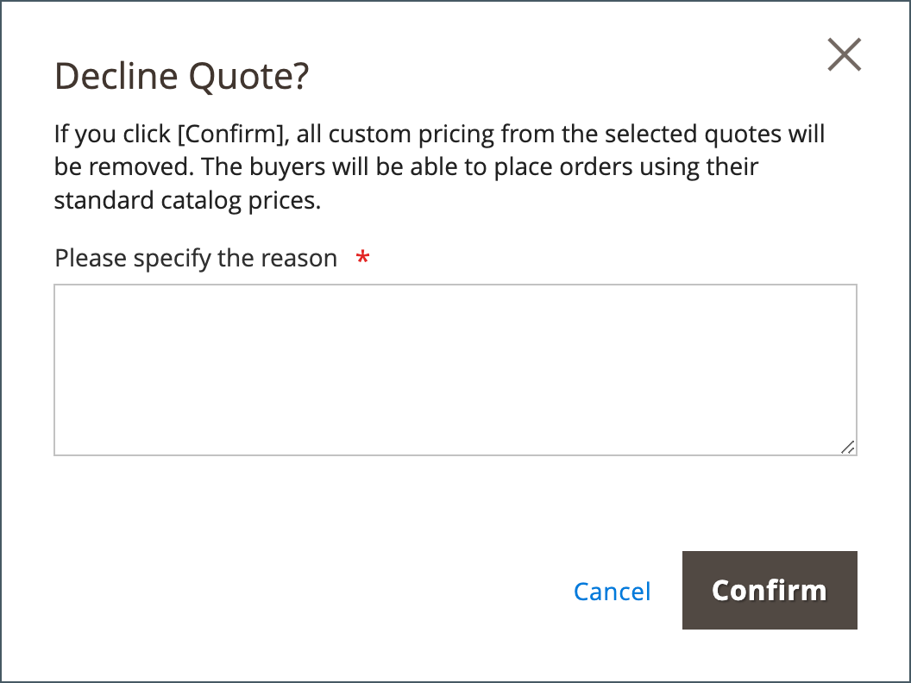
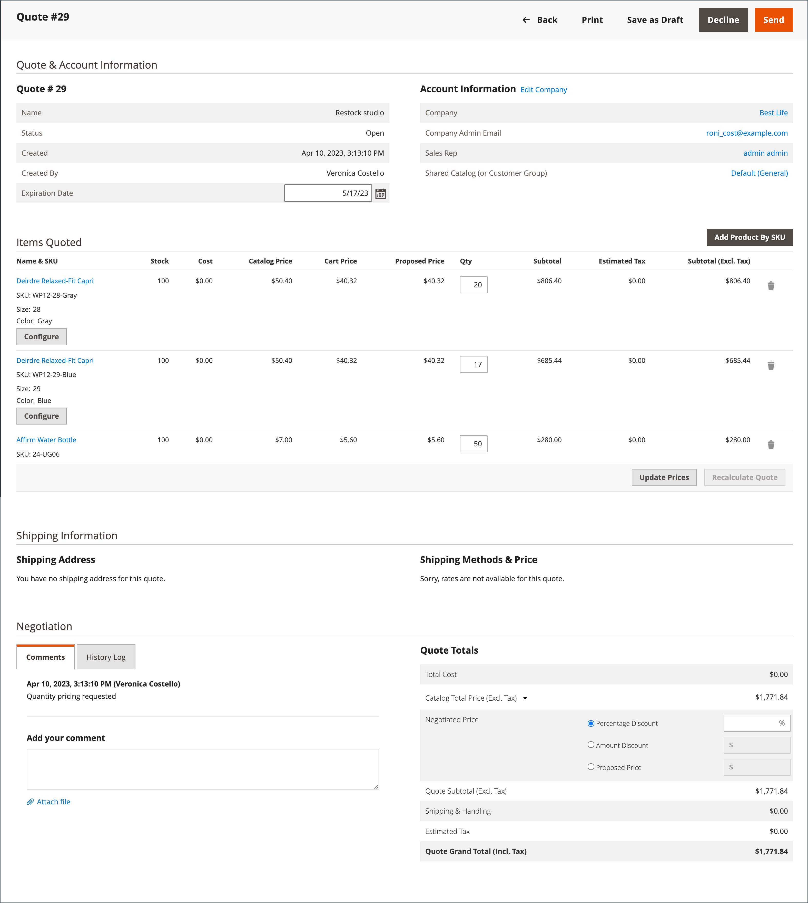

# Negotiable Quotes

Buyers and sellers use Quotes to manage the negotiation process for an order–adding items, updating quantities, requesting and applying discounts, and so on—until they reach agreement. The quote negotiation process can be initiated by an authorized company buyer, or by a company sales representative.

Quotes can be initiated by an authorized company buyer or a sales representative. After the quote is created, the negotiation process begins when the buyer or seller submits the quote for review. The _Quotes_ grid which lists each quote received and maintains a history of the communication between buyer and seller. Use the standard [workplace controls](../getting-started/admin-workspace.md) to filter the list, change the column layout, save views, and export data.

- In the storefront, buyers submit the quote as a [request to negotiate](quote-price-negotiation.md) the price from the shopping cart. When creating the quote request, a buyer can save the quote as a draft, or submit it directly to the seller.

- In the Admin, Sales representatives can create quotes on behalf of company buyer. When creating the quote, a seller can save the quote as a draft, or submit it directly to the buyer to initiate the negotiation process.

During the negotiation process, the quote can only be updated by the person reviewing and proposing terms for further negotiation.

## Prerequisites

Negotiable quotes are available only if Adobe Commerce has the following configuration settings:

- [The B2B for Adobe Commerce extension is installed](install.md)
- [Configured B2B features](enable-basic-features.md)
  - Enable company accounts
  - Enable B2B quote

## Quote workflow

Quotes can be initiated by the buyer or the seller.

This diagram shows the quote statuses for a buyer and seller (Admin) in the different steps when you initiate a quote.

{width="700" zoomable="yes"}

**Step 1: Quote creation (New)**

- **Buyer requests quote** - The buyer [requests a quote](quote-request.md) from the shopping cart. The request appears in the _My Quotes_ list in the account dashboard of the buyer and email notification is sent to the sales representative who is assigned to the company account. In the Admin, the request appears in the _Quotes_ grid, with a status of `New`. A request for a quote can be modified by the buyer until it is opened by the seller.

  {width="700" zoomable="yes"}

- **Sales representative** — A Sales Representative can [create a quote](sales-rep-initiates-quote.md) from the Admin on behalf of a specific company buyer. The Sales Representative must update the quote to add products and other information like discounts and notes to the buyer. The Sales Representation can save the quote as a `draft` or send it to the buyer to start the negotiation. In draft state, the quote is visible only to the seller. Once the quote is sent, the status is `Submitted`. It cannot be modified by the seller until the buyer sends it back.

  {width="700" zoomable="yes"}

**Step 2: Quote review and negotiation (Review)**

Reviewing or negotiating a quote can include changing quantities, removing items, adding line item comments, applying line item or quote discounts (seller), and adding a shipping address (buyer).

- **Seller views request and sends response** - In the Admin, the seller views the request for a quote. On the storefront, the status of the quote changes to `Pending`, and the buyer cannot make any changes. The [seller responds](quote-price-negotiation.md) by offering price discounts and adjusting quantities and items as needed, enters a comment, and sends the quote back to the buyer. The buyer and sales representative are notified by email that the seller has responded.

- **Buyer views quote from seller and sends response** - The buyer clicks the link in the email notification to open the quote, or opens the quote from the _My Quotes_ page of the account dashboard. The buyer can leave notes to the seller at the line item or quote level, change quantities, and remove items.

The buyer and seller can continue the negotiation process until an agreement is reached, or the seller declines the quote. If the buyer makes changes to the quote—adding or removing products or changing product quantities—the quote must be returned to the seller for review.

- **Buyer adds a shipping address** - The buyer can add a shipping address to the quote. After the buyer adds the address, the seller can provide shipping and delivery options. The shipping methods shown depend on the Storefront configuration.

If the buyer adds a shipping address, the negotiation agreement has to be reviewed, and the seller can continue the negotiation process until an agreement is reached, or the seller declines the quote.

**Step 3: Buyer accepts quote (Checkout)**

The buyer accepts the proposed price and proceeds to checkout. Additional discounts cannot be added to the negotiated quote.

Shipping options are locked on checkout.

## B2B role resources for store quotes

Configuration options for quotes are controlled using the [role resources](../systems/permissions-user-roles.md#role-resources). These role resources must be set for the Admin user role that is assigned to the store administrator.

To grant access to quote functions in the Admin, go to **[!UICONTROL System]** > _[!UICONTROL Permissions]_ > **[!UICONTROL User Roles]**, select the role, and navigate to [!UICONTROL Sales] > [!UICONTROL Operations] > [!UICONTROL Quotes] in the _Role Resources_ tree.

{width="700" zoomable="yes"}

## Apply an action

In the Admin, B2B Administrators and Sellers can manage quotes from the Quote Grid by using the [!UICONTROL Actions] menu.

{width="700" zoomable="yes"}

1. On the _Admin_ sidebar, go to **[!UICONTROL Sales]** > **[!UICONTROL Quotes]**.

1. In the first column of the grid, select the checkbox for each record that you want to apply the action to.

1. In the **[!UICONTROL Actions]** select the action to apply.

### View a quote

1. In the **[!UICONTROL Actions]** column for a record, click **[!UICONTROL View]**.

1. To respond to the customer request, follow the instructions and begin the [price negotiation](quote-price-negotiation.md) process.

### View quote activity

View the negotiation timeline, communication, and other quote activity from the [!UICONTROL Comments] and [!UICONTROL History Log]--information includes status changes, updates to customer and shipping info, item and price updates, and other important information.

1. Open a quote.

1. View quote negotiation comments and history by scrolling to **[!UICONTROL Negotiation]**, and selecting **[!UICONTROL Comments]** and **[!UICONTROL History Log]**.

   {width="400"}

1. History is also tracked at the line item level.

   {width="400"}

### Decline a request for a quote

Only quote requests with an `Open` status can be declined.

1. Select each open quote request that you want to decline.

1. Set the _[!UICONTROL Actions]_ control to `Declined`.

1. When prompted, enter the reason the quote was declined and click **[!UICONTROL Confirm]**.

   {width="400"}

## Column descriptions

| Column  | Description                                                                                                                                                                                                                                                                                                                                                                                                                                                                                                                                                                                                                                                                                                                                                                                                                                                                                                                                                                                                                                                                                                                                                                                                                                                                                                                                                                                                                                                                                                                                                                                                                                                                                                                        |
|---------------------------------------|------------------------------------------------------------------------------------------------------------------------------------------------------------------------------------------------------------------------------------------------------------------------------------------------------------------------------------------------------------------------------------------------------------------------------------------------------------------------------------------------------------------------------------------------------------------------------------------------------------------------------------------------------------------------------------------------------------------------------------------------------------------------------------------------------------------------------------------------------------------------------------------------------------------------------------------------------------------------------------------------------------------------------------------------------------------------------------------------------------------------------------------------------------------------------------------------------------------------------------------------------------------------------------------------------------------------------------------------------------------------------------------------------------------------------------------------------------------------------------------------------------------------------------------------------------------------------------------------------------------------------------------------------------------------------------------------------------------------------------|
| [!UICONTROL Select]                   | To select the quotes to be subject to an action, select the checkbox or use the selection control in the column header. Options: Select All / Deselect All                                                                                                                                                                                                                                                                                                                                                                                                                                                                                                                                                                                                                                                                                                                                                                                                                                                                                                                                                                                                                                                                                                                                                                                                                                                                                                                                                                                                                                                                                                                                                                         |
| [!UICONTROL ID]                       | A unique numeric identifier that is assigned when a request for a quote is submitted from the shopping cart of a buyer. When viewing the quote detail the ID appears at the top of the page, instead of the quote name.                                                                                                                                                                                                                                                                                                                                                                                                                                                                                                                                                                                                                                                                                                                                                                                                                                                                                                                                                                                                                                                                                                                                                                                                                                                                                                                                                                                                                                                                                                            |
| [!UICONTROL Name]                     | The name assigned to a quote request by the buyer.                                                                                                                                                                                                                                                                                                                                                                                                                                                                                                                                                                                                                                                                                                                                                                                                                                                                                                                                                                                                                                                                                                                                                                                                                                                                                                                                                                                                                                                                                                                                                                                                                                                                                 |
| [!UICONTROL Created Date]             | The date and time the buyer first submitted the request for a quote.                                                                                                                                                                                                                                                                                                                                                                                                                                                                                                                                                                                                                                                                                                                                                                                                                                                                                                                                                                                                                                                                                                                                                                                                                                                                                                                                                                                                                                                                                                                                                                                                                                                               |
| [!UICONTROL Company]                  | The name of the company on behalf of which a buyer submits a request for a quote.                                                                                                                                                                                                                                                                                                                                                                                                                                                                                                                                                                                                                                                                                                                                                                                                                                                                                                                                                                                                                                                                                                                                                                                                                                                                                                                                                                                                                                                                                                                                                                                                                                                  |
| [!UICONTROL Submitted By]             | The first and last name of the company buyer who submits a request for a quote.                                                                                                                                                                                                                                                                                                                                                                                                                                                                                                                                                                                                                                                                                                                                                                                                                                                                                                                                                                                                                                                                                                                                                                                                                                                                                                                                                                                                                                                                                                                                                                                                                                                    |
| [!UICONTROL Last Updated]             | The date and time of the last communication between buyer and seller regarding the quote.                                                                                                                                                                                                                                                                                                                                                                                                                                                                                                                                                                                                                                                                                                                                                                                                                                                                                                                                                                                                                                                                                                                                                                                                                                                                                                                                                                                                                                                                                                                                                                                                                                          |
| [!UICONTROL Sales Rep]                | The first and last name of the sales representative who manages the buyer's account.                                                                                                                                                                                                                                                                                                                                                                                                                                                                                                                                                                                                                                                                                                                                                                                                                                                                                                                                                                                                                                                                                                                                                                                                                                                                                                                                                                                                                                                                                                                                                                                                                                               |
| [!UICONTROL Quote Total (Base)]       | The total price of products to be purchased based on the original quote. The total amount appears in the base currency of the website and in the currency of the storefront.                                                                                                                                                                                                                                                                                                                                                                                                                                                                                                                                                                                                                                                                                                                                                                                                                                                                                                                                                                                                                                                                                                                                                                                                                                                                                                                                                                                                                                                                                                                                                       |
| [!UICONTROL Quote Total (Negotiated)] | The total price of products to be purchased based on the negotiated quote. This total is calculated automatically by the system and includes any line item or quote level discounts applied by the seller. The total amount appears in the base currency of the website and in the currency of the storefront.                                                                                                                                                                                                                                                                                                                                                                                                                                                                                                                                                                                                                                                                                                                                                                                                                                                                                                                                                                                                                                                                                                                                                                                                                                                                                                                                                                                                                     |
| [!UICONTROL Status] | Indicates the current state of a quote request. The status of a quote can be changed only by action on the part of either the buyer or seller. See also the Status settings from the [buyer's account](account-dashboard-my-quotes.md#column-descriptions) <ul><li>**[!UICONTROL New]** - The buyer submitted a request for a quote, but it has not been viewed by the seller. The request can be updated by the buyer until it is opened by the seller.</li><li>**[!UICONTROL Draft]** - The seller creates a draft quote for a buyer. The quote is not visible to the buyer until the seller adds the offer details (items, quantity, discount, and so on) and submits the quote to the buyer.</li> <li>**[!UICONTROL Open]** - The seller opened the request and is in the process of reviewing it and preparing a response. </li><li>**[!UICONTROL Submitted]** - The seller sent a response to the buyer. The quote record cannot be edited during the negotiation process.</li><li>**[!UICONTROL Client Reviewed]** - The buyer viewed the response from the seller and is in the process of preparing a reply.</li><li>**[!UICONTROL Updated]** - The buyer submitted a response, but it has not been viewed by the seller.</li><li>**[!UICONTROL Ordered]** - The buyer submitted the order based on the negotiated quote.</li><li>**[!UICONTROL Closed]** - The buyer canceled the quote request.</li><li>**[!UICONTROL Declined]** - The seller declined the request for a quote. Any custom pricing is removed from the quote and the record is locked from further edits.</li><li>**[!UICONTROL Expired]** - The buyer did not respond to the seller's reply within the designated time period and the quote is no longer valid.</li></ul> |
| [!UICONTROL Actions]                  | **[!UICONTROL View]** - Opens the request for a quote and maintains a record of the negotiation between buyer and seller.md).                                                                                                                                                                                                                                                                                                                                                                                                                                                                                                                                                                                                                                                                                                                                                                                                                                                                                                                                                                                                                                                                                                                                                                                                                                                                                                                                                                                                                                                                      |

{style="table-layout:auto"}

## Button bar

| Button                     | Description                                                                                                                                                                                                                                                                                                                                                                                        |
|----------------------------|----------------------------------------------------------------------------------------------------------------------------------------------------------------------------------------------------------------------------------------------------------------------------------------------------------------------------------------------------------------------------------------------------|
| [!UICONTROL Send ]         | Sends the updated quote as a reply to the buyer's inquiry. This button is disabled if the seller is waiting for a reply from the buyer.                                                                                                                                                                                                                                                            |
| [!UICONTROL Back]          | Returns to the _Quotes_ page without saving changes.                                                                                                                                                                                                                                                                                                                                               |
| [!UICONTROL Create Copy]   | Create a new quote from the current quote by copying and renaming it. When the new quote opens, the default name is `<original quote name> (copy)`. Change the name by editing the value in the [!UICONTROL Name] field and saving the quote as a draft. |
| [!UICONTROL Print]         | Sends the quote to a printer or saves it as a PDF file.                                                                                                                                                                                                                                                                                                                                            |
| [!UICONTROL Save as Draft] | Saves any changes made to the quote, but does not send it back to the buyer.                                                                                                                                                                                                                                                                                                                       |
| [!UICONTROL Decline]       | Declines the request to negotiate prices, either on the initial inquiry, or during ongoing negotiations. When a quote is declined, the seller should add a comment to explain the decision. When a quote is declined, all negotiated prices are reset to the original values. This button is disabled while the seller is waiting for a reply from the buyer.                                      |

{style="table-layout:auto"}

## Example quote

The following figure shows an example of the quote detail view in the Admin with some settings configured.

{width="700" zoomable="yes"}

>[!NOTE]
>
> The Quote detail page for the buyer now offers an additional option to create a copy of the quote.
