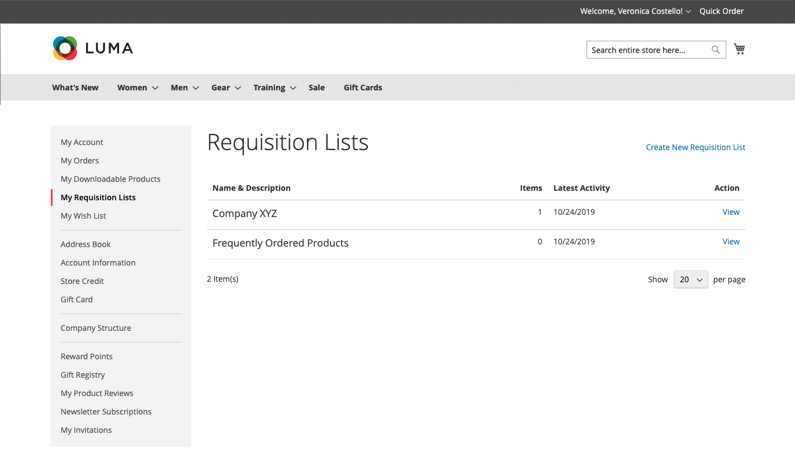
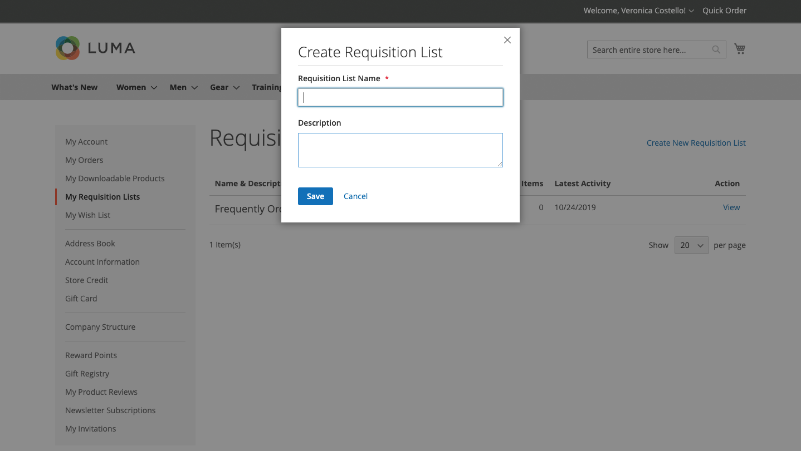
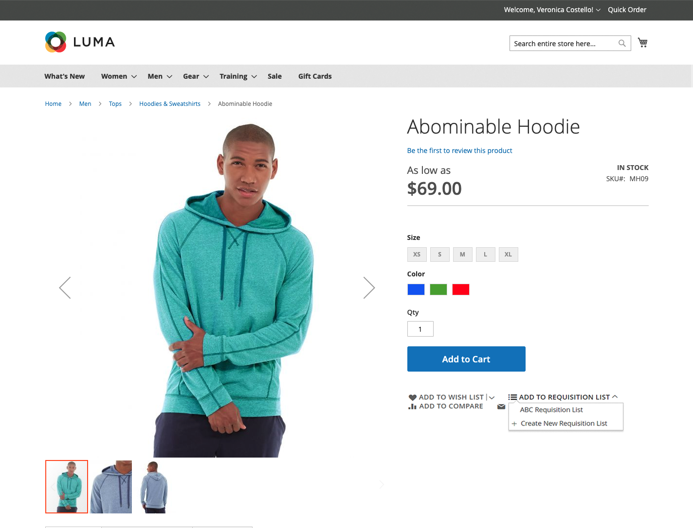
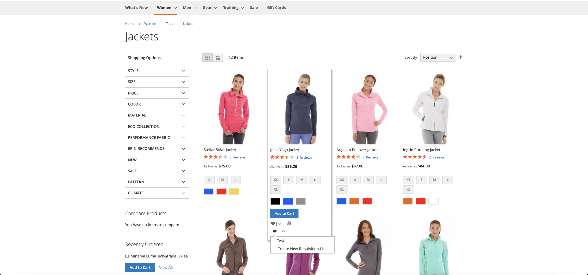
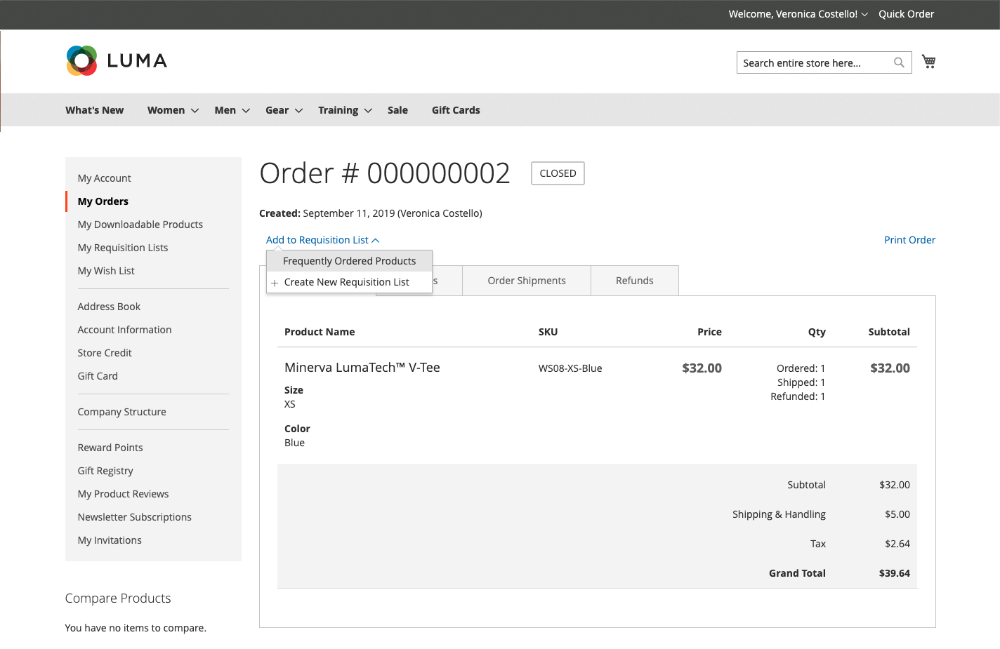
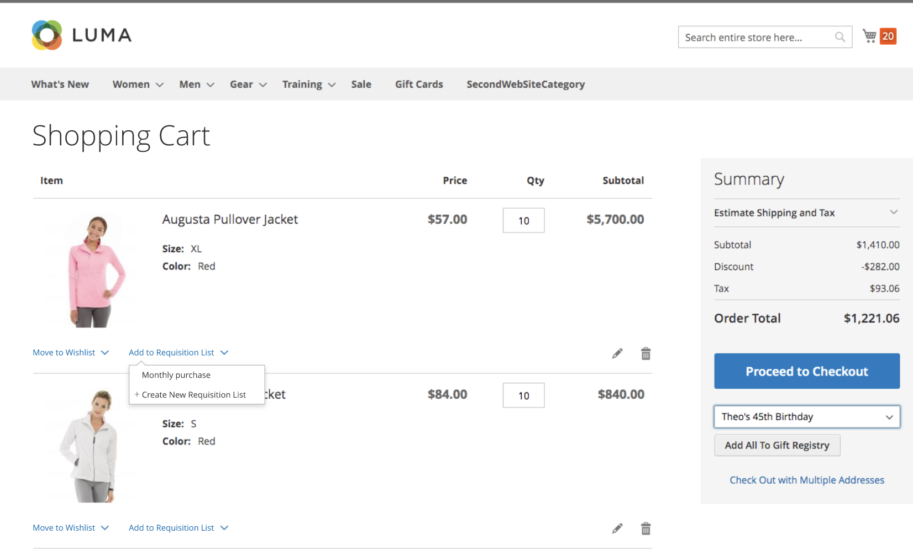
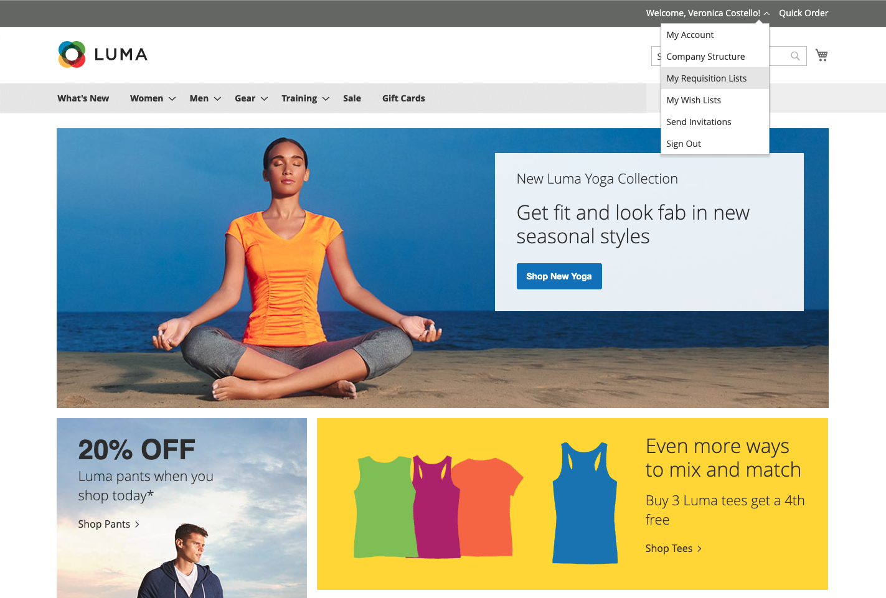

# Requisition lists

Using a requisition list saves time when purchasing frequently ordered products because items are added to the shopping cart directly from the list. Buyers can maintain multiple lists that focus on products from different vendors, buyers, teams, campaigns, or anything else that streamlines their workflow. The requisition list capability is available to logged-in users.

>[!NOTE]
>
>To enable requisition lists for your store, see [Enable B2B Features](enable-basic-features.md). Up to 999 requisition lists can be maintained for each buyer account, depending on the [configuration](configure-requisition-lists.md).

Requisition list functionality is similar to wish lists, with the following differences:

- A requisition list is not cleared after sending items to the shopping cart. It can be used multiple times.
- The user interface for requisition lists uses a compact view to display many items.

{width="600" zoomable="yes"}

## Create a requisition list from the account dashboard

A logged in buyer that is associated with a company account can create a requisition list from their account dashboard.

1. In the sidebar of their account, chooses **[!UICONTROL My Requisition Lists]**.

1. On the _[!UICONTROL Requisition Lists]_ page, clicks **[!UICONTROL Create New Requisition List]**.

1. Enters the **[!UICONTROL Requisition List Name]** and **[!UICONTROL Description]**.

   {width="300"}

1. When complete, clicks **[!UICONTROL Save]**.

## Create a requisition list from a product page

A logged in buyer that is associated with a company account can create a requisition list from a product page. This method provides an easy shortcut to create the list and add the product.

1. From the product detail page, the buyer clicks **[!UICONTROL Add to Requisition List]**.

1. Clicks **[!UICONTROL Create New Requisition List]**.

1. Enters the **[!UICONTROL Requisition List Name]** and **[!UICONTROL Description]**.

1. When complete, clicks **[!UICONTROL Save]**.

## Add products to a requisition list

Buyers can add products to a requisition list from:

- Product pages
- A catalog page
- The shopping cart
- Existing orders
- Existing quotes

### From a product detail page

1. From the storefront, the buyer goes to the detail page of the product that is to be added to the requisition list.

1. Clicks **[!UICONTROL Add to Requisition List]** and does one of the following:

   - Chooses an existing requisition list.
   - Creates a requisition list.

   {width="700" zoomable="yes"}

### From a catalog page

1. From the storefront, the buyer goes to the catalog page that contains the product that is to be added to the requisition list.

1. Hovers over the product.

1. Clicks **[!UICONTROL Add to Requisition List]** and does one of the following:

   - Chooses an existing requisition list.
   - Creates a requisition list.

   {width="700" zoomable="yes"}

### From an existing order

1. In the sidebar of their account dashboard, the buyer chooses **[!UICONTROL My Orders]**.

1. At the top of the order, clicks **[!UICONTROL Add to Requisition List]** and does one of the following:

   - Chooses an existing requisition list.
   - Creates a requisition list.

   {width="700" zoomable="yes"}

### From an existing quote

From a negotiable quote, buyers can use the [!UICONTROL Move to Requisition List] option to move products from the quote to an existing requisition list. If there are no requisition lists, the [!UICONTROL Move to Requisition List] option is not available.

1. In the sidebar of their account dashboard, the buyer selects **[!UICONTROL My Quotes]**.

1. Find and access the desired quote in the list.

1. In the [!UICONTROL Items Quoted] tab, select the product to move.

1. Using the [!UICONTROL Select] dropdown in the [!UICONTROL Actions] column for the product line item, choose **[!UICONTROL Move to Requisition list]**.

1. Select the requisition list for the selected items.

1. Click **[!UICONTROL Move item to Requisition List]**.

See the [My quotes](account-dashboard-my-quotes.md) topic for more information about B2B Quotes.

### From the cart

1. Under the item, the buyer clicks the **[!UICONTROL Add to Requisition List]** menu and does one of the following:

   - Chooses an existing requisition list.
   - Creates a requisition list.

   {width="700" zoomable="yes"}

## View the updated requisition list

When logged into their account, a buyer can use either of the following methods to view any of their requisition lists.

{width="700" zoomable="yes"}

### From the account dashboard

1. In the sidebar of their account dashboard, chooses **[!UICONTROL My Requisition Lists]**.

1. In the list of requisition lists, clicks **[!UICONTROL View]** in the _Actions_ column.

### From any storefront page

1. In the quick links bar at the top of the page, clicks their user name.

1. On the menu, chooses **[!UICONTROL My Requisition Lists]**.
